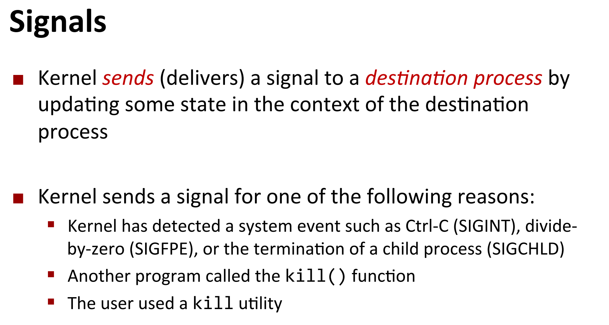
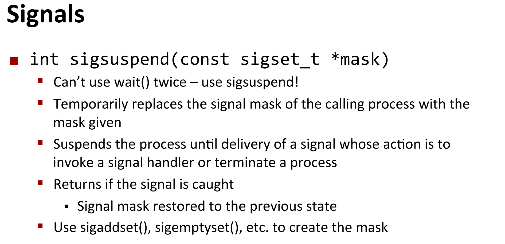
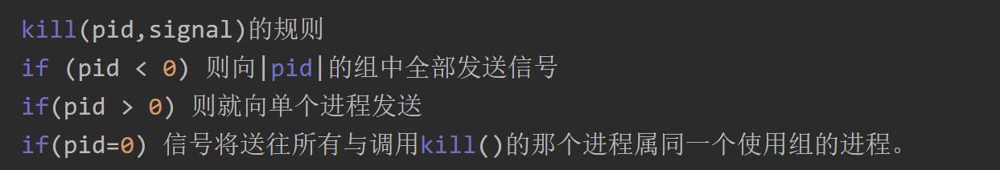

CSAPP+SICP - 知乎 (zhihu.com)](https://www.zhihu.com/column/c_1212802114247979008)

[五 Shell Lab - 简书 (jianshu.com)](https://www.jianshu.com/p/7f5e78e83a0e)

[[已完成+附代码\]CS:APP:Lab6-ShellLab - 周小伦 - 博客园 (cnblogs.com)](https://www.cnblogs.com/JayL-zxl/p/14386369.html)

[shell-lab | Jason‘s Blog (jasonxqh.github.io)](https://jasonxqh.github.io/2021/01/29/shell-lab/)

# 实验ppt讲解


**中断是一种异步异常**

是由于外部事件而对进程造成中断，中断是通过设置处理器的中断引脚来实现的，中断完成后，会回到下一条指令继续执行

例子：

1. IO中断
   * 键盘敲CTRL+C，这是键盘的IO造成的中断
   * 一个网络包的到达，会触发一个IO中断，通知传输完成
   * 一个磁盘上的数据的到达，也会触发一个IO中断，通知传输完成
2. 硬件重启中断
   * 点了重启按钮
3. 软件重启中断
   * 敲击CTRL-ALT-DELETE


进程四种基本状态

* Running——正在运行

* Runnable——可以运行

* Blocked——阻塞

* Zombie——终止但没被回收

  （这里没有终止且回收的进程，估计是因为那种占用的资源已经完全回收了，相当于从来没有过这个进程）


信号是一种消息，用来通知进程发生了某种事件

* 类似于(akin to)异常和中断
* 这个消息是从内核发送至一个进程（有时是应另一个进程的要求）
* 信号类型是1~30的编号
* 信号传递的唯一信息是它的信号ID和它到达的事实。



* **内核**通过**更新目标进程上下文中的一些状态**向**目标进程发送（传递）一个信号**

* **发送信号的原因**：
  * 内核检测到一个系统事件，如Ctrl-C（SIGINT），除零（SIGFPE），或一个子进程的终止（SIGCHLD）。
  * 另一个进程调用了kill函数.


* 当一个**目标进程**被**内核强迫以某种方式对信号的传递做出反应时**，它就会接收一个信号
* 接收信号是不排队的
* **信号接收的时间：上下文切换**（上下文切换的时候，本来执行进程A，内核态准备切换到进程B执行时，会去检查是否有收到信号，并去处理）
* 对信号的三种反应：
  * 忽略信号
  * 终止进程
  * 捕捉这个信号，执行用户级的信号处理程序（类似于硬件异常处理程序被调用以响应异步中断）


* 当一个目标进程**被内核强迫以某种方式对信号的传递做出反应时**，它就会收到一个信号
* **阻塞信号**
  * 有时代码需要运行在一个不能被中断的部分
  * 用`sigprocmask()`函数实现
* **等待信号**
  * 有时，我们想**暂停执行，直到得到一个特定的信号**
  * 用sigsuspend()实现。（阻塞信号，pause，开启信号）

* **SIGKILL and SIGSTOP不能被改变反应行为**


**信号处理程序：**

* 可以被安装，在收到信号时运行
* 形式是 **void handler(int signum){ ... }**
* **在同一进程中分离控制流**，形成处理信号的控制流和程序原本执行的逻辑流
* **返回后恢复正常的控制流**（继续执行原本的逻辑流）
* 当适当的信号被触发时，可以在任何时候被执行



```c
int sigsuspend(const sigset_t *mask)
"等价于":阻塞信号 - pause() - 取消阻塞
```

* 暂时将调用进程的信号掩码替换为给定的掩码
* 暂停pause进程，直到收到一个信号


# 实验目标

这个lab要求我们实现一个简易的unix shell程序，内容依托CSAPP第八章的异常控制流.
 这个LAB 就按照TRACE 文件来一点点实现。 读WRITES UP很重要，理解课本里的每段代码也很重要是前置功课。

所给的文件中已经有了大致的框架，我们要做的就是补全tsh.c下几个函数：

```c
void eval(char *cmdline) 		//分析命令，并派生子进程执行
int builtin_cmd(char **argv) 	//执行内置的命令
void do_bgfg(char **argv) 		//执行bg和fg命令
void waitfg(pid_t pid) 			//阻塞直到一个进程不在前台运行
void sigchld_handler(int sig) 	//SIGCHID信号处理函数
void sigint_handler(int sig) 	//SIGINT信号处理函数
void sigtstp_handler(int sig) 	//SIGTSTP信号处理函数
```

我们希望实现的shell具有以下功能：

* tsh应该回收（reap）所有僵尸进程，如果一个工作是因为收到了一个它没有捕获的（没有按照信号处理函数）而终止的，那么tsh应该输出这个工作的PID和这个信号的相关描述。

* shell不需要支持管道`|`或I/O重定向`<`和`>`

* 键入`ctrl-c`（`ctrl-z`）应该会导致`SIGINT`（`SIGTSTP`）信号发送到当前前台作业以及该作业的任何后代，如果没有前台作业，那么信号应该没有效果。
* 如果一个命令以“&”结尾，那么tsh应该将它们放在后台运行，否则就放在前台运行（并等待它的结束）

* shell需要支持以下内置命令：`quit`、`jobs`、`bg <job>`和`fg <job>`。

  ```shell
  – The quit command terminates the shell.
  – The jobs command lists all background jobs.
  – The bg <job> command restarts <job> by sending it a SIGCONT signal, and then runs it in
  the background. The <job> argument can be either a PID or a JID.
  – The fg <job> command restarts <job> by sending it a SIGCONT signal, and then runs it in
  the foreground. The <job> argument can be either a PID or a JID.
  ```

  

# 实验开始

好了下面开始实验了。首先根据writeup我们知道我们要依次根据test文件进行测试。就是说我们的make test0x的执行结果要和make rtest0x的参考结果一样就可以了。


这里我们发现对于test02的测试就出现了问题。这里去看一下trace02看看到底发生了什么。


这里有一条quit指令。不通过的原因就是我们的tsh程序还没有实现对于这个命令的处理。所以它不会退出而会停在这里。
**下面正式开始我们的实验啦**


由于我们没有办法预估信号到达的顺序。因此对于并发编程的处理就变得非常的重要。

考虑下面这种情况

[](https://img2020.cnblogs.com/blog/2282357/202102/2282357-20210207190512308-1257259315.png)

因此我们要考虑这种情况。在父进程`addjob`之前先把`SIGCHLD`信号阻塞掉。


## **1. `eval`函数的实现**

```c
void eval(char *cmdline) 
{
    char *argv[MAXLINE];    /*Argument list execve()*/
    char buf[MAXLINE];      /*Hold modified commend line*/
    int bg;                 /*Should the job run in bg or fg?*/
    pid_t pid;
    int state;
    sigset_t mask_all, mask_one, prev_one;
    strcpy(buf,cmdline);		//将cmdline得到的字符串拷贝到buf
    bg=parseline(cmdline,argv);	//将cmdline解析成数组argv[]
    if(argv[0]==0){
        return ;//ignore empty line
    }
    if(!builtin_cmd(argv)){
        sigfillset(&mask_all);	
        sigemptyset(&mask_one);
        sigaddset(&mask_one, SIGCHLD);	//mask_one:SIGCHLD
        
        //在这里就可以直接阻塞SIGCHLD了
        sigprocmask(SIG_BLOCK, &mask_one, &prev_one); //Block SIGCHLD

        if((pid=fork())==0){
            /*子进程:*/
            sigprocmask(SIG_SETMASK,&prev_one,NULL);//UnBlock SIGCHLD
            if (setpgid(0, 0) < 0)	//创建一个进程组，pgid=pid
            {
                perror("SETPGID ERROR");
                exit(0);
            }
            if (execve(argv[0], argv, environ) < 0) //if execve error return 0
            {
                printf("%s: Command not found\n", argv[0]);
                exit(0);
            }
        }
      else{
        state = bg ? BG : FG;	
        sigprocmask(SIG_BLOCK, &mask_all, NULL); //parent process
        addjob(jobs, pid, state, cmdline);
        sigprocmask(SIG_SETMASK, &prev_one, NULL); //unblock SIGCHLD
      }
        bg?printf("[%d] (%d) %s",pid2jid(pid), pid, cmdline):waitfg(pid);
        //后台执行:输出jid,pid和执行的指令
        //前台执行:waitfg(pid)
    }
    return;
}
```

基本参考了书上`p525`的`shell`代码和`p543`的代码。考虑了上述提到的并发访问问题。


## **2. `builtin_cmd`的实现**

> 如果用户输入的是built-in command则立即执行否则返回0

一共需要支持四个内置命令


```c
int builtin_cmd(char **argv)
{
    if(!strcmp(argv[0],"quit")){	//如果第一个参数是quit，那就直接退出
        exit(0);
    }
    if(!strcmp(argv[0],"&"))
        return 1;
    if(!strcmp(argv[0],"bg")||!strcmp(argv[0],"fg"))
    {
        do_bgfg(argv);
        return 1;
    }
    if(!strcmp(argv[0],"jobs")){	//如果第一个参数是jobs，那就列出当前的jobs
        listjobs(jobs);
        return 1;
    }
    return 0;     /* not a builtin command */
}
```


## **3. `do_bgfg`**的实现

这个函数单独处理了`bg`和`fg`这两个内置命令。

每个job都可以由进程ID（PID）或job ID（JID）标识，该ID是一个正整数tsh分配。 JID应该在命令行上以前缀“％”表示。 

例如，**“％5”表示JID 5**，“ **5”表示PID5**。

```shell
tsh> fg %1
Job [1] (9723) stopped by signal 20
```




```c
void do_bgfg(char **argv) 
{
    struct  job_t *job;
    int id;
    if(argv[1]==NULL){	//如果仅有argv[0]一个参数,那么打印出，需要输入pid或%jid
        printf("%s command requires PID or %%jobid argument\n", argv[0]);
        return ;
    }
    if (sscanf(argv[1], "%%%d", &id) > 0)
    {
        job = getjobjid(jobs, id);
        if (job == NULL)
        {
            printf("%%%d: No such job\n", id);
            return ;
        }
    }
    else if (sscanf(argv[1], "%d", &id) > 0)
    {
        job = getjobpid(jobs, id);
        if (job == NULL)
        {
            printf("(%d): No such process\n", id);
            return ;
        }
    }
    else
    {
        printf("%s: argument must be a PID or %%jobid\n", argv[0]);
        return;
    }
    
    if(!strcmp(argv[0], "bg"))
    {
        kill(-(job->pid), SIGCONT);
        job->state = BG;
        printf("[%d] (%d) %s",job->jid, job->pid, job->cmdline);
    }
    else
    {
        kill(-(job->pid), SIGCONT);
        job->state = FG;
        waitfg(job->pid);
    }


    return;
}
```

**bg命令**，我们是先kill一个SIGCONT指令，让暂停的进程继续，然后将job的state变成BG，再打印出来，然后就任由其在后台执行了。我们的kill SIGCONT是为了被CTRL+Z暂停的

**fg命令**，我们是先kill一个SIGCONT指令，让暂停的进程继续，然后将job的state变成FG,再waitfg去等待这个前台执行完成，例子如下


## 4.**`waitfg` 函数实现**

实际上，我们这里的waitfg并不需要参数，我们用jobs数组去检查是否还有前台任务在执行，如果还有前台任务在执行，就自旋。这里的参数是csapp给我们提供的函数原型，就不去修改他了，但是明白实际上这参数是用不到的.

```c
void waitfg(pid_t pid) 			//阻塞,直到一个进程不在前台运行了,并从jobs中删除之后,才会返回.这里的作用就是一个同步语义，我们的shell必须等前台执行完了才能继续执行.
```

```c
void waitfg(pid_t pid)
{
    //实际上，这里的sigsuspend的效果应该和pause一样
    sigset_t mask;
    sigemptyset(&mask);
    /* fgpid - Return PID of current foreground job, 0 if no such job */
    while (fgpid(jobs) > 0)	//fgpid可以得到当前正在前台运行的job的pid,0表示没有
        sigsuspend(&mask);
    return;
}
```

我们的waitfd是在do_bgfg中用到的，如果我们让一个进程变成前台的话，需要用waitfd来进行同步，等到这个前台执行完后，才将控制权给shell.

**waitfd的while循环反复检测当前的子进程是否还在前台执行，这是一个非常重要的同步，有了waitfd就意味着，我们的shell进程会等到前台的进程job被delete之后才能继续下一列命令行交互。比如我们执行子进程，然后ctrl+c，我们会将子进程终止，或者ctrl+z，会将子进程暂停，这样，我们通过waitpid来检查子进程的终止或停止信息，来确定子进程是ctrl+c终止，还是ctrl+z暂停，还是自己正常退出.**

fdpid函数的代码如下（这是实验提供给我们的，不用自己写）：

```c
pid_t fgpid(struct job_t *jobs) {
    int i;

    for (i = 0; i < MAXJOBS; i++)
	if (jobs[i].state == FG)
	    return jobs[i].pid;
    return 0;
}
```

## 5.`sigint_handler`和`sigstp_handler`

从这里开始，是3个信号处理程序函数。

sigint是CTRL+C带来的终止.

sigstp是CTRL+Z带来的停止.

```c
/* 
 * sigint_handler - The kernel sends a SIGINT to the shell whenver the
 *    user types ctrl-c at the keyboard.  Catch it and send it along
 *    to the foreground job.  
 */
void sigint_handler(int sig) 
{
    int old_errno = errno;	//首先需要保存原始的errno
    pid_t pid = fgpid(jobs);
    if (pid != 0)    //如果没有前台在执行,直接return,如果有前台在执行,给这个进程组发送SIGINT终止信号
        kill(-pid,sig);
    errno = old_errno; 
}

/*
 * sigtstp_handler - The kernel sends a SIGTSTP to the shell whenever
 *     the user types ctrl-z at the keyboard. Catch it and suspend the
 *     foreground job by sending it a SIGTSTP.  
 */
void sigtstp_handler(int sig) 
{
    int old_errno = errno;	//首先需要保存原始的errno
    pid_t pid = fgpid(jobs);
    if (pid != 0)    //如果没有前台在执行,直接return,如果有前台在执行,给这个进程组发送SIGTSTP暂停信号
        kill(-pid,sig);
    errno = old_errno; 
}
```

**当我们键入`Ctrl+C`时，内核会发送`SIGINT`信号给shell，而shell只需要通过`kill`函数将其转发给子进程，当我们键入`Ctrl+Z`时也同理。**

**注意：**(这里参考自[CSAPP+SICP - 知乎 (zhihu.com)](https://www.zhihu.com/column/c_1212802114247979008))

- 我们需要保存`errno`，并在返回时重新赋值，防止它被改变。 

- 我写这段代码时，一直有个疑惑，我们在最外侧通过`Signal`来捕获了这两个信号，则`fork`新建的子进程应该也会通过这两个信号处理程序来处理该信号。所以当shell发送`SIGINT`或`SIGTSTP`信号给前台进程时，前台进程不也会跑到这两个信号处理程序中吗？但是我发现会跑到`SIGCHLD`的信号处理程序中。**这里是由于：**

- - 当一个进程调用`fork`时，因为子进程在开始时复制父进程的存储映像，信号处理程序的地址在子进程中是有意义的，所以**子进程继承父进程定义的信号处理程序**。
  - **但是**当子进程调用`execve`后，因为**`execve`运行新的程序后会覆盖从父进程继承来的存储映像，那么信号处理程序在新程序中已无意义，所以`execve`会将原先设置为要捕捉的信号都更改为默认动作**。所以当shell发送`SIGINT`和`SIGTSTP`信号给子进程时，他们会执行默认操作，即终止进程，所以当子进程终止时，内核会发送`SIGCHLD`信号给父进程，所以可以发送跳转到shell的`SIGCHLD`的信号处理程序中了。

- > 这里说的太好了，解答了我的疑惑：为什么对前台进程组的kill(-pid,sig)不是继续调用这个信号处理程序呢，而陷入无限的循环呢？
  >
  > 原因在于，我们用execve重置了状态机，那么子进程中的信号处理程序也重置了，所以子进程的信号处理程序是默认，那么调用kill(-pid,sig)时，就真的让他停止 or 终止.

- 

## 6.**`sigchld_handler`**的实现

 **sigchld_handler** ,也就**是当一个子进程终止或者结束的时候,子进程会发送一个SIGCHLD给父进程，然后回收它**.

我们的子进程有三种结束的可能：

1. 正常退出
2. CTRL+C强行终止，这样子进程直接终止
3. CTRL+Z将任务暂停的意思,但是此任务并没有结束,他仍然在进程中他只是维持挂起的状态,用户可以使用fg/bg操作继续前台或后台的任务,fg命令重新启动前台被中断的任务,bg命令把被中断的任务放在后台执行.

**子进程的停止或终止，都会给父进程发送SIGCHLD信号，所以我们需要对这三种情况进行处理**

```c
void sigchld_handler(int sig) 
{

    int olderrno = errno;	//保留原来的errno
    pid_t pid;
    int status;
    sigset_t mask_all, prev;

    sigfillset(&mask_all);
    while((pid = waitpid(-1, &status, WNOHANG | WUNTRACED)) > 0)
    {
        if (WIFEXITED(status)) //如果子进程正常exit了,那么为真，去delete job
        {
            sigprocmask(SIG_BLOCK, &mask_all, &prev);
            deletejob(jobs, pid);	
            sigprocmask(SIG_SETMASK, &prev, NULL);
        }
        else if (WIFSIGNALED(status))  //如果这个子进程是收到一个信号之后结束的，打印SIGNAL之后再删除
        {
            struct job_t* job = getjobpid(jobs, pid);
            sigprocmask(SIG_BLOCK, &mask_all, &prev);
            printf("Job [%d] (%d) terminated by signal %d\n", job->jid, job->pid, WTERMSIG(status));
            deletejob(jobs, pid);
            sigprocmask(SIG_SETMASK, &prev, NULL);
        }
        else //如果这个子进程是暂停的,就不删除,而是将这个进程的状态改成ST(stop),并打印
        {
            struct job_t* job = getjobpid(jobs, pid);
            sigprocmask(SIG_BLOCK, &mask_all, &prev);
            printf("Job [%d] (%d) stopped by signal %d\n", job->jid, job->pid, WSTOPSIG(status));
            job->state= ST;
            sigprocmask(SIG_SETMASK, &prev, NULL);	//恢复信号接收
        }
    }
    errno = olderrno;//将errno复原,保持回收子进程前后错误信息不能变.
    return;

}
```

* 正常exit
  * deletejob
* CTRL+C终止
  * deletejob + 打印终止信息
* CTRL+Z暂停
  * job变成ST暂停状态(state)+打印暂停信息

`SIGCHLD`信号的处理程序比较复杂。首先，由于信号不存在队列，所以我们需要假设一个未处理信号表明至少有一个信号到达，所以我们需要使用`while`循环，而不能用`if`。其次，在使用`waitpid`函数回收子进程时，我们需要设置选项为`WNOHANG | WUNTRACED`，`WNOHANG`表示当没有子进程终止时，父进程不会被挂起，而是`waitpid`函数返回0，这样防止当shell中还存在子进程时，由于`while`的存在，而卡在这个循环中；`WUNTRACED`保证能返回被终止和停止的子进程PID，因为子进程收到`SIGINT`和`SIGTSTP`信号时会采取默认默认行为而终止和停止，则内核会发送`SIGCHLD`信号给shell，如果没有`WUNTRACED`，则当子进程是被停止的，则会卡在这个循环中。

**此外我们还需注意：**

- 执行信号处理程序和主程序处于相同的进程中 
- 信号是内核发送给父进程的，比如键入`Ctrl+C`或`Ctrl+Z`时，内核会发送`SIGINT`或`SIGTSTP`信号给父进程，当子进程停止或终止时，内核会发送`SIGCHLD`信号给父进程，然后在父进程中执行对应的信号处理程序。需要时刻注意当前的执行的进程是什么。


## 7.总结

**简单总结以下shell的行为。**

shell本身作为一个进程，接收到命令行后，会先判断是否为内置命令

- 如果该命令为内置命令，则shell直接执行该命令
- 如果不是内置命令，则shell会通过`fork`新建一个子进程，并未该子进程分配一个独立的进程组ID，与shell进程独立开来，然后通过`execve`函数来执行可执行目标文件。如果是前台作业，则shell会等待该作业执行完毕，如果是后台作业，则shell会直接读取下一条命令。**注意：**`execve`函数会消除我们定义的信号处理程序。 

**当我们执行的程序正常退出，或者CTRL+C终止，或者Ctrl+Z暂停，由于子进程的终止和暂停都会触发Sigchld，然后我们进入Sigchld处理程序。**

* **正常退出 - delete job**
* **Ctrl+c终止 - delete job + Print**
* **Ctrl+z暂停 - 修改这个前台进程的state为ST(stop) + Print**

**这些处理完后，我们要么delete 这个前台job，要么把前台job改成stop状态，所以，我们父进程本来卡在waitfg中，现在，由于没有前台job了，那么父进程就进入下一轮tsh交互.**

当我们键入`Ctrl+C`或`Ctrl+Z`时，由于我们是在执行shell进程，所以**内核会发送`SIGINT`或`SIGTSTP`信号给tsh这个父进程**，此时**tsh就需要将该信号通过`kill`函数发送给对应的前台进程**。**由于该前台进程执行了`execve`函数，所以会采用默认行为，要么终止或停止该子进程，然后内核会发送`SIGCHLD`信号给shell，表示有子进程被终止或停止了，然后shell再通过对应的信号处理程序对该子进程进行回收或修改作业状态。**


## 8.几个示例分析执行过程


当我们执行./myspin 2时，会创建一个子进程去执行他，然后父进程用waitfg一直等着，不进入下一轮的zsh交互。我们waitfg一直去检查jobs中是否还有前台程序在运行，直到子进程exit后，我们的sigchld中用waitpid去删除这个前台job，所以tsh进程就从waitfg返回，进入下一轮tsh交互.


Ctrl+C，我们会将Ctrl+C信号传给我们的tsh进程。讲到信号就得先将进程组了，我们是这样的，tsh进程创建一个子进程去执行任务，刚fork的时候，它的进程组pgid也从tsh复制过来，所以是tsh的pid。由于我们需要让它们分属于不同的进程组，让这个子进程成为一个独立的进程组，如ppt所示


其实，根本的执行流程是这样的：我们的terminal接收到键盘中断Ctrl+c，然后把这个信号传给我们的tsh进程，我们的tsh进程又用kill去传给前台的子进程的进程组.


Ctrl+Z的暂停也是类似:


再来看看后台执行：


后台执行，tsh进程就没有了waitfg的等待，而是直接进入下一轮的tsh交互。而且由于我们在eval函数中，已经将这个job加入了jobs了，所以输入jobs仍然可以显示进程信息.


再来看看bg 和 fg


可以看到，我们将一个后台进程移到前台，他就真的卡在这等待前台运行结束，这是因为我们do_bgfg函数中写了waitfg，如下


我们再来试试将一个暂停的进程移到前台:


## 9.测验

```shell
 kkbabe@ubuntu  ~/csapp/labs/05-shell-lab   master ±  
 kkbabe@ubuntu  ~/csapp/labs/05-shell-lab   master ±  make test01
./sdriver.pl -t trace01.txt -s ./tsh -a "-p"
#
# trace01.txt - Properly terminate on EOF.
#
 kkbabe@ubuntu  ~/csapp/labs/05-shell-lab   master ±  make test02
./sdriver.pl -t trace02.txt -s ./tsh -a "-p"
#
# trace02.txt - Process builtin quit command.
#
 kkbabe@ubuntu  ~/csapp/labs/05-shell-lab   master ±  make test03
./sdriver.pl -t trace03.txt -s ./tsh -a "-p"
#
# trace03.txt - Run a foreground job.
#
tsh> quit
 kkbabe@ubuntu  ~/csapp/labs/05-shell-lab   master ±  make test04
./sdriver.pl -t trace04.txt -s ./tsh -a "-p"
#
# trace04.txt - Run a background job.
#
tsh> ./myspin 1 &
[1] (47246) ./myspin 1 &
 kkbabe@ubuntu  ~/csapp/labs/05-shell-lab   master ±  make test05
./sdriver.pl -t trace05.txt -s ./tsh -a "-p"
#
# trace05.txt - Process jobs builtin command.
#
tsh> ./myspin 2 &
[1] (47325) ./myspin 2 &
tsh> ./myspin 3 &
[2] (47327) ./myspin 3 &
tsh> jobs
[1] (47325) Running ./myspin 2 &
[2] (47327) Running ./myspin 3 &
 kkbabe@ubuntu  ~/csapp/labs/05-shell-lab   master ±  make test06
./sdriver.pl -t trace06.txt -s ./tsh -a "-p"
#
# trace06.txt - Forward SIGINT to foreground job.
#
tsh> ./myspin 4
Job [1] (47420) terminated by signal 2
 kkbabe@ubuntu  ~/csapp/labs/05-shell-lab   master ±  make test07
./sdriver.pl -t trace07.txt -s ./tsh -a "-p"
#
# trace07.txt - Forward SIGINT only to foreground job.
#
tsh> ./myspin 4 &
[1] (47535) ./myspin 4 &
tsh> ./myspin 5
Job [2] (47537) terminated by signal 2
tsh> jobs
[1] (47535) Running ./myspin 4 &
 kkbabe@ubuntu  ~/csapp/labs/05-shell-lab   master ±  make test08
./sdriver.pl -t trace08.txt -s ./tsh -a "-p"
#
# trace08.txt - Forward SIGTSTP only to foreground job.
#
tsh> ./myspin 4 &
[1] (47621) ./myspin 4 &
tsh> ./myspin 5
Job [2] (47623) stopped by signal 20
tsh> jobs
[1] (47621) Running ./myspin 4 &
[2] (47623) Stopped ./myspin 5 
 kkbabe@ubuntu  ~/csapp/labs/05-shell-lab   master ±  make test09
./sdriver.pl -t trace09.txt -s ./tsh -a "-p"
#
# trace09.txt - Process bg builtin command
#
tsh> ./myspin 4 &
[1] (47715) ./myspin 4 &
tsh> ./myspin 5
Job [2] (47717) stopped by signal 20
tsh> jobs
[1] (47715) Running ./myspin 4 &
[2] (47717) Stopped ./myspin 5 
tsh> bg %2
[2] (47717) ./myspin 5 
tsh> jobs
[1] (47715) Running ./myspin 4 &
[2] (47717) Running ./myspin 5 
 kkbabe@ubuntu  ~/csapp/labs/05-shell-lab   master ±  make test10 
./sdriver.pl -t trace10.txt -s ./tsh -a "-p"
#
# trace10.txt - Process fg builtin command. 
#
tsh> ./myspin 4 &
[1] (47809) ./myspin 4 &
tsh> fg %1
Job [1] (47809) stopped by signal 20
tsh> jobs
[1] (47809) Stopped ./myspin 4 &
tsh> fg %1
tsh> jobs
 kkbabe@ubuntu  ~/csapp/labs/05-shell-lab   master ±  make test11
./sdriver.pl -t trace11.txt -s ./tsh -a "-p"
#
# trace11.txt - Forward SIGINT to every process in foreground process group
#
tsh> ./mysplit 4
Job [1] (47935) terminated by signal 2
tsh> /bin/ps a
    PID TTY      STAT   TIME COMMAND
   1760 tty2     Ssl+   0:00 /usr/lib/gdm3/gdm-x-session --run-script env GNOME_SHELL_SESSION_MODE=ubuntu /usr/bin/gnome-session --systemd --session=ubuntu
   1762 tty2     Sl+    6:57 /usr/lib/xorg/Xorg vt2 -displayfd 3 -auth /run/user/1000/gdm/Xauthority -background none -noreset -keeptty -verbose 3
   1813 tty2     Sl+    0:00 /usr/libexec/gnome-session-binary --systemd --systemd --session=ubuntu
   1887 tty2     Z+     0:00 [fcitx] <defunct>
  46847 pts/6    Ss     0:00 /usr/bin/zsh
  46893 pts/7    Ss+    0:00 /usr/bin/zsh
  47930 pts/6    S+     0:00 make test11
  47931 pts/6    S+     0:00 /bin/sh -c ./sdriver.pl -t trace11.txt -s ./tsh -a "-p"
  47932 pts/6    S+     0:00 /usr/bin/perl ./sdriver.pl -t trace11.txt -s ./tsh -a -p
  47933 pts/6    S+     0:00 ./tsh -p
  47943 pts/6    R      0:00 /bin/ps a
 kkbabe@ubuntu  ~/csapp/labs/05-shell-lab   master ±  make test12
./sdriver.pl -t trace12.txt -s ./tsh -a "-p"
#
# trace12.txt - Forward SIGTSTP to every process in foreground process group
#
tsh> ./mysplit 4
Job [1] (48070) stopped by signal 20
tsh> jobs
[1] (48070) Stopped ./mysplit 4 
tsh> /bin/ps a
    PID TTY      STAT   TIME COMMAND
   1760 tty2     Ssl+   0:00 /usr/lib/gdm3/gdm-x-session --run-script env GNOME_SHELL_SESSION_MODE=ubuntu /usr/bin/gnome-session --systemd --session=ubuntu
   1762 tty2     Sl+    6:57 /usr/lib/xorg/Xorg vt2 -displayfd 3 -auth /run/user/1000/gdm/Xauthority -background none -noreset -keeptty -verbose 3
   1813 tty2     Sl+    0:00 /usr/libexec/gnome-session-binary --systemd --systemd --session=ubuntu
   1887 tty2     Z+     0:00 [fcitx] <defunct>
  46847 pts/6    Ss     0:00 /usr/bin/zsh
  46893 pts/7    Ss+    0:00 /usr/bin/zsh
  48065 pts/6    S+     0:00 make test12
  48066 pts/6    S+     0:00 /bin/sh -c ./sdriver.pl -t trace12.txt -s ./tsh -a "-p"
  48067 pts/6    S+     0:00 /usr/bin/perl ./sdriver.pl -t trace12.txt -s ./tsh -a -p
  48068 pts/6    S+     0:00 ./tsh -p
  48070 pts/6    T      0:00 ./mysplit 4
  48071 pts/6    T      0:00 ./mysplit 4
  48074 pts/6    R      0:00 /bin/ps a
 kkbabe@ubuntu  ~/csapp/labs/05-shell-lab   master ±  make test13
./sdriver.pl -t trace13.txt -s ./tsh -a "-p"
#
# trace13.txt - Restart every stopped process in process group
#
tsh> ./mysplit 4
Job [1] (48162) stopped by signal 20
tsh> jobs
[1] (48162) Stopped ./mysplit 4 
tsh> /bin/ps a
    PID TTY      STAT   TIME COMMAND
   1760 tty2     Ssl+   0:00 /usr/lib/gdm3/gdm-x-session --run-script env GNOME_SHELL_SESSION_MODE=ubuntu /usr/bin/gnome-session --systemd --session=ubuntu
   1762 tty2     Sl+    6:58 /usr/lib/xorg/Xorg vt2 -displayfd 3 -auth /run/user/1000/gdm/Xauthority -background none -noreset -keeptty -verbose 3
   1813 tty2     Sl+    0:00 /usr/libexec/gnome-session-binary --systemd --systemd --session=ubuntu
   1887 tty2     Z+     0:00 [fcitx] <defunct>
  46847 pts/6    Ss     0:00 /usr/bin/zsh
  46893 pts/7    Ss+    0:00 /usr/bin/zsh
  48157 pts/6    S+     0:00 make test13
  48158 pts/6    S+     0:00 /bin/sh -c ./sdriver.pl -t trace13.txt -s ./tsh -a "-p"
  48159 pts/6    S+     0:00 /usr/bin/perl ./sdriver.pl -t trace13.txt -s ./tsh -a -p
  48160 pts/6    S+     0:00 ./tsh -p
  48162 pts/6    T      0:00 ./mysplit 4
  48163 pts/6    T      0:00 ./mysplit 4
  48171 pts/6    R      0:00 /bin/ps a
tsh> fg %1
tsh> /bin/ps a
    PID TTY      STAT   TIME COMMAND
   1760 tty2     Ssl+   0:00 /usr/lib/gdm3/gdm-x-session --run-script env GNOME_SHELL_SESSION_MODE=ubuntu /usr/bin/gnome-session --systemd --session=ubuntu
   1762 tty2     Sl+    6:58 /usr/lib/xorg/Xorg vt2 -displayfd 3 -auth /run/user/1000/gdm/Xauthority -background none -noreset -keeptty -verbose 3
   1813 tty2     Sl+    0:00 /usr/libexec/gnome-session-binary --systemd --systemd --session=ubuntu
   1887 tty2     Z+     0:00 [fcitx] <defunct>
  46847 pts/6    Ss     0:00 /usr/bin/zsh
  46893 pts/7    Ss+    0:00 /usr/bin/zsh
  48157 pts/6    S+     0:00 make test13
  48158 pts/6    S+     0:00 /bin/sh -c ./sdriver.pl -t trace13.txt -s ./tsh -a "-p"
  48159 pts/6    S+     0:00 /usr/bin/perl ./sdriver.pl -t trace13.txt -s ./tsh -a -p
  48160 pts/6    S+     0:00 ./tsh -p
  48179 pts/6    R      0:00 /bin/ps a
 kkbabe@ubuntu  ~/csapp/labs/05-shell-lab   master ±  make test14
./sdriver.pl -t trace14.txt -s ./tsh -a "-p"
#
# trace14.txt - Simple error handling
#
tsh> ./bogus
./bogus: Command not found
tsh> ./myspin 4 &
[1] (48311) ./myspin 4 &
tsh> fg
fg command requires PID or %jobid argument
tsh> bg
bg command requires PID or %jobid argument
tsh> fg a
fg: argument must be a PID or %jobid
tsh> bg a
bg: argument must be a PID or %jobid
tsh> fg 9999999
(9999999): No such process
tsh> bg 9999999
(9999999): No such process
tsh> fg %2
%2: No such job
tsh> fg %1
Job [1] (48311) stopped by signal 20
tsh> bg %2
%2: No such job
tsh> bg %1
[1] (48311) ./myspin 4 &
tsh> jobs
[1] (48311) Running ./myspin 4 &
 kkbabe@ubuntu  ~/csapp/labs/05-shell-lab   master ±  make test15
./sdriver.pl -t trace15.txt -s ./tsh -a "-p"
#
# trace15.txt - Putting it all together
#
tsh> ./bogus
./bogus: Command not found
tsh> ./myspin 10
Job [1] (48397) terminated by signal 2
tsh> ./myspin 3 &
[1] (48399) ./myspin 3 &
tsh> ./myspin 4 &
[2] (48401) ./myspin 4 &
tsh> jobs
[1] (48399) Running ./myspin 3 &
[2] (48401) Running ./myspin 4 &
tsh> fg %1
Job [1] (48399) stopped by signal 20
tsh> jobs
[1] (48399) Stopped ./myspin 3 &
[2] (48401) Running ./myspin 4 &
tsh> bg %3
%3: No such job
tsh> bg %1
[1] (48399) ./myspin 3 &
tsh> jobs
[1] (48399) Running ./myspin 3 &
[2] (48401) Running ./myspin 4 &
tsh> fg %1
tsh> quit
 kkbabe@ubuntu  ~/csapp/labs/05-shell-lab   master ±  make test16
./sdriver.pl -t trace16.txt -s ./tsh -a "-p"
#
# trace16.txt - Tests whether the shell can handle SIGTSTP and SIGINT
#     signals that come from other processes instead of the terminal.
#
tsh> ./mystop 2
Job [1] (48517) stopped by signal 20
tsh> jobs
[1] (48517) Stopped ./mystop 2
tsh> ./myint 2
Job [2] (48525) terminated by signal 2
```

我们的确通过了所有的测验


## 10.全部代码

```c
/* 
 * tsh - A tiny shell program with job control
 * 
 * <Put your name and login ID here>
 */
#include <stdio.h>
#include <stdlib.h>
#include <unistd.h>
#include <string.h>
#include <ctype.h>
#include <signal.h>
#include <sys/types.h>
#include <sys/wait.h>
#include <errno.h>

/* Misc manifest constants */
#define MAXLINE    1024   /* max line size */
#define MAXARGS     128   /* max args on a command line */
#define MAXJOBS      16   /* max jobs at any point in time */
#define MAXJID    1<<16   /* max job ID */

/* Job states */
#define UNDEF 0 /* undefined */
#define FG 1    /* running in foreground */
#define BG 2    /* running in background */
#define ST 3    /* stopped */

/* 
 * Jobs states: FG (foreground), BG (background), ST (stopped)
 * Job state transitions and enabling actions:
 *     FG -> ST  : ctrl-z
 *     ST -> FG  : fg command
 *     ST -> BG  : bg command
 *     BG -> FG  : fg command
 * At most 1 job can be in the FG state.
 */

/* Global variables */
extern char **environ;      /* defined in libc */
char prompt[] = "tsh> ";    /* command line prompt (DO NOT CHANGE) */
int verbose = 0;            /* if true, print additional output */
int nextjid = 1;            /* next job ID to allocate */
char sbuf[MAXLINE];         /* for composing sprintf messages */

struct job_t {              /* The job struct */
    pid_t pid;              /* job PID */
    int jid;                /* job ID [1, 2, ...] */
    int state;              /* UNDEF, BG, FG, or ST */
    char cmdline[MAXLINE];  /* command line */
};
struct job_t jobs[MAXJOBS]; /* The job list */
/* End global variables */


/* Function prototypes */

/* Here are the functions that you will implement */
void eval(char *cmdline);
int builtin_cmd(char **argv);
void do_bgfg(char **argv);
void waitfg(pid_t pid);

void sigchld_handler(int sig);
void sigtstp_handler(int sig);
void sigint_handler(int sig);

/* Here are helper routines that we've provided for you */
int parseline(const char *cmdline, char **argv); 
void sigquit_handler(int sig);

void clearjob(struct job_t *job);
void initjobs(struct job_t *jobs);
int maxjid(struct job_t *jobs); 
int addjob(struct job_t *jobs, pid_t pid, int state, char *cmdline);
int deletejob(struct job_t *jobs, pid_t pid); 
pid_t fgpid(struct job_t *jobs);
struct job_t *getjobpid(struct job_t *jobs, pid_t pid);
struct job_t *getjobjid(struct job_t *jobs, int jid); 
int pid2jid(pid_t pid); 
void listjobs(struct job_t *jobs);

void usage(void);
void unix_error(char *msg);
void app_error(char *msg);
typedef void handler_t(int);
handler_t *Signal(int signum, handler_t *handler);

/*
 * main - The shell's main routine 
 */
int main(int argc, char **argv) 
{
    char c;
    char cmdline[MAXLINE];
    int emit_prompt = 1; /* emit prompt (default) */

    /* Redirect stderr to stdout (so that driver will get all output
     * on the pipe connected to stdout) */
    dup2(1, 2);

    /* Parse the command line */
    while ((c = getopt(argc, argv, "hvp")) != EOF) {
        switch (c) {
        case 'h':             /* print help message */
            usage();
	    break;
        case 'v':             /* emit additional diagnostic info */
            verbose = 1;
	    break;
        case 'p':             /* don't print a prompt */
            emit_prompt = 0;  /* handy for automatic testing */
	    break;
	default:
            usage();
	}
    }

    /* Install the signal handlers */

    /* These are the ones you will need to implement */
    Signal(SIGINT,  sigint_handler);   /* ctrl-c */
    Signal(SIGTSTP, sigtstp_handler);  /* ctrl-z */
    Signal(SIGCHLD, sigchld_handler);  /* Terminated or stopped child */

    /* This one provides a clean way to kill the shell */
    Signal(SIGQUIT, sigquit_handler); 

    /* Initialize the job list */
    initjobs(jobs);

    /* Execute the shell's read/eval loop */
    while (1) {

	/* Read command line */
	if (emit_prompt) {
	    printf("%s", prompt);
	    fflush(stdout);
	}
	if ((fgets(cmdline, MAXLINE, stdin) == NULL) && ferror(stdin))
	    app_error("fgets error");
	if (feof(stdin)) { /* End of file (ctrl-d) */
	    fflush(stdout);
	    exit(0);
	}

	/* Evaluate the command line */
	eval(cmdline);
	fflush(stdout);
	fflush(stdout);
    } 

    exit(0); /* control never reaches here */
}
  
/* 
 * eval - Evaluate the command line that the user has just typed in
 * 
 * If the user has requested a built-in command (quit, jobs, bg or fg)
 * then execute it immediately. Otherwise, fork a child process and
 * run the job in the context of the child. If the job is running in
 * the foreground, wait for it to terminate and then return.  Note:
 * each child process must have a unique process group ID so that our
 * background children don't receive SIGINT (SIGTSTP) from the kernel
 * when we type ctrl-c (ctrl-z) at the keyboard.  
*/
void eval(char *cmdline) 
{
    char *argv[MAXLINE];    /*Argument list execve()*/
    char buf[MAXLINE];      /*Hold modified commend line*/
    int bg;                 /*Should the job run in bg or fg?*/
    pid_t pid;
    int state;
    sigset_t mask_all, mask_one, prev_one;
    strcpy(buf,cmdline);
    bg=parseline(cmdline,argv);
    if(argv[0]==0){
        return ;//ignore empty line
    }
    if(!builtin_cmd(argv)){
        sigfillset(&mask_all);
        sigemptyset(&mask_one);
        sigaddset(&mask_one, SIGCHLD);
        sigprocmask(SIG_BLOCK, &mask_one, &prev_one); //Block SIGCHLD

        if((pid=fork())==0){
            sigprocmask(SIG_SETMASK,&prev_one,NULL);//UnBlock SIGCHLD
            if (setpgid(0, 0) < 0)
            {
                perror("SETPGID ERROR");
                exit(0);
            }
            if (execve(argv[0], argv, environ) < 0) //if execve error return 0
            {
                printf("%s: Command not found\n", argv[0]);
                exit(0);
            }
        }
        else{
            state = bg ? BG : FG;
            sigprocmask(SIG_BLOCK, &mask_all, NULL); //parent process
            addjob(jobs, pid, state, cmdline);
            sigprocmask(SIG_SETMASK, &prev_one, NULL); //unblock SIGCHLD
      }
        bg?printf("[%d] (%d) %s",pid2jid(pid), pid, cmdline):waitfg(pid);
    }
    return;
}
/* 
 * parseline - Parse the command line and build the argv array.
 * 
 * Characters enclosed in single quotes are treated as a single
 * argument.  Return true if the user has requested a BG job, false if
 * the user has requested a FG job.  
 */
int parseline(const char *cmdline, char **argv) 
{
    static char array[MAXLINE]; /* holds local copy of command line */
    char *buf = array;          /* ptr that traverses command line */
    char *delim;                /* points to first space delimiter */
    int argc;                   /* number of args */
    int bg;                     /* background job? */

    strcpy(buf, cmdline);
    buf[strlen(buf)-1] = ' ';  /* replace trailing '\n' with space */
    while (*buf && (*buf == ' ')) /* ignore leading spaces */
	buf++;

    /* Build the argv list */
    argc = 0;
    if (*buf == '\'') {
	buf++;
	delim = strchr(buf, '\'');
    }
    else {
	delim = strchr(buf, ' ');
    }

    while (delim) {
	argv[argc++] = buf;
	*delim = '\0';
	buf = delim + 1;
	while (*buf && (*buf == ' ')) /* ignore spaces */
	       buf++;

	if (*buf == '\'') {
	    buf++;
	    delim = strchr(buf, '\'');
	}
	else {
	    delim = strchr(buf, ' ');
	}
    }
    argv[argc] = NULL;
    
    if (argc == 0)  /* ignore blank line */
	return 1;

    /* should the job run in the background? */
    if ((bg = (*argv[argc-1] == '&')) != 0) {
	argv[--argc] = NULL;
    }
    return bg;
}

/* 
 * builtin_cmd - If the user has typed a built-in command then execute
 *    it immediately.  
 */
int builtin_cmd(char **argv)
{
    if(!strcmp(argv[0],"quit")){	//如果第一个参数是quit，那就直接退出
        exit(0);
    }
    if(!strcmp(argv[0],"&"))
        return 1;
    if(!strcmp(argv[0],"bg")||!strcmp(argv[0],"fg"))
    {
        do_bgfg(argv);
        return 1;
    }
    if(!strcmp(argv[0],"jobs")){	//如果第一个参数是jobs，那就列出当前的jobs
        listjobs(jobs);
        return 1;
    }
    return 0;     /* not a builtin command */
}
/* 
 * do_bgfg - Execute the builtin bg and fg commands
 */
void do_bgfg(char **argv) 
{
    struct  job_t *job;
    int id;
    if(argv[1]==NULL){	//如果仅有argv[0]一个参数,那么打印出，需要输入pid或%jid
        printf("%s command requires PID or %%jobid argument\n", argv[0]);
        return ;
    }
    if (sscanf(argv[1], "%%%d", &id) > 0)
    {
        job = getjobjid(jobs, id);
        if (job == NULL)
        {
            printf("%%%d: No such job\n", id);
            return ;
        }
    }
    else if (sscanf(argv[1], "%d", &id) > 0)
    {
        job = getjobpid(jobs, id);
        if (job == NULL)
        {
            printf("(%d): No such process\n", id);
            return ;
        }
    }
    else
    {
        printf("%s: argument must be a PID or %%jobid\n", argv[0]);
        return;
    }
    
    if(!strcmp(argv[0], "bg"))
    {
        kill(-(job->pid), SIGCONT); //让这个子进程继续执行
        job->state = BG;
        printf("[%d] (%d) %s",job->jid, job->pid, job->cmdline);
    }
    else
    {
        kill(-(job->pid), SIGCONT); //让这个子进程继续执行
        job->state = FG;
        waitfg(job->pid);
    }


    return;
}

/* 
 * waitfg - Block until process pid is no longer the foreground process
 */
void waitfg(pid_t pid)
{
    //实际上，这里的sigsuspend的效果应该和pause一样
    sigset_t mask;
    sigemptyset(&mask);
    while (fgpid(jobs) > 0) //如果前台还有正在运行的,那么pause.
        sigsuspend(&mask);
    
    return;
}

/*****************
 * Signal handlers
 *****************/

/* 
 * sigchld_handler - The kernel sends a SIGCHLD to the shell whenever
 *     a child job terminates (becomes a zombie), or stops because it
 *     received a SIGSTOP or SIGTSTP signal. The handler reaps all
 *     available zombie children, but doesn't wait for any other
 *     currently running children to terminate.  
 */
void sigchld_handler(int sig) 
{

    int olderrno = errno;	//保留原来的errno
    pid_t pid;
    int status;
    sigset_t mask_all, prev;

    sigfillset(&mask_all);
    while((pid = waitpid(-1, &status, WNOHANG | WUNTRACED)) > 0)    //一直wait,直到成功回收
    {
        
        if (WIFEXITED(status)) //如果子进程exit了,那么为真，去delete job
        {
            sigprocmask(SIG_BLOCK, &mask_all, &prev);
            deletejob(jobs, pid);	
            sigprocmask(SIG_SETMASK, &prev, NULL);
        }
        else if (WIFSIGNALED(status))  //如果这个子进程是收到一个信号之后结束(ctrl+c)的，就会返回true,打印SIGNAL之后再删除
        {
            struct job_t* job = getjobpid(jobs, pid);
            sigprocmask(SIG_BLOCK, &mask_all, &prev);
            printf("Job [%d] (%d) terminated by signal %d\n", job->jid, job->pid, WTERMSIG(status));
            deletejob(jobs, pid);
            sigprocmask(SIG_SETMASK, &prev, NULL);
        }
        else //如果这个子进程是暂停的(ctrl+Z),就不删除,而是将这个进程的状态改成ST(stop),并打印
        {
            struct job_t* job = getjobpid(jobs, pid);
            sigprocmask(SIG_BLOCK, &mask_all, &prev);
            printf("Job [%d] (%d) stopped by signal %d\n", job->jid, job->pid, WSTOPSIG(status));
            job->state= ST;
            sigprocmask(SIG_SETMASK, &prev, NULL);
        }
        
    }
    errno = olderrno;//将errno复原,保持回收子进程前后错误信息不能变.
    return;
}
/* 
 * sigint_handler - The kernel sends a SIGINT to the shell whenver the
 *    user types ctrl-c at the keyboard.  Catch it and send it along
 *    to the foreground job.  
 */
void sigint_handler(int sig) 
{
    int old_errno = errno;	//首先需要保存原始的errno
    pid_t pid = fgpid(jobs);
    if (pid != 0)    //如果没有前台在执行,直接return,如果有前台在执行,给这个进程组发送SIGINT终止信号
        kill(-pid,sig);
    errno = old_errno; 
}

/*
 * sigtstp_handler - The kernel sends a SIGTSTP to the shell whenever
 *     the user types ctrl-z at the keyboard. Catch it and suspend the
 *     foreground job by sending it a SIGTSTP.  
 */
void sigtstp_handler(int sig) 
{
    int old_errno = errno;	//首先需要保存原始的errno
    pid_t pid = fgpid(jobs);
    if (pid != 0)    //如果没有前台在执行,直接return,如果有前台在执行,给这个进程组发送SIGTSTP暂停信号
        kill(-pid,sig);
    errno = old_errno; 
}

/*********************
 * End signal handlers
 *********************/

/***********************************************
 * Helper routines that manipulate the job list
 **********************************************/

/* clearjob - Clear the entries in a job struct */
void clearjob(struct job_t *job) {
    job->pid = 0;
    job->jid = 0;
    job->state = UNDEF;
    job->cmdline[0] = '\0';
}

/* initjobs - Initialize the job list */
void initjobs(struct job_t *jobs) {
    int i;

    for (i = 0; i < MAXJOBS; i++)
	clearjob(&jobs[i]);
}

/* maxjid - Returns largest allocated job ID */
int maxjid(struct job_t *jobs) 
{
    int i, max=0;

    for (i = 0; i < MAXJOBS; i++)
	if (jobs[i].jid > max)
	    max = jobs[i].jid;
    return max;
}

/* addjob - Add a job to the job list */
int addjob(struct job_t *jobs, pid_t pid, int state, char *cmdline) 
{
    int i;
    
    if (pid < 1)
	return 0;

    for (i = 0; i < MAXJOBS; i++) {
	if (jobs[i].pid == 0) {
	    jobs[i].pid = pid;
	    jobs[i].state = state;
	    jobs[i].jid = nextjid++;
	    if (nextjid > MAXJOBS)
		nextjid = 1;
	    strcpy(jobs[i].cmdline, cmdline);
  	    if(verbose){
	        printf("Added job [%d] %d %s\n", jobs[i].jid, jobs[i].pid, jobs[i].cmdline);
            }
            return 1;
	}
    }
    printf("Tried to create too many jobs\n");
    return 0;
}

/* deletejob - Delete a job whose PID=pid from the job list */
int deletejob(struct job_t *jobs, pid_t pid) 
{
    int i;

    if (pid < 1)
	return 0;

    for (i = 0; i < MAXJOBS; i++) {
	if (jobs[i].pid == pid) {
	    clearjob(&jobs[i]);
	    nextjid = maxjid(jobs)+1;
	    return 1;
	}
    }
    return 0;
}

/* fgpid - Return PID of current foreground job, 0 if no such job */
pid_t fgpid(struct job_t *jobs) {
    int i;

    for (i = 0; i < MAXJOBS; i++)
	if (jobs[i].state == FG)
	    return jobs[i].pid;
    return 0;
}

/* getjobpid  - Find a job (by PID) on the job list */
struct job_t *getjobpid(struct job_t *jobs, pid_t pid) {
    int i;

    if (pid < 1)
	return NULL;
    for (i = 0; i < MAXJOBS; i++)
	if (jobs[i].pid == pid)
	    return &jobs[i];
    return NULL;
}

/* getjobjid  - Find a job (by JID) on the job list */
struct job_t *getjobjid(struct job_t *jobs, int jid) 
{
    int i;

    if (jid < 1)
	return NULL;
    for (i = 0; i < MAXJOBS; i++)
	if (jobs[i].jid == jid)
	    return &jobs[i];
    return NULL;
}

/* pid2jid - Map process ID to job ID */
int pid2jid(pid_t pid) 
{
    int i;

    if (pid < 1)
	return 0;
    for (i = 0; i < MAXJOBS; i++)
	if (jobs[i].pid == pid) {
            return jobs[i].jid;
        }
    return 0;
}

/* listjobs - Print the job list */
void listjobs(struct job_t *jobs) 
{
    int i;
    
    for (i = 0; i < MAXJOBS; i++) {
	if (jobs[i].pid != 0) {
	    printf("[%d] (%d) ", jobs[i].jid, jobs[i].pid);
	    switch (jobs[i].state) {
		case BG: 
		    printf("Running ");
		    break;
		case FG: 
		    printf("Foreground ");
		    break;
		case ST: 
		    printf("Stopped ");
		    break;
	    default:
		    printf("listjobs: Internal error: job[%d].state=%d ", 
			   i, jobs[i].state);
	    }
	    printf("%s", jobs[i].cmdline);
	}
    }
}
/******************************
 * end job list helper routines
 ******************************/


/***********************
 * Other helper routines
 ***********************/

/*
 * usage - print a help message
 */
void usage(void) 
{
    printf("Usage: shell [-hvp]\n");
    printf("   -h   print this message\n");
    printf("   -v   print additional diagnostic information\n");
    printf("   -p   do not emit a command prompt\n");
    exit(1);
}

/*
 * unix_error - unix-style error routine
 */
void unix_error(char *msg)
{
    fprintf(stdout, "%s: %s\n", msg, strerror(errno));
    exit(1);
}

/*
 * app_error - application-style error routine
 */
void app_error(char *msg)
{
    fprintf(stdout, "%s\n", msg);
    exit(1);
}

/*
 * Signal - wrapper for the sigaction function
 */
handler_t *Signal(int signum, handler_t *handler) 
{
    struct sigaction action, old_action;

    action.sa_handler = handler;  
    sigemptyset(&action.sa_mask); /* block sigs of type being handled */
    action.sa_flags = SA_RESTART; /* restart syscalls if possible */

    if (sigaction(signum, &action, &old_action) < 0)
	unix_error("Signal error");
    return (old_action.sa_handler);
}

/*
 * sigquit_handler - The driver program can gracefully terminate the
 *    child shell by sending it a SIGQUIT signal.
 */
void sigquit_handler(int sig) 
{
    printf("Terminating after receipt of SIGQUIT signal\n");
    exit(1);
}

```

