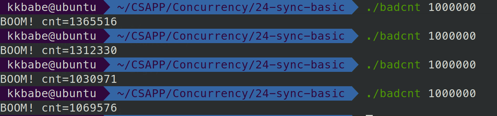

# 12.3 基于线程的并发编程

到目前为止，我们已经看到了两种创建并发逻辑流的方法。

在第一种方法中，**我们为每个流使用了单独的进程**。内核会自动调度每个进程. 而每个进程有它自己的私有地址空间，这使得流共享数据很困难。

在第二种方法中，我们创建自己的逻辑流，并利用 **I/O 多路复用来显式地调度流**。因为只有一个进程，所有的流共享整个地址空间。本节介绍第三种方法——基于线程，它是这两种方法的混合。

**线程**（thread）就是**运行在进程上下文中的逻辑流**。在本书里迄今为止，程序都是由每个进程中一个线程组成的。但是现代系统也允许我们编写一个进程里同时运行多个线程的程序。**线程由内核自动调度**。

每个线程都有它自己的**线程上下文**（thread context），包括一个唯一的整数**线程 ID**（Thread ID，TID）、**栈、栈指针、程序计数器、通用目的寄存器和条件码**。所有的运行在一个进程里的线程**共享该进程的整个虚拟地址空间**。

基于线程的逻辑流结合了基于进程和基于 I/O 多路复用的流的特性。同进程一样，线程由内核自动调度，并且内核通过一个整数 ID 来识别线程。同基于 I/O 多路复用的流一样，多个线程运行在单一进程的上下文中，因此共享这个进程虚拟地址空间的所有内容，包括它的代码、数据、堆、共享库和打开的文件。


## 12.3.1 线程执行模型

多线程的执行模型在某些方面和多进程的执行模型是相似的。思考图 12-12 中的示例。每个进程开始生命周期时都是单一线程，这个线程称为**主线程**（main thread）。在某一时刻，主线程创建一个**对等线程**（peer thread），从这个时间点开始，两个线程就并发地运行。最后，因为主线程执行一个慢速系统调用，例如 read 或者 sleep，或者因为被系统的间隔计时器中断，控制就会通过上下文切换传递到对等线程。对等线程会执行一段时间，然后控制传递回主线程，依次类推。


在一些重要的方面，线程执行是不同于进程的。因为一个**线程的上下文要比一个进程的上下文小得多**，线程的上下文切换要比进程的上下文切换快得多。另一个不同就是线程不像进程那样，不是按照严格的父子层次来组织的。和一个进程相关的线程组成一个**对等（线程）池**，独立于其他线程创建的线程。**主线程和其他线程的区别仅在于它总是进程中第一个运行的线程**。对等（线程）池概念的主要影响是，**一个线程可以杀死它的任何对等线程，或者等待它的任意对等线程终止。**另外，每个对等线程都能读写相同的共享数据。

> wow，这里很重要，线程是没有地位区别的，都是同等地位！！！


## 12.3.2 Posix 线程


——注意，线程函数返回值必须是void*,参数也必须是void *

**Posix 线程（Pthreads）**是在 C 程序中处理线程的一个标准接口。它最早出现在 1995 年，而且在所有的 Linux 系统上都可用。Pthreads 定义了大约 60 个函数，允许程序创建、杀死和回收线程，与对等线程安全地共享数据，还可以通知对等线程系统状态的变化。

图 12-13 展示了一个简单的 Pthreads 程序。

```c
#include "csapp.h"
void *thread(void *vargp);

int main()
{
    pthread_t tid;
    Pthread_create(&tid, NULL, thread, NULL);
    Pthread_join(tid, NULL);
    exit(0);
}

void *thread(void *vargp) /* Thread routine */
{
    printf("Hello, world!\n");
    return NULL;
}
//图 12-13 hello.c：使用 Pthreads 的 “Hello, world!” 程序
```

 

主线程创建一个对等线程，然后等待它的终止。对等线程输岀 “Hello, world!\n” 并且终止。当主线程检测到对等线程终止后，它就通过调用 exit 终止该进程。这是我们看到的第一个线程化的程序，所以让我们仔细地解析它。线程的代码和本地数据被封装在一个**线程例程**（thread routine）中。正如第二行里的原型所示，每个线程例程都以一个通用指针作为输入，并返回一个通用指针。如果想传递多个参数给线程例程，那么你应该将参数放到一个结构中，并传递一个指向该结构的指针。相似地，如果想要线程例程返回多个参数，你可以返回一个指向一个结构的指针。

第 4 行标出了主线程代码的开始。主线程声明了一个本地变量 tid，可以用来存放对等线程的 ID（第 6 行）。主线程通过调用 **pthread_create 函数创建一个新的对等线程**（第 7 行）。当对 pthread_create 的调用返回时，主线程和新创建的对等线程同时运行，并且 tid 包含新线程的 ID。通过在第 8 行调用 **pthread_join，主线程等待对等线程终止**。最后，主线程调用 exit（第 9 行），终止当时运行在这个进程中的所有线程（在这个示例中就只有主线程）。

第 12 ~ 16 行定义了对等线程的例程。它只打印一个字符串，然后就通过执行第 15 行中的 **return 语句来终止对等线程**。

> 注意：线程在这个函数return时就结束了.


可以看到，我们的main线程执行main的函数，在return 0后exit，而新线程从函数return就terminate终止了.


我们如果在中间加一句bye，如下


可以看到，在create之后，我们的新线程打印Hello,wolrd后就return了，然后就终止了，main线程打印一个bye，然后用join等新线程终止，才继续执行。

## 12.3.3 创建线程

线程通过调用 pthread_create 函数来创建其他线程

```c
#include <pthread.h>
typedef void *(func)(void *);

int pthread_create(pthread_t *tid, pthread_attr_t *attr,func *f, void *arg);

// 若成功则返回 0，若出错则为非零。
```

pthread_create 函数创建一个新的线程，并带着一个**输入变量 arg**，在新线程的上下文中运行**线程例程 f**。能用 **attr 参数来改变新创建线程的默认属性**。改变这些属性已超出我们学习的范围，在我们的示例中，总是用一个为 NULL 的参数来调用 pthread_create 函数。

**返回值：若成功则返回 0，若出错则为非零。**

当 pthread_create 返回时，参数 **tid 包含新创建线程的 ID**。新线程可以通过调用 **pthread_self** 函数来获得它自己的线程 ID。

```c
#include <pthread.h>

pthread_t pthread_self(void);

// 返回调用者的线程 ID。
```


## 12.3.4 终止线程

——贯彻整个的原则是，我们的所有线程都终止，进程才会终止

一个线程是以下列方式之一来终止的：:eagle:

* **当顶层的线程例程返回时**，线程会**隐式地**终止。

* 通过调用 **pthread_exit** 函数，线程会显式地终止。**如果主线程调用 pthread_exit，它会等待所有其他对等线程终止，然后再终止主线程和整个进程，返回值为 thread_return**。
* 对等线程调用**exit**函数，该函数终止该进程的所有线程并终止该进程
* **pthread_cancel(pid)**,对等线程调用该函数，终止线程ID为tid的线程


### 1.线程例程return时,线程会隐式终止

:1st_place_medal: 先来看第一点——顶层线程返回时，线程会隐式地终止(这个意思不是说main线程返回，子线程会隐式的终止，而是说thread函数return时，自动终止这个线程，return自动终止这个子线程是显然的，我们来测试，main线程返回时不会使子线程终止)

```c
#include <csapp.c>
#include <sys/syscall.h>
void *thread(void *vargp);
pthread_t main_tid;
int main()
{
    main_tid = pthread_self();   //全局变量tid=main线程
    pthread_t tid;
    Pthread_create(&tid, NULL, thread, NULL);
    printf("Main Hello\n");
    syscall(SYS_exit, 0);
    printf("Main Bye\n");
}

void *thread(void *vargp) /* Thread routine */
{
    printf("Hello, world!\n");
    sleep(2);
    int num = 0;
    while (num < 10){
        sleep(1);
        printf("Thread spin\n");
        num ++;
    }
    printf("Thread Bye\n");
}
```

结果：


我们可以看到，父线程__exit时，我们的子线程仍然在运行，并且thread return终止时，此时所有线程都终止了，那么进程就终止.


### 2.**主线程**调用pthread_exit会等待其他对等线程终止后,终止当前线程并终止整个进程，返回值为 thread_return

```c
#include <pthread.h>

void pthread_exit(void *thread_return);

// 从不返回。
```

:2nd_place_medal:第二点，主线程调用pthread_exit，它会等待所有其他对等线程终止，然后再终止这个线程和整个进程.

```c
#include <csapp.c>
void *thread(void *vargp);

int main()
{
    pthread_t tid;
    Pthread_create(&tid, NULL, thread, NULL);
    printf("Main Hello\n");
    pthread_exit(0);
    printf("Main Bye\n");
}

void *thread(void *vargp) /* Thread routine */
{
    printf("Hello, world!\n");
    while (1)
    ;
    return NULL;
}
```

在这个例子中，由于子线程不会终止，所以主线程用pthread_exit来对等线程终止，会卡在那，如下图


再举一个例子，看看成功用pthread等待对等线程终止是什么效果.

```c
#include <csapp.c>
void *thread(void *vargp);

int main()
{
    pthread_t tid;
    Pthread_create(&tid, NULL, thread, NULL);
    Pthread_create(&tid, NULL, thread, NULL);
    printf("Main Hello\n");
    pthread_exit(0);
    printf("Main Bye\n");
}

void *thread(void *vargp) /* Thread routine */
{
    printf("Hello, world!\n");
    sleep(2);
    return NULL;
}
```


这里有三个知识：

* pthread_exit要等所有对等线程都终止了才会返回，所以两个Hello.World都会打印
* pthread_exit等对等线程都终止了以后，Main线程不会继续执行，而是执行退出，所以不会打印Main Bye
* 经测试，必须是**主线程**调用pthread_exit才有用.


### 3.某个线程调用exit函数,会终止所有线程以及这个进程(exit_group)

:3rd_place_medal:**某个对等线程调用 Linux 的 exit 函数，该函数终止进程以及所有与该进程相关的线程。**

见下面的例子：

```c
#include <csapp.c>
void *thread(void *vargp);

int main()
{
    pthread_t tid;
    Pthread_create(&tid, NULL, thread, NULL);
    printf("Main Hello\n");
    while (1)
    ;
}

void *thread(void *vargp) /* Thread routine */
{
    printf("Hello, world!\n");
    sleep(2);
    exit(0);
}
```

可以看到，在子线程，我们调用exit(0)，main线程是while(1)的循环的

结果如下：


可以看到，确实是exit了.

我们在jyy的笔记虚拟化——进程抽象中就说了这件事：


(其中，__exit()其实是syscall(SYS_exit, 0);)

**我们的exit和_exit，都是调用exit_group(),不仅调用exit的该线程，还终止调用该进程的线程组的所有线程！！**

我们如果把exit改成syscall(SYS_exit,0)的话，就不会终止所有线程，如下:


另外，我们**main**函数的return 0，是**exit_group()**，所以这就是为什么，我们main函数return 0时，子线程就自动终止，并且把整个进程终止啦


### 4.线程执行pthread_cancel(tid)函数来终止tid线程。

:four:另一个对等线程通过以当前线程 ID 作为参数调用 pthread_Cancel 函数来终止当前线程。

```c
#include <pthread.h>

int pthread_cancel(pthread_t tid);

// 若成功则返回 0，若出错则为非零。
```

pthread_cancel是指定一个线程去终止他.

举一个例子吧：

```c
#include <csapp.c>
void *thread(void *vargp);
pthread_t main_tid;
int main()
{
    main_tid = pthread_self();   //全局变量tid=main线程
    pthread_t tid;
    Pthread_create(&tid, NULL, thread, NULL);
    printf("Main Hello\n");
    while (1){
        sleep(1);
        printf("Main spin\n");
    }    
    printf("Main Bye\n");

}

void *thread(void *vargp) /* Thread routine */
{
    printf("Hello, world!\n");
    sleep(2);
    pthread_cancel(main_tid);
    while (1){
        sleep(1);
        printf("Thread spin\n");
    }
    printf("Thread Bye\n");
}
```


可以看到，在这里，我们的thread去pthread_cancle(main_tid)去终止main线程，确实成功终止了，然后我们的thread继续执行.


## 12.3.5 回收已终止线程的资源(pthread_join)

线程通过调用 pthread_join 函数等待其他线程终止。

```c
#include <pthread.h>

int pthread_join(pthread_t tid, void **thread_return);

// 若成功则返回 0，若出错则为非零。
```

pthread_join 函数会**阻塞**，直到线程 **tid 终止**，将线程例程返回的通用 **(void *)** 指针赋值为 **thread_return** 指向的位置，然后**回收已终止线程占用的所有内存资源**。

注意，和 Linux 的 wait 函数不同，pthread_join 函数只能等待一个指定的线程终止。没有办法让 pthread_wait 等待任意一个线程终止。这使得代码更加复杂，因为它迫使我们去使用其他一些不那么直观的机制来检测进程的终止。实际上，Stevens 在【110】中就很有说服力地论证了这是规范中的一个错误。


## 12.3.6 分离线程(pthread_detach)

在任何一个时间点上，线程是**可结合的**（joinable）或者是**分离的**（detached）。

一个**可结合的线程**能够被其他线程收回和杀死。在被其他线程回收之前，它的内存资源（例如栈）是**不释放**的。

相反，一个**分离的线程**是不能被其他线程回收或杀死的。它的内存资源在它终止时由**系统自动释放**。

**默认情况下，线程被创建成可结合的**。为了避免内存泄漏，**每个可结合线程都应该要么被其他线程显式地收回，要么通过调用 pthread_detach 函数被分离**。


```c
#include <pthread.h>
int pthread_detach(pthread_t tid);
// 若成功则返回 0，若出错则为非零。
```

pthread_detach 函数分离一个可结合线程 tid。线程能够通过以 pthread_self() 参数的 pthread_detach 调用来分离它们自己。

尽管我们的一些例子会使用可结合线程，但是在现实程序中，有很好的理由要使用分离的线程。例如，**一个高性能 Web 服务器可能在每次收到 Web 浏览器的连接请求时都创建一个新的对等线程。因为每个连接都是由一个单独的线程独立处理的，所以对于服务器而言，就很没有必要（实际上也不愿意）显式地等待每个对等线程终止。在这种情况下，每个对等线程都应该在它开始处理请求之前分离它自身，这样就能在它终止后回收它的内存资源了。**


## 12.3.7 初始化线程(pthread_once)

在多线程环境中，有些事仅需要执行一次。通常当初始化应用程序时，可以比较容易地将其放在main函数中。但当你写一个库时，就不能在main里面初始化了，你可以用静态初始化，但使用一次初始化（pthread_once）会比较容易些。

pthread_once 函数允许你**初始化与线程例程相关的状态**。

```c
#include <pthread.h>

pthread_once_t once_control = PTHREAD_ONCE_INIT;

int pthread_once(pthread_once_t *once_control,
                 void (*init_routine)(void));

// 总是返回 0。
```

once_control 变量是一个全局或者静态变量，总是被初始化为 PTHREAD_ONCE_INIT。（本函数使用初值为PTHREAD_ONCE_INIT的once_control变量保证init_routine()函数在本进程执行序列中仅执行一次。）

当你**第一次**用参数 once_control 调用 pthread_once 时，它调用 **init_routine**，这是一个没有输入参数、也不返回什么的函数。

**接下来**的以 once_control 为参数的 pthread_once 调用不做任何事情。无论何时，**当你需要动态初始化多个线程共享的全局变量时，pthread_once 函数是很有用的**。我们将在 12.5.5 节里看到一个示例。

(现在还没看懂啥意思，等学到后面再回头看吧)


## 12.3.8 基于线程的并发服务器

图 12-14 展示了基于线程的并发 echo 服务器的代码。

```c

#include <csapp.c>
void echo(int connfd);
void *thread(void *vargp);

int main(int argc, char **argv)
{
    int listenfd, *connfdp, port;
    socklen_t clientlen = sizeof(struct sockaddr_in);
    struct sockaddr_in clientaddr;
    pthread_t tid;

    if (argc != 2) {
        fprintf(stderr, "usage: %s <port>\n", argv[0]);
        exit(0);
    }
    port = atoi(argv[1]);	//接收argv[1]为端口号
    listenfd = Open_listenfd(port);	//在port端口上创建一个监听描述符
    while (1) {
        // 为了避免对等线程的赋值语句和主线程的accept语句间引入的竞争
        connfdp = Malloc(sizeof(int));
        *connfdp = Accept(listenfd, (SA *) &clientaddr, &clientlen);	//fd
        Pthread_create(&tid, NULL, thread, connfdp);	//产生一个线程去处理
    }
}

void echo(int connfd)
{
    size_t n;
    char buf[MAXLINE];
    rio_t rio;

    Rio_readinitb(&rio, connfd);
    while ((n = Rio_readlineb(&rio, buf, MAXLINE)) != 0) {
        printf("server received %d bytes\n", n);
        Rio_writen(connfd, buf, n);
    }
}

void *thread(void *vargp)
{
    int connfd = *((int *)vargp);
    Pthread_detach(pthread_self());
    Free(vargp);
    echo(connfd);
    Close(connfd);
    return NULL;
}
```


整体结构类似于基于进程的设计。主线程不断地等待连接请求，然后创建一个对等线程处理该请求。虽然代码看似简单，但是有几个普遍而且有些微妙的问题需要我们更仔细地看一看。第一个问题是当我们调用 pthread_create 时，如何将已连接描述符传递给对等线程。最明显的方法就是传递一个指向这个描述符的指针，就像下面这样

```c
connfd = Accept(listenfd, (SA *) &clientaddr, &clientlen);
Pthread_create(&tid, NULL, thread, &connfd);
```

然后，我们让对等线程间接引用这个指针，并将它赋值给一个局部变量，如下所示

```c
void *thread(void *vargp) {
    int connfd = *((int *)vargp);
    .
    .
    .
}
```

然而，这样可能会出错，因为它在对等线程的赋值语句和主线程的 accept 语句间引入了**竞争**（race）。如果赋值语句在下一个 accept 之前完成，那么对等线程中的局部变量 connfd 就得到正确的描述符值。然而，如果赋值语句是在 accept 之后才完成的，那么对等线程中的局部变量 connfd 就得到下一次连接的描述符值。那么不幸的结果就是，现在两个线程在同一个描述符上执行输入和输出。为了避免这种潜在的致命竞争，我们必须将 accept 返回的每个已连接描述符分配到它自己的动态分配的内存块，如第 21~22 行所示。我们会在 12.7.4 节中回过来讨论竞争的问题。

另一个问题是在线程例程中避免**内存泄漏**。既然不显式地收回线程，就必须**分离每个线程**，使得在它终止时它的内存资源能够被收回（第 43 行）。更进一步，我们必须小心**释放主线程分配的内存块**（第 44 行）。


# 12.4 多线程程序中的共享变量

从程序员的角度来看，线程很有吸引力的一个方面是**多个线程很容易共享相同的程序变量**。然而，这种共享也是很棘手的。为了编写正确的多线程程序，我们必须对所谓的共享以及它是如何工作的有很清楚的了解。

为了理解 C 程序中的一个变量是否是共享的，有一些基本的问题要解答：

1. 线程的基础内存模型是什么？
2. 根据这个模型，变量实例是如何映射到内存的？
3. 最后，有多少线程引用这些实例？一个变量是**共享的**，当且仅当多个线程引用这个变量的某个实例。

为了让我们对共享的讨论具体化，我们将使用图 12-15 中的程序作为运行示例。尽管有些人为的痕迹，但是它仍然值得研究，因为它说明了关于共享的许多细微之处。示例程序由一个创建了两个对等线程的主线程组成。主线程传递一个唯一的 ID 给每个对等线程，每个对等线程利用这个 ID 输出一条个性化的信息，以及调用该线程例程的总次数。

```c
#include "csapp.h"
#define N 2
void *thread(void *vargp);

char **ptr; /* Global variable */

int main()
{
    int i;
    pthread_t tid;
    char *msgs[N] = {
        "Hello from foo",
        "Hello from bar"
    };

    ptr = msgs;
    for (i = 0; i < N; i++)
        Pthread_create(&tid, NULL, thread, (void *)i);
    Pthread_exit(NULL);
}

void *thread(void *vargp)
{
    int myid = (int)vargp;
    static int cnt = 0;
    printf("[%d]: %s (cnt=%d)\n", myid, ptr[myid], ++cnt);
    return NULL;
}
```


## 12.4.1 线程内存模型

一组并发线程运行在一个**进程的上下文中**。每个线程都有它自己**独立的线程上下文，包括线程 ID、栈、栈指针、程序计数器、条件码和通用目的寄存器值。**每个线程和其他线程一起**共享进程上下文的剩余部分。这包括整个用户虚拟地址空间，它是由只读文本（代码）、读/写数据、堆以及所有的共享库代码和数据区域组成的**。线程也**共享相同的打开文件的集合**。

从实际操作的角度来说，让一个线程去读或写另一个线程的寄存器值是不可能的。另一方面，任何线程都可以访问共享虚拟内存的任意位置。如果某个线程修改了一个内存位置，那么其他每个线程最终都能在它读这个位置时发现这个变化。因此，寄存器是从不共享的，而虚拟内存总是共享的。

各自独立的线程栈的内存模型不是那么整齐清楚的。这些栈被保存在虚拟地址空间的栈区域中，并且通常是被相应的线程独立地访问的。我们说通常而不是总是，是因为不同的线程栈是不对其他线程设防的。所以，如果一个线程以某种方式得到一个指向其他线程栈的指针，那么它就可以读写这个栈的任何部分。示例程序在第 26 行展示了这一点，其中对等线程直接通过全局变量 ptr 间接引用主线程的栈的内容。


## 12.4.2 将变量映射到内存

多线程的 C 程序中变量根据它们的存储类型被映射到虚拟内存：

* **全局变量。**全局变量是定义在函数之外的变量。在运行时，虚拟内存的读/写区域只包含每个全局变量的一个实例，任何线程都可以引用。例如，第 5 行声明的全局变量 ptr 在虚拟内存的读/写区域中有一个运行时实例。当一个变量只有一个实例时，我们只用变量名（在这里就是 ptr）来表示这个实例。

* **本地自动变量。**本地自动变量就是定义在函数内部但是没有 static 属性的变量。在运行时，每个线程的栈都包含它自己的所有本地自动变量的实例。即使多个线程执行同一个线程例程时也是如此。例如，有一个本地变量 tid 的实例，它保存在主线程的栈中。我们用 **tid.m** 来表示这个实例。再来看一个例子，本地变量 myid 有两个实例，一个在对等线程。的栈内，另一个在对等线程 1 的栈内。我们将这两个实例分别表示为 **myid.p0** 和 **myid.p1**。

* **本地静态变量。**本地静态变量是定义在函数内部并有 static 属性的变量。和全局变量一样，虚拟内存的读/写区域只包含在程序中声明的每个本地静态变量的一个实例。例如，即使示例程序中的每个对等线程都在第 25 行声明了 cnt，在运行时，虚拟内存的读/写区域中也只有一个 cnt 的实例。每个对等线程都读和写这个实例。

## 12.4.3 共享变量

我们说一个变量 v 是共享的，当且仅当它的一个实例被一个以上的线程引用。例如，示例程序中的变量 cnt 就是共享的，因为它只有一个运行时实例，并且这个实例被两个对等线程引用。在另一方面，myid 不是共享的，因为它的两个实例中每一个都只被一个线程引用。然而，认识到像 msgs 这样的本地自动变量也能被共享是很重要的。


​	 说明：

- ptr：一个被主线程写和被对等线程读的全局变量。

- cnt：一个静态变量，在内存中只有一个实例，被两个对等线程读和写。

- i.m：一个存储在主线程栈中的本地自动变量。虽然它的值被传递给对等线程，但是对等线程也绝不会在栈中引用它，因此它不是共享的。

- msgs.m：一个存储在主线程栈中的本地自动变量，被两个对等线程通过 ptr 间接地引用。

- myid.0 和 myid.1；—个本地自动变量的实例，分别驻留在对等线程 0 和线程 1 的栈中。

  B. 变量 ptr、ent 和 msgs 被多于一个线程引用，因此它们是共享的。


# 12.5 用信号量同步线程

共享变量是十分方便，但是它们也引入了**同步错误**（synchronization error）的可能性。考虑图 12-16 中的程序 badcnt.c，它创建了两个线程，每个线程都对共享计数变量 cnt 加 1。

`badcnt.c`

```c
/* WARNING: This code is buggy! */
#include "csapp.h"

void *thread(void *vargp); /* Thread routine prototype */

/* Global shared variable */
volatile long cnt = 0; /* Counter */

int main(int argc, char **argv)
{
    long niters;
    pthread_t tid1, tid2;

    /* Check input argument */
    if (argc != 2) {
        printf("usage: %s <niters>\n", argv[0]);
        exit(0);
    }
    niters = atoi(argv[1]);

    /* Create threads and wait for them to finish */
    Pthread_create(&tid1, NULL, thread, &niters);
    Pthread_create(&tid2, NULL, thread, &niters);
    Pthread_join(tid1, NULL);
    Pthread_join(tid2, NULL);

    /* Check result */
    if (cnt != (2 * niters))
        printf("BOOM! cnt=%ld\n", cnt);
    else
        printf("OK cnt=%ld\n", cnt);
    exit(0);
}

/* Thread routine */
void *thread(void *vargp)
{
    long i, niters = *((long *)vargp);

    for (i = 0; i < niters; i++)
        cnt++;

    return NULL;
}

```

> 图 12-16 badcnt.c：一个同步不正确的计数器程序

因为每个线程都对计数器增加了 niters 次，我们预计它的最终值是 2 × niters。这看上去简单而直接。然而，当在 Linux 系统上运行 badcnt.c 时，我们不仅得到错误的答案，而且每次得到的答案都还不相同！



我们ubuntu上得到的汇编代码记录一下吧：

```assembly
0000000000401c20 <thread>:
  401c20:       48 8b 0f                mov    (%rdi),%rcx
  401c23:       48 85 c9                test   %rcx,%rcx
  401c26:       7e 20                   jle    401c48 <thread+0x28>
  401c28:       b8 00 00 00 00          mov    $0x0,%eax
  401c2d:       48 8b 15 5c 36 20 00    mov    0x20365c(%rip),%rdx        # 605290 <cnt>
  401c34:       48 83 c2 01             add    $0x1,%rdx
  401c38:       48 89 15 51 36 20 00    mov    %rdx,0x203651(%rip)        # 605290 <cnt>
  401c3f:       48 83 c0 01             add    $0x1,%rax
  401c43:       48 39 c8                cmp    %rcx,%rax
  401c46:       75 e5                   jne    401c2d <thread+0xd>
  401c48:       b8 00 00 00 00          mov    $0x0,%eax
  401c4d:       c3                      retq   

```

那么哪里出错了呢？为了清晰地理解这个问题，我们需要研究计数器循环（第 40 ~ 41 行）的汇编代码，如图 12-17 所示。


我们发现，将线程 i 的循环代码分解成五个部分是很有帮助的：


H:<Header> L:<Load> U:<Update> S:<Store> T:<Tailer>


当 badcnt.c 中的两个对等线程在一个单处理器上并发运行时，机器指令以某种顺序一个接一个地完成。因此，每个并发执行定义了两个线程中的指令的某种全序（或者交叉）。不幸的是，这些顺序中的一些将会产生正确结果，但是其他的则不会。

这里有个关键点：**一般而言，你没有办法预测操作系统是否将为你的线程选择一个正确的顺序。**例如，图 12-18a 展示了一个正确的指令顺序的分步操作。在每个线程更新了共享变量 cnt 之后，它在内存中的值就是 2，这正是期望的值。

另一方面，图 12-18b 的顺序产生一个不正确的 cnt 的值。会发生这样的问题是因为，线程 2 在第 5 步加载 ent，是在第 2 步线程 1 加载 cnt 之后，而在第 6 步线程 1 存储它的更新值之前。因此，每个线程最终都会存储一个值为 1 的更新后的计数器值。我们能够借助于一种叫做**进度图**（progress graph）的方法来阐明这些正确的和不正确的指令顺序的概念，这个图我们将在下一节中介绍。


具体这个在下节介绍，这里我们看到，正确的顺序中，LOAD和STORE中间没有插入另一个LOAD。

而错误的顺序中，LOAD1和STORE1中间插入了一个LOAD2.


## 12.5.1 进度图


进度图将指令执行模型化为从一种状态到另一种状态的**转换**（transition）。转换被表示为一条从一点到相邻点的有向边。**合法的转换**是**向右**（线程 1 中的一条指令完成）或者向上（线程 2 中的一条指令完成）的。**两条指令不能在同一时刻完成一对角线转换是不允许的**。程序决**不会反向运行**，所以**向下或者向左移动的转换也是不合法的**。

一个程序的执行历史被模型化为状态空间中的一条轨迹线。图 12-20 展示了下面指令顺序对应的轨迹线：


我**们的每个点，表示刚完成了这个点的任务**。比如(H1,L2),表示线程1刚执行完H1，线程2刚执行完L2.

这个正方形的内部表示不安全区，**不包括边界的点**。

我们原点是O，第一个坐标是H，第二个坐标是L，....

OK,那么就可以分析这个不安全区了：

* 线程1是L1时，即刚执行LOAD，如果线程2是L2或者U2，即刚LOAD完或者UPDATE完，这是不安全的
* 线程1是U1时，线程2的L2或U2依然是不安全的


进度图就是这样的，如果从旁边擦过去没关系，穿过去就是错的.

感觉可以用进度图的思想实现一个并发bug检测器，待完成todo...


## 12.5.2 信号量

Edsger Dijkstra，并发编程领域的先锋人物，提出了一种经典的解决同步不同执行线程问题的方法，这种方法是基于一种叫做**信号量**（semaphore）的特殊类型变量的。**信号量 s 是具有非负整数值的全局变量**，只能由两种特殊的操作来处理，这两种操作称为 **P 和 V**：

- **P(s)：测试** 如果s是非零的，P将sj减1，并立即返回。如果s为零，那么就挂起这个线程，直到s变为非零。而一个 V 操作会重启这个线程。在重启之后，P 操作将 s 减 1，并将控制返回给调用者。

  ```c
  // 这里的代码仅仅是为了模拟，不是真正的，真正的需要保证一定的原子性
  void P(s){
      while (s == 0)
          ;
      s -= 1;
  }
  ```

- **V(s)：增加** V操作将s加1。如果有任何线程阻塞在P操作等待s变成非零，那么V操作会重启这些线程中的一个。

  ```c
  void V(s){
      s += 1;
  }
  ```

  **P 中的测试和减 1 操作是不可分割的**，也就是说，**一旦预测信号量 s 变为非零，就会将 s 减 1，不能有中断。**（这个不可分割的语义，使得测试如果不是0，就会立即-1，信号s不可能出现负数的情况）

  **V 中的加 1 操作也是不可分割的**，也就是**Load、加 1 和Store信号量的过程中没有中断**。注意，V 的定义中没有定义等待线程被重启动的顺序。唯一的要求是 V 必须**只能重启一个正在等待的线程**。**因此，当有多个线程在等待同一个信号量时，你不能预测 V 操作要重启哪一个线程。**

  （V不可分割的语义，并且s+=1后，只能有一个退出s=0的自旋，也保证信号s不可能出现负数的情况）

  ——信号量ss绝不可能变为负值，这种属性称为**信号量不变性**，这为控制并发程序的轨迹线提供了强有力的工具，在下一节中我们将看到。

  信号量提供一种方便的方法来确保对**共享变量的互斥访问**，基本思想就是**将每个共享变量和一个信号量联系起来**，然后使用P(s)和V(s)将相应的**临界区包围**起来

  这种信号量又称为**二元信号量**，因为它的值总是0或1，也常叫做**互斥锁**，相应的**P和V**操作就叫做**加锁**和**解锁**

  > s的意义和锁很像
  >
  > s=1,说明当前没有线程正在获得锁，所以当前的锁是可获取的.
  >
  > s=0,说明当前如果有线程想进程P操作，就会卡在while循环，直到获得锁的那个线程用P(V)释放了锁.


Posix 标准定义了许多操作信号量的函数。

```c
#include <semaphore.h>

int sem_init(sem_t *sem, 0, unsigned int value);
int sem_wait(sem_t *s); /* P(s) */
int sem_post(sem_t *s); /* V(s) */

// 返回：若成功则为 0，若出错则为 -1。
```

* sem_init 函数将信号量 sem 初始化为 value。每个信号量在使用前必须初始化。针对我们的目的，中间的参数总是零。
* 程序分别通过调用 sem_wait 和 sem_post 函数来执行 P 和 V 操作。为了简明，我们更喜欢使用下面这些等价的 P 和 V 的包装函数：

```c
#include "csapp.h"

void P(sem_t *s); /* Wrapper function for sem_wait */
void V(sem_t *s); /* Wrapper function for sem_post */

// 返回：无。
```


## 12.5.3 使用信号量来实现互斥

信号量提供了一种很方便的方法来确保对共享变量的**互斥访问**。基本思想是将每个共享变量（或者一组相关的共享变量）与一个信号量 s（初始为 1）联系起来，然后用P(s)和V(s)操作将相应的临界区包围起来。

以这种方式来保护共享变量的信号量叫做**二元信号量**（binary semaphore），因为它的值总是 0 或者 1。以提供互斥为目的的二元信号量常常也称为**互斥锁**（**mutex**）。在一个互斥锁上执行 **P 操作称为对互斥锁加锁**。类似地，**执行 V 操作称为对互斥锁解锁**。对一个互斥锁加了锁但是还没有解锁的线程称为**占用这个互斥锁**。一个被用作一组**可用资源的计数器**的信号量被称为**计数信号量**。

图 12-22 中的进度图展示了我们如何利用二元信号量来正确地同步计数器程序示例。每个状态都标出了该状态中信号量 s 的值。关键思想是这种 P 和 V 操作的结合创建了一组状态，叫做**禁止区**（forbidden region），其中因为信号量的不变性，没有实际可行的轨迹线能够包含禁止区中的状态。而且，因为禁止区完全包括了不安全区，所以没有实际可行的轨迹线能够接触不安全区的任何部分。因此，每条实际可行的轨迹线都是安全的，而且不管运行时指令顺序是怎样的，程序都会正确地增加计数器值。


从可操作的意义上来说，由 P 和 V 操作创建的禁止区使得在任何时间点上，在被包围的临界区中，不可能有多个线程在执行指令。换句话说，**信号量操作确保了对临界区的互斥访问**。

总的来说，为了用信号量正确同步图 12-16 中的计数器程序示例，我们首先声明一个**信号量 mutex**：

```c
volatile long cnt = 0; /* Counter */
sem_t mutex;           /* Semaphore that protects counter */
```

然后在主例程中将 **mutex 初始化为 1**：

```c
Sem_init(&mutex, 0, 1); /* mutex = 1 */
```

最后，我们通过把在线程例程中对共享变量 cnt 的更新包围 P 和 V 操作，从而保护它们：

```c
for (i = 0; i < niters; i++) {
    P(&mutex);
    cnt++;
    V(&mutex);
}
```

总的代码如下：

```c
/* 
 * goodcnt.c - A correctly synchronized counter program 
 */
/* $begin goodcnt */
#include "csapp.h"

void *thread(void *vargp); /* Thread routine prototype */

/* Global shared variables */
/* $begin goodcntsemdef */
    volatile long cnt = 0; /* Counter */
    sem_t mutex;           /* Semaphore that protects counter */
/* $end goodcntsemdef */

int main(int argc, char **argv) 
{
    int niters;
    pthread_t tid1, tid2;

    /* Check input argument */
    if (argc != 2) {
	printf("usage: %s <niters>\n", argv[0]);
	exit(0);
    }
    niters = atoi(argv[1]);

    /* Create threads and wait for them to finish */
/* $begin goodcntseminit */
    Sem_init(&mutex, 0, 1);  /* mutex = 1 */
/* $end goodcntseminit */
    Pthread_create(&tid1, NULL, thread, &niters);
    Pthread_create(&tid2, NULL, thread, &niters);
    Pthread_join(tid1, NULL);
    Pthread_join(tid2, NULL);

    /* Check result */
    if (cnt != (2 * niters))
	printf("BOOM! cnt=%ld\n", cnt);
    else
	printf("OK cnt=%ld\n", cnt);
    exit(0);
}

/* Thread routine */
void *thread(void *vargp) 
{
    int i, niters = *((int *)vargp);

/* $begin goodcntthread */
    for (i = 0; i < niters; i++) {
	P(&mutex);
	cnt++;
	V(&mutex);
    }
/* $end goodcntthread */
    return NULL;
}
/* $end goodcnt */


```


当我们运行这个正确同步的程序时，现在它每次都能产生正确的结果了。


> ## 旁注 - 进度图的局限性
>
> 进度图给了我们一种较好的方法，将在单处理器上的并发程序执行可视化，也帮助我们理解为什么需要同步。然而，它们确实也有局限性，特别是对于在多处理器上的并发执行，在多处理器上一组 CPU/高速缓存对共享同一个主存。多处理器的工作方式是进度图不能解释的。特别是，一个多处理器内存系统可以处于一种状态，不对应于进度图中任何轨迹线。不管如何，结论总是一样的：无论是在单处理器还是多处理器上运行程序，都要同步你对共享变量的访问。


## 12.5.4 利用信号量来调度共享资源

除了提供互斥之外，信号量的另一个重要作用是调度对共享资源的访问。在这种场景中，一个线程用信号量操作来通知另一个线程，程序状态中的某个条件已经为真了。两个经典而有用的例子是**生产者—消费者**和**读者—写者**问题。

### 1. 生产者—消费者问题

图 12-23 给出了生产者—消费者问题。生产者和消费者线程共享一个**有 n 个槽的有限缓冲区**。生产者线程反复地生成新的**项目**（item），并把它们插入到缓冲区中。消费者线程不断地从缓冲区中取出这些项目，然后消费（使用）它们。也可能有多个生产者和消费者的变种。


因为插入和取出项目都涉及更新共享变量，所以我们必须保证对缓冲区的访问是互斥的。但是只保证互斥访问是不够的，我们还需要调度对缓冲区的访问。如果缓冲区是满的（没有空的槽位），那么生产者必须等待直到有一个槽位变为可用。与之相似，如果缓冲区是空的（没有可取用的项目），那么消费者必须等待直到有一个项目变为可用。

生产者—消费者的相互作用在现实系统中是很普遍的。例如，在一个多媒体系统中，生产者编码视频帧，而消费者解码并在屏幕上呈现出来。缓冲区的目的是为了减少视频流的抖动，而这种抖动是由各个帧的编码和解码时与数据相关的差异引起的。缓冲区为生产者提供了一个槽位池，而为消费者提供一个已编码的帧池。另一个常见的示例是图形用户接口设计。生产者检测到鼠标和键盘事件，并将它们插入到缓冲区中。消费者以某种基于优先级的方式从缓冲区取出这些事件，并显示在屏幕上。

在本节中，我们将开发一个简单的包，叫做 **SBUF**，用来构造生产者—消费者程序。在下一节里，我们会看到如何用它来构造一个基于预线程化（prethreading）的有趣的并发服务器。SBUF 操作类型为 sbuf_t 的**有限缓冲区**（图 12-24）。

* **项目**存放在一个动态分配的 1 项**整数数组**（**buf**）中。
* **front 和 rear 索引值记录该数组中的第一项和最后一项**。
* 三个信号量同步对缓冲区的访问。**mutex 信号量提供互斥的缓冲区访问**。**slots 和 items 信号量分别记录空槽位和可用项目的数量。**

> 我们给每一个资源一个信号，来控制这个资源。我们给buf缓冲区一个mutex信号量，表示同时只能有一个线程去修改buf。空槽slots也是一个资源，这是对于生产者而言的资源，生产者想要生产的话，必须要先用P(slots)来获得这个空槽.槽上的产品也是一个资源，消费者想要消费的话，必须要P(items)来获得这个空槽.

`sbuf.h:`

```c
typedef struct {
    int *buf;       /* Buffer array */
    int n;          /* Maximum number of slots */
    int front;      /* buf[(front+1)%n] is first item */
    int rear;       /* buf[rear%n] is last item */
    sem_t mutex;    /* Protects accesses to buf */
    sem_t slots;    /* Counts available slots */
    sem_t items;    /* Counts available items */
} sbuf_t;
```

> 图 12-24 sbuf_t：SBUF 包使用的有限缓冲区

图 12-25 给出了 SBUF 函数的实现。**sbuf_init** 函数为缓冲区分配堆内存，**设置 front 和 rear** 表示一个空的缓冲区，并为**三个信号量赋初始值**。这个函数在调用其他三个函数中的任何一个之前调用一次。**sbuf_deinit** 函数是当应用程序使用完缓冲区时，释放缓冲区存储的。**sbuf_insert** 函数等待一个可用的槽位，对互斥锁加锁，添加项目，对互斥锁解锁，然后宣布有一个新项目可用。sbuf_remove 函数是与 sbuf_insert 函数对称的。在等待一个可用的缓冲区项目之后，对互斥锁加锁，从缓冲区的前面取出该项目，对互斥锁解锁，然后发信号通知一个新的槽位可供使用。

`sbuf.c:`

```c
#include "csapp.h"
#include "sbuf.h"

/* Create an empty, bounded, shared FIFO buffer with n slots */
void sbuf_init(sbuf_t *sp, int n)	//为
{
    sp->buf = Calloc(n, sizeof(int));
    sp->n = n;                       /* Buffer holds max of n items */
    sp->front = sp->rear = 0;        /* Empty buffer iff front == rear */
    Sem_init(&sp->mutex, 0, 1);      /* Binary semaphore for locking */
    Sem_init(&sp->slots, 0, n);      /* Initially, buf has n empty slots */
    Sem_init(&sp->items, 0, 0);      /* Initially, buf has zero data items */
}

/* Clean up buffer sp */
void sbuf_deinit(sbuf_t *sp)
{
    Free(sp->buf);
}

/* Insert item onto the rear of shared buffer sp */
void sbuf_insert(sbuf_t *sp, int item)
{
    P(&sp->slots);                           /* Wait for available slot */
    P(&sp->mutex);                           /* Lock the buffer */
    sp->buf[(++sp->rear) % (sp->n)] = item;  /* Insert the item */
    V(&sp->mutex);                           /* Unlock the buffer */
    V(&sp->items);                           /* Announce available item */
}

/* Remove and return the first item from buffer sp */
int sbuf_remove(sbuf_t *sp)
{
    int item;
    P(&sp->items);                           /* Wait for available item */
    P(&sp->mutex);                           /* Lock the buffer */
    item = sp->buf[(++sp->front) % (sp->n)]; /* Remove the item */
    V(&sp->mutex);                           /* Unlock the buffer */
    V(&sp->slots);                           /* Announce available slot */
    return item;
}
```

> 图 12-25 SBUF：同步对有限缓冲区并发访问的包

这个代码，对于有多个生产者和消费者，也是成立的，因为无非是多个生产者去获得这个P(items)，但是由于信号量所给的只能有一个获得资源的语义，所以是正确的.


Ok,我们写一个生产者消费者实例，并用checker.c去检查正确性：

```c
// sbuf.c
/* $begin sbufc */
#include <csapp.c>
#include <unistd.h>
#include "sbuf.h"
#define N 10
sbuf_t *sp;

/* Create an empty, bounded, shared FIFO buffer with n slots */
/* $begin sbuf_init */
void sbuf_init(sbuf_t *sp, int n)
{
    sp->buf = Calloc(n, sizeof(int)); 
    sp->n = n;                       /* Buffer holds max of n items */
    sp->front = sp->rear = 0;        /* Empty buffer iff front == rear */
    Sem_init(&sp->mutex, 0, 1);      /* Binary semaphore for locking */
    Sem_init(&sp->slots, 0, n);      /* Initially, buf has n empty slots */
    Sem_init(&sp->items, 0, 0);      /* Initially, buf has zero data items */
}
/* $end sbuf_init */

/* Clean up buffer sp */
/* $begin sbuf_deinit */
void sbuf_deinit(sbuf_t *sp)
{
    Free(sp->buf);
}
/* $end sbuf_deinit */

/* Insert item onto the rear of shared buffer sp */
/* $begin sbuf_insert */
void sbuf_insert(sbuf_t *sp, int item)
{
    P(&sp->slots);                          /* Wait for available slot */
    P(&sp->mutex);                          /* Lock the buffer */
    printf("p\n");
    sp->buf[(++sp->rear)%(sp->n)] = item;   /* Insert the item */
    V(&sp->mutex);                          /* Unlock the buffer */
    V(&sp->items);                          /* Announce available item */
}
/* $end sbuf_insert */

/* Remove and return the first item from buffer sp */
/* $begin sbuf_remove */
int sbuf_remove(sbuf_t *sp)
{
    int item;
    P(&sp->items);                          /* Wait for available item */
    P(&sp->mutex);                          /* Lock the buffer */
    printf("c\n");
    item = sp->buf[(++sp->front)%(sp->n)];  /* Remove the item */
    V(&sp->mutex);                          /* Unlock the buffer */
    V(&sp->slots);                          /* Announce available slot */
    return item;
}
/* $end sbuf_remove */
/* $end sbufc */

void *producer(void *args)
{
    while(1)
    {
        usleep(100);
        sbuf_insert(sp,1);
    }
}
void *consumer(void *args)
{
    while(1)
    {
        usleep(100);
        sbuf_remove(sp);
    }
}
int main()
{
    pthread_t tid1;
    pthread_t tid2;

    sp = (sbuf_t *) malloc(sizeof(sbuf_t));
    sbuf_init(sp,N);

	pthread_create(&tid1,NULL,producer,NULL);
    pthread_create(&tid2,NULL,consumer,NULL);
    pthread_exit(0);

    sbuf_deinit(sp);
}

```

我们这个生产者，打印p，消费者，打印c

再来看checker.c

```c
//checker.c
#include <csapp.c>
#define MAX_LEN 1000
int main(int argc,char **argv)
{
    int con_num = 0;
    int pro_num = 0;
    if (argc < 3){
        printf ("argv usage\n");
    }
    int N = atoi(argv[2]);
    int fd = Open(argv[1], O_RDONLY, 0);
    char * buf = (char *)malloc(MAX_LEN);
    int n;
    int linshi = 0;
    while ((n=read(fd,buf,MAX_LEN))>0)
    {
        for (int i = 0;i < n;i++){
            if (buf[i] == 'p'){
                linshi++;
                pro_num++;
                if ((pro_num-con_num)>N){
                    printf("produce too much\n");
                    printf("%d\n",linshi);
                    return 0;
                }
            } else if (buf[i] == 'c'){
                linshi++;
                con_num++;
                if (con_num > pro_num){
                    printf("consume too much\n");
                    printf("%d\n",linshi);
                    return 0;
                }
            }
        }
    }
    printf("the model is OK!\n");
}
```

结果如下：


A：p=1,c=1,n>1,需要互斥锁，这是因为要保护buf临界区

B：p=1,c=1,n=1,不用互斥锁，这是因为n只有1，本来就不可能生产者和消费者同时去写buf.

C: p>1,c>1,n=1,不用互斥锁，原因和B一样，同时只能有一个生产者或消费者在写buf.


### 2. 读者—写者问题

读者—写者问题是互斥问题的一个概括。一组并发的线程要访问一个共享对象，例如一个主存中的数据结构，或者一个磁盘上的数据库。有些线程**只读**对象，而其他的线程只修改对象。修改对象的线程叫做**写者**。只读对象的线程叫做**读者**。**写者必须拥有对对象的独占的访问，而读者可以和无限多个其他的读者共享对象**。一般来说，有无限多个并发的读者和写者。

读者—写者交互在现实系统中很常见。例如，一个在线航空预定系统中，允许有无限多个客户同时查看座位分配，但是正在预订座位的客户必须拥有对数据库的独占的访问。再来看另一个例子，在一个多线程缓存 Web 代理中，无限多个线程可以从共享页面缓存中取出已有的页面，但是任何向缓存中写入一个新页面的线程必须拥有独占的访问。

读者—写者问题有几个变种，分别基于读者和写者的优先级:

* 第一类读者—写者问题，**读者优先**，要求不要让读者等待，除非已经把使用对象的权限赋予了一个写者。换句话说，读者不会因为有一个写者在等待而等待。

* 第二类读者—写者问题，**写者优先**，要求一旦一个写者准备好可以写，它就会尽可能快地完成它的写操作。同第一类问题不同，在一个写者后到达的读者必须等待，即使这个写者也是在等待。

  

图 12-26 给出了一个对第一类读者—写者问题的解答。同许多同步问题的解答一样，这个解答很微妙，极具欺骗性地简单。**信号量 w 控制对访问共享对象的临界区的访问**。**信号量 mutex 保护对共享变量 readcnt 的访问**，readcnt 统计当前在临界区中的读者数量。**每当一个写者进入临界区时，它对互斥锁 w 加锁，每当它离开临界区时，对 w 解锁。这就保证了任意时刻临界区中最多只有一个写者**。另一方面，只有第一个进入临界区的读者对 w 加锁，而只有最后一个离开临界区的读者对 w 解锁。当一个读者进入和离开临界区时，如果还有其他读者在临界区中，那么这个读者会忽略互斥锁 w。这就意味着只要还有一个读者占用互斥锁 w，无限多数量的读者可以没有障碍地进入临界区。

```c
/* Global variables */
int readcnt;    /* Initially = 0 */
sem_t mutex, w; /* Both initially = 1 */

void reader(void)
{
    while (1) {
        P(&mutex);
        readcnt++;
        if (readcnt == 1) /* First in 第一个读者会用P获得访问权限*/
            P(&w);
        V(&mutex);

        /* Critical section */
        /* Reading happens  */

        P(&mutex);
        readcnt--;
        if (readcnt == 0) /* Last out 最后一个读者会用V释放访问资源 */
            V(&w);
        V(&mutex);
    }
}

void writer(void)
{
    while (1) {
        P(&w);
        
        /* Critical section */
        /* Writing happens  */

        V(&w);
    }
}
```

> 图 12-26 对第一类读者—写者问题的解答。读者优先级高于写者

对这两种读者—写者问题的正确解答可能导致饥饿（starvation），饥饿就是一个线程无限期地阻塞，无法进展。例如，图 12-26 所示的解答中，如果有读者不断地到达，写者就可能无限期地等待。


分析:line10~11,保证了第一个读者获得这个信号量(这个保证了读者优先,一旦有第一个读者到了，那么就一直持有这个信号量，直到最后一个读者退出了，写着才能或者的信号量)。	第一个读者到了以后，由于用P(&w)获得这个信号量，所以写者就只能卡在P(&w)中.所以后面的读者到了，就直接去访问临界区，然后退出.


这个问题说的是，我们如果有读者和写者共同想要获得信号量w，我们需要把信号量w给读者而不是写者，但是上面的代码并不能准确的做到给读者，所以称为弱优先级.描述一个场景，这种若优先级会导致一群写者而使得一个读者饥饿


> ## 旁注 - 其他同步机制
>
> 我们已经向你展示了如何利用信号量来同步线程，主要是因为它们简单、经典，并且有一个清晰的语义模型。但是你应该知道还是存在着其他同步技术的。例如，Java 线程是用一种叫做 Java 监控器（Java Monitor）【48】的机制来同步的，它提供了对信号量互斥和调度能力的更高级别的抽象；实际上，监控器可以用信号量来实现。再来看一个例子，Pthreads 接口定义了一组对互斥锁和条件变量的同步操作。Pthreads 互斥锁被用来实现互斥。条件变量用来调度对共享资源的访问，例如在一个生产者—消费者程序中的有限缓冲区。
>
> 具体参见[第21章 并发](https://123xzy.github.io/2019/01/18/《TIJ-并发》/)


## 12.5.5 综合：基于预线程化的并发服务器

我们已经知道了如何使用信号量来访问共享变量和调度对共享资源的访问。为了帮助你更清晰地理解这些思想，让我们把它们应用到一个基于称为**预线程化**（prethreading）技术的并发服务器上。

在图 12-14 所示的并发服务器中，我们**为每一个新客户端创建了一个新线程**。这种方法的缺点是我们为每一个新客户端创建一个新线程，导致不小的**代价**。一个基于预线程化的服务器试图通过使用如图 12-27 所示的**生产者—消费者模型**来降低这种开销。**服务器是由一个主线程和一组工作者线程构成的。主线程不断地接受来自客户端的连接请求，并将得到的连接描述符放在一个有限缓冲区中。每一个工作者线程反复地从共享缓冲区中取出描述符，为客户端服务，然后等待下一个描述符。**


图 12-28 显示了我们怎样用 SBUF 包来实现一个预线程化的并发 echo 服务器。在初始化了缓冲区 sbuf（第 24 行）后，主线程创建了一组工作者线程（第 25 ~ 26 行）。然后它进入了无限的服务器循环，接受连接请求，并将得到的已连接描述符插入到缓冲区 sbuf 中。每个工作者线程的行为都非常简单。它等待直到它能从缓冲区中取出一个已连接描述符（第 39 行），然后调用 echo_cnt 函数回送客户端的输入。

`echoservert-pre.c:`

```c
#include "csapp.h"
#include "sbuf.h"
#define NTHREADS 4
#define SBUFSIZE 16

void echo_cnt(int connfd);
void *thread(void *vargp);

sbuf_t sbuf; /* Shared buffer of connected descriptors */

int main(int argc, char **argv)
{
    int i, listenfd, connfd;
    socklen_t clientlen;
    struct sockaddr_storage clientaddr;
    pthread_t tid;

    if (argc != 2) {
        fprintf(stderr, "usage: %s <port>\n", argv[0]);
        exit(0);
    }
    listenfd = Open_listenfd(argv[1]);	//监听文件描述符

    sbuf_init(&sbuf, SBUFSIZE);	//创建sbuf缓冲区struct
    for (i = 0; i < NTHREADS; i++)  //创建4个工作线程
        Pthread_create(&tid, NULL, thread, NULL);

    while (1) {
        clientlen = sizeof(struct sockaddr_storage);
        connfd = Accept(listenfd, (SA *) &clientaddr, &clientlen);
        sbuf_insert(&sbuf, connfd); /* Insert connfd in buffer,thread会自动取出处理*/
    }
}

void *thread(void *vargp)
{
    Pthread_detach(pthread_self());	//分离线程,线程结束后自动释放资源
    while (1) {
        int connfd = sbuf_remove(&sbuf); //能从缓冲区中取出一个已连接描述符
        echo_cnt(connfd);                /* Service client */
        Close(connfd);
    }
}
```

> 图 12-28 一个预线程化的并发 echo 服务器。这个服务器使用的是有一个生产者和多个消费者的生产者—消费者模型

可以看到，这里的行为就是，建立4个线程去不断的从s_buf取出connfd去进行处理.我们main线程在accept后，用sbuf_insert来插入待处理的connfd，然后thraed中我们会sub_remove(&sbuf)去取出一个已连接的描述符，哇妙啊，生产者消费者模型果然很实用！！！我们的服务器非常高效，只是accept然后insert到缓冲区中，线程自动会处理


图 12-29 所示的函数 echo_cnt 是图 11-22 中的 echo 函数的一个版本，它在全局变量 byte_cnt 中记录了从所有客户端接收到的累计字节数。这是一段值得研究的有趣代码，因为它向你展示了一个从线程例程调用的初始化程序包的一般技术。在这种情况中，我们需要初始化 byte_cnt 计数器和 mutex 信号量。一个方法是我们为 SBUF 和 RIO 程序包使用过的，它要泰主线程显式地调用一个初始化函数。另外一个方法，在此显示的，是当第一次有某个线程调用 echo_cnt 函数时，使用 pthread_once 函数（第 19 行）去调用初始化函数。这个方法的优点是它届程序包的使用更加容易。这种方法的缺点是每一次调用 echo_ent 都会导致调用 pthread_once 函数，而在大多数时候它没有做什么有用的事

`echo_cnt.c:`

```c
#include "csapp.h"

static int byte_cnt; /* Byte counter */
static sem_t mutex;  /* and the mutex that protects it */

static void init_echo_cnt(void)
{
    Sem_init(&mutex, 0, 1);//初始化锁
    byte_cnt = 0;	//从所有客户端收到总字节数
}

void echo_cnt(int connfd)
{
    int n;
    char buf[MAXLINE];
    rio_t rio;
    static pthread_once_t once = PTHREAD_ONCE_INIT;	//静态变量,效果相当于全局

    Pthread_once(&once, init_echo_cnt);	//第一个执行这个函数的线程,会去调用这个初始化函数
    Rio_readinitb(&rio, connfd);
    while ((n = Rio_readlineb(&rio, buf, MAXLINE)) != 0) {	//反复读取一行
        P(&mutex);	//PV mutex来保护byte_cnt的原子性增加
        byte_cnt += n;
        printf("server received %d (%d total) bytes on fd %d\n",
               n, byte_cnt, connfd);
        V(&mutex);
        Rio_writen(connfd, buf, n);
    }
}
```

> 图 12-29 echo_cnt：echo 的一个版本，它对从客户端接收的所有字节计数

一旦程序包被初始化，echo_cnt 函数会初始化 RIO 带缓冲区的 I/O 包（第 20 行），然后回送从客户端接收到的每一个文本行。注意，在第 23 ~ 25 行中对共享变量 byte_cnt 的访问是被 P 和 V 操作保护的。


结果：


确实可以处理多个


> ## 旁注 - 基于线程的事件驱动程序
>
> I/O 多路复用不是编写事件驱动程序的唯一方法。例如，你可能已经注意到我们刚才开发的并发的预线程化的服务器实际上是一个事件驱动服务器，**带有主线程和工作者线程的简单状态机**。主线程有两种状态（“等待连接请求” 和 “等待可用的缓冲区槽位”）、两个 I/O 事件（“连接请求到达” 和 “缓冲区槽位变为可用”）和两个转换（“接受连接请求” 和“插入缓冲区项目”）。类似地，每个工作者线程有一个状态（“等待可用的缓冲项目”）、一个 I/O 事件（“缓冲区项目变为可用”）和一个转换（“取出缓冲区项目”）。


# 12.6 使用线程提高并行性

到目前为止，在对并发的研究中，我们都假设并发线程是在单处理器系统上执行的。然而，大多数现代机器具有多核处理器。并发程序通常在这样的机器上运行得更快，因为操作系统内核在多个核上并行地调度这些并发线程，而不是在单个核上顺序地调度。在像繁忙的 Web 服务器、数据库服务器和大型科学计算代码这样的应用中利用这样的并行性是至关重要的，而且在像 Web 浏览器、电子表格处理程序和文档处理程序这样的主流应用中，并行性也变得越来越有用。

图 12-30 给出了顺序、并发和并行程序之间的集合关系。所有程序的集合能够被划分成不相交的顺序程序集合和并发程序的集合。写顺序程序只有一条逻辑流。写并发程序有多条并发流。并行程序是一个运行在多个处理器上的并发程序。因此，并行程序的集合是并发程序集合的真子集。


将任务分配到不同线程的最直接方法是将序列划分成 t 个不相交的区域，然后给，个不同的线程每个分配一个区域。为了简单，假设 n 是 t 的倍数，这样每个区域有以 n/t 个元素。让我们来看看多个线程并行处理分配给它们的区域的不同方法。

最简单也最直接的选择是将线程的和放入一个共享全局变量中，用互斥锁保护这个变量。图 12-31 给出了我们会如何实现这种方法。在第 28 ~ 33 行，主线程创建对等线程，然后等待它们结束。注意，主线程传递给每个对等线程一个小整数，作为唯一的线程 ID。每个对等线程会用它的线程 ID 来决定它应该计算序列的哪一部分。这个向对等线程传递一个小的唯一的线程 ID 的思想是一项通用技术，许多并行应用中都用到了它。在对等线程终止后，全局变量 gsum 包含着最终的和。然后主线程用闭合形式解答来验证结果（第 36 ~ 37 行）。

`psum-mutex.c:`

```c
#include "csapp.h"
#define MAXTHREADS 32

void *sum_mutex(void *vargp); /* Thread routine */

/* Global shared variables */
long gsum = 0;          /* Global sum */
long nelems_per_thread; /* Number of elements to sum */
sem_t mutex;            /* Mutex to protect global sum */

int main(int argc, char **argv)
{
    long i, nelems, log_nelems, nthreads, myid[MAXTHREADS];
    pthread_t tid[MAXTHREADS];

    /* Get input arguments */
    if (argc != 3) {
        printf("Usage: %s <nthreads> <log_nelems>\n", argv[0]);
        exit(0);
    }
    nthreads = atoi(argv[1]);	//线程数
    log_nelems = atoi(argv[2]);	//加法个数
    nelems = (1L << log_nelems);//nelem=log_nelems*2
    nelems_per_thread = nelems / nthreads;	//每个线程执行几个加法任务
    sem_init(&mutex, 0, 1);

    /* Create peer threads and wait for them to finish */
    for (i = 0; i < nthreads; i++) {
        myid[i] = i;
        Pthread_create(&tid[i], NULL, sum_mutex, &myid[i]);
    }
    for (i = 0; i < nthreads; i++)
        Pthread_join(tid[i], NULL);

    /* Check final answer */
    if (gsum != (nelems * (nelems - 1)) / 2)
        printf("Error: result=%ld\n", gsum);

    exit(0);
}
```

> 图 12-31 psum-mutex 的主程序，使用多个线程将一个序列元素的和放入一个用互斥锁保护的共享全局变量中

图 12-32 给出了每个对等线程执行的函数。在第 4 行中，线程从线程参数中提取出线程 ID，然后用这个 ID 来决定它要计算的序列区域（第 5 ~ 6 行）。在第 9 ~ 13 行中，线程在它的那部分序列上迭代操作，每次迭代都更新共享全局变量 gsum。注意，我们很小心地用 P 和 V 互斥操作来保护每次更新。

```c
/* Thread routine for psum-mutex.c */
void *sum_mutex(void *vargp)
{
    long myid = *((long *)vargp);          /* Extract the thread ID */
    long start = myid * nelems_per_thread; /* Start element index */
    long end = start + nelems_per_thread;  /* End element index */
    long i;
    
    for (i = start; i < end; i++) {
        P(&mutex);
        gsum += i;
        V(&mutex);
    }
    return NULL;
}
```

> 图 12-32 psum-mutex 的线程例程。每个对等线程将各自的和累加进一个用互斥锁保护的共享全局变量中


程序单线程顺序运行时非常慢，几乎比多线程并行运行时慢了一个数量级。不仅如此，使用的核数越多，性能越差。造成性能差的原因是相对于内存更新操作的开销，同步操作（P 和 V）代价太大。这突显了并行编程的一项重要教训：**同步开销巨大，要尽可能避免。如果无可避免，必须要用尽可能多的有用计算弥补这个开销。**

在我们的例子中，一种避免同步的方法是让每个对等线程在一个私有变量中计算它自己的部分和，这个私有变量不与其他任何线程共享，如图 12-33 所示。主线程（图中未显示）定义一个全局数组 psum，每个对等线程 i 把它的部分和累积在 **psum[i]** 中。因为小心地给了每个对等线程一个不同的内存位置来更新，所以不需要用互斥锁来保护这些更新。唯一需要同步的地方是主线程必须等待所有的子线程完成。在对等线程结束后，主线程把 psum 向量的元素加起来，得到最终的结果。

```c
/* Thread routine for psum-array.c */
void *sum_array(void *vargp)
{
    long myid = *((long *)vargp);          /* Extract the thread ID */
    long start = myid * nelems_per_thread; /* Start element index */
    long end = start + nelems_per_thread;  /* End element index */
    long i;

    for (i = start; i < end; i++) {
        psum[myid] += i;
    }
    return NULL;
}
```

> 图 12-33 psum-array 的线程例程。每个对等线程把它的部分和累积在一个私有数组元素中，不与其他任何对等线程共享该元素


运行 psum-array 时，我们看到它比 psum-mutex 运行得快好几个数量级

在第 5 章中，我们学习到了如何使用局部变量来消除不必要的内存引用。图 12-34 展示了如何应用这项原则，让每个对等线程把它的部分和累积在一个局部变量而不是全局变量中。当在四核机器上运行 psum-local 时，得到一组新的递减的运行时间：


```c
/* Thread routine for psum-local.c */
void *sum_local(void *vargp)
{
    long myid = *((long *)vargp);          /* Extract the thread ID */
    long start = myid * nelems_per_thread; /* Start element index */
    long end = start + nelems_per_thread;  /* End element index */
    long i, sum = 0;

    for (i = start; i < end; i++) {
        sum += i;
    }
    psum[myid] = sum;
    return NULL;
}
```

> 图 12-34 psum-local 的线程例程。每个对等线程把它的部分和累积在一个局部变量中

从这个练习可以学习到一个重要的经验，那就是写并行程序相当棘手。对代码看上去很小的改动可能会对性能有极大的影响。


# 12.7 其他并发问题

你可能已经注意到了，一旦我们要求**同步对共享数据的访问**，那么事情就变得复杂得多了。迄今为止，我们已经看到了用于互斥和生产者—消费者同步的技术，但这仅仅是冰山一角。同步从根本上说是很难的问题，它引出了在普通的顺序程序中不会出现的问题。这一小节是关于你在写并发程序时需要注意的一些问题的（非常不完整的）综述。为了让事情具体化，我们将以线程为例描述讨论。不过要记住，这些典型问题是任何类型的并发流操作共享资源时都会出现的。

## 12.7.1 线程安全


当用线程编写程序时，必须小心地编写那些具有称为**线程安全性**（thread safety）属性的函数。一个函数被称为**线程安全的**（thread-safe），当且仅当被多个并发线程反复地调用时，它会一直产生正确的结果。如果一个函数不是线程安全的，我们就说它是**线程不安全的**（thread-unsafe）。


### 线程不安全函数

我们能够定义出四个（不相交的）**线程不安全函数**类：

#### 第 1 类：不保护共享变量的函数。


我们在图 12-16 的 thread 函数中就已经遇到了这样的问题，该函数对一个未受保护的全局计数器变量加 1。将这类线程不安全函数变成线程安全的，相对而言比较容易：利用像 P 和 V 操作这样的同步操作来保护共享的变量。这个方法的优点是在调用程序中不需要做任何修改。缺点是同步操作将减慢程序的执行时间。

> 解决办法：使用 P 和 V semaphore 操作，互斥锁保护临界区、


#### 第 2 类：函数中有后续调用需要用的状态的函数。

（在多次调用间保存状态的函数）一个伪随机数生成器是这类线程不安全函数的简单例子。请参考图 12-37 中的伪随机数生成器程序包。rand 函数是线程不安全的，因为当前调用的结果依赖于前次调用的中间结果。当调用 srand 为 rand 设置了一个种子后，我们从一个单线程中反复地调用 rand，能够预期得到一个可重复的随机数字序列。然而，如果多线程调用 rand 函数，这种假设就不再成立了。

> 解决办法：把状态当做传入参数

`libc - rand.c`

```c
unsigned next_seed = 1;

/* rand - return pseudorandom integer in the range 0..32767 */
unsigned rand(void)
{
    next_seed = next_seed * 1103515245 + 12543;
    return (unsigned)(next_seed >> 16) % 32768;
}

/* srand - set the initial seed for rand() */
void srand(unsigned new_seed)
{
    next_seed = new_seed;
}
```

> 图 12-37 一个线程不安全的伪随机数生成器（基于【61】）

> 要使像 rand 这样的函数变成线程安全的唯一方式是重写它，使得它不再使用任何 static 数据，而是依靠调用者在参数中传递状态信息。这样做的缺点是，程序员现在还要被迫修改调用程序中的代码。在一个大的程序中，可能有成百上千个不同的调用位置，做这样的修改将是非常麻烦的，而且容易出错。

比如下面这个demo，展示了srand和rand的使用(单线程)

```c
#include <csapp.c>
int main()
{
    srand(100);
    for (int i = 0;i < 4;i++){
        printf("%d\n",rand());
    }
    return 0;
}
```


可以看到，如果srand规定了全局变量next_rand之后,每次rand()都是依赖上次next_rand的结果,所以结果都是一样的.

再看下面的例子，展示了多线程的srand下,相同种子，调用的结果却不同

```c
#include <csapp.c>
void * thread(void *args);
int main()
{
    pthread_t tid1;
    pthread_t tid2;
    srand(100);
    int i1 = 1;
    int i2 = 2;
    Pthread_create(&tid1,NULL,thread,(void *)&i1);
    Pthread_create(&tid2,NULL,thread,(void *)&i2);
    pthread_exit(0);
    return 0;
}
void * thread(void *args)
{
    int n = *((int *) args);
    srand(100);
    for (int i = 0;i < 4;i++){
        sleep(1);
        printf("[thread %d] 第[%d]次:%d\n",n,i+1,rand());
    }
    return 0;
}
```


可以看到，相同的种子下，得到的结果却不同.

解决办法：重新写一个rand，每次都传入参数，而且结果放在局部变量


#### 第 3 类：返回指向静态变量的指针的函数。

某些函数，例如 ctime 和 gethost-byname，将计算结果放在一个 static 变量中，然后返回一个指向这个变量的指针，所以总是返回相同的地址.如果我们从并发线程中调用这些函数，那么将可能发生灾难，因为正在被一个线程使用的结果会被另一个线程悄悄地覆盖了。(一个线程调用函数后得到变量指针，在这个指针的值拿来用，但是多线程中会被一直修改)

> 有两种方法来处理这类线程不安全函数。一种选择是重写函数，使得调用者传递存放结果的变量的地址。这就消除了所有共享数据，但是它要求程序员能够**修改函数的源代码**。

> 如果线程不安全函数是难以修改或不可能修改的（例如，代码非常复杂或是没有源代码可用），那么另外一种选择就是使用**加锁—复制（lock-and-copy）技术**。基本思想是**将线程不安全函数与互斥锁联系起来。在每一个调用位置，对互斥锁加锁，调用线程不安全函数，将函数返回的结果复制到一个私有的内存位置，然后对互斥锁解锁**。为了尽可能地减少对调用者的修改，你应该定义一个线程安全的包装函数，它执行加锁—复制，然后通过调用这个包装函数来取代所有对线程不安全函数的调用。例如，图 12-38 给出了 ctime 的一个线程安全的版本，利用的就是加锁—复制技术。

```c
char *ctime_ts(const time_t *timep, char *privatep)
{
    char *sharedp;
    
    P(&mutex);
    sharedp = ctime(timep);
    strcpy(privatep, sharedp); /* Copy string from shared to private */
    V(&mutex);
    return privatep;
}
```

> 图 12-38 C 标准库函数 ctime 的线程安全的包装函数。使用加锁—复制技术调用一个第 3 类线程不安全函数


#### 第 4 类：调用线程不安全函数的函数。

如果函数 f 调用线程不安全函数 g，那么 f 就是线程不安全的吗？不一定。如果 g 是第 2 类函数，即依赖于跨越多次调用的状态，那么 f 也是线程不安全的，而且除了重写 g 以外，没有什么办法。然而，如果 g 是第 1 类或者第 3 类函数，那么只要你用一个互斥锁保护调用位置和任何得到的共享数据，f 仍然可能是线程安全的。在图 12-38 中我们看到了一个这种情况很好的示例，其中我们使用加锁—复制编写了一个线程安全函数，它调用了一个线程不安全的函数。


## 12.7.2 可重入性

有一类重要的线程安全函数，叫做**可重入函数**（reentrant function），其特点在于它们具有这样一种属性：**当它们被多个线程调用时，不会引用任何共享数据**。尽管**线程安全**和**可重入**有时会（不正确地）被用做同义词，但是它们之间还是有清晰的技术差别，值得留意。图 12-39 展示了可重入函数、线程安全函数和线程不安全函数之间的集合关系。所有函数的集合被划分成不相交的线程安全和线程不安全函数集合。可重入函数集合是线程安全函数的一个真子集。


就是说，可重入函数一定是线程安全的，因为用的都是线程本地的变量

可重入函数通常要比不可重入的线程安全的函数高效一些，因为它们不需要同步操作。更进一步来说，将第 2 类线程不安全函数转化为线程安全函数的唯一方法就是重写它，使之变为可重入的。例如，图 12-40 展示了图 12-37 中 rand 函数的一个可重入的版本。关键思想是我们用一个调用者传递进来的指针取代了静态的 next 变量。

```c
/* rand_r - return a pseudorandom integer on 0..32767 */
int rand_r(unsigned int *nextp)
{
    *nextp = *nextp * 1103515245 + 12345;
    return (unsigned int)(*nextp / 65536) % 32768;
}
```

> 图 12-40 rand_r：图 12-37 中的 rand 函数的可重入版本

检査某个函数的代码并先验地断定它是可重入的，这可能吗？不幸的是，不一定能这样。如果所有的函数参数都是传值传递的（即没有指针），并且所有的数据引用都是本地的自动栈变量（即没有引用静态或全局变量），那么函数就是**显式可重入的**（explicitly reentrant），也就是说，无论它是被如何调用的，都可以断言它是可重入的。

然而，如果把假设放宽松一点，允许显式可重入函数中一些参数是引用传递的（即允许它们传递指针），那么我们就得到了一个**隐式可重入的**（implicitly reentrant）函数，也就是说，如果调用线程小心地传递指向非共享数据的指针，那么它是可重入的。例如，图 12-40 中的 rand_r 函数就是隐式可重入的。

我们总是使用术语**可重入的**（reentrant）既包括显式可重入函数也包括隐式可重入函数。然而，认识到可重入性有时既是调用者也是被调用者的属性，并不只是被调用者单独的属性是非常重要的。


Unix大多数系统调用都是线程安全的，下面列出了一些线程不安全的


为左边这些函数，Unix基本都提供了一个可重入函数的版本，不过它们通常有不同的参数


## 12.7.4 竞争

——竞争才是并发bug的源泉

当一个**程序的正确性依赖**于一个线程要在另一个线程到达 y 点之前到达它的控制流中的 x 点时，就会发生**竞争**（race）。通常发生竞争是因为程序员假定线程将按照某种特殊的轨迹线穿过执行状态空间，而忘记了另一条准则规定：多线程的程序必须对任何可行的轨迹线都正确工作。

例子是理解竞争本质的最简单的方法。让我们来看看图 12-42 中的简单程序。主线程创建了四个对等线程，并传递一个指向一个唯一的整数 ID 的指针到每个线程。每个对等线程复制它的参数中传递的 ID 到一个局部变量中（第 22 行），然后输出一个包含这个 ID 的信息。它看上去足够简单，但是当我们在系统上运行这个程序时，我们得到以下不正确的结果：

```c
/* WARNING: This code is buggy! */
#include "csapp.h"
#define N 4

void *thread(void *vargp);

int main()
{
    pthread_t tid[N];
    int i;

    for (i = 0; i < N; i++)
        Pthread_create(&tid[i], NULL, thread, &i);
    for (i = 0; i < N; i++)
        Pthread_join(tid[i], NULL);
    exit(0);
}

/* Thread routine */
void *thread(void *vargp)
{
    int myid = *((int *)vargp);
    printf("Hello from thread %d\n", myid);
    return NULL;
}
```

> 图 12-42 一个具有竞争的程序


问题是由每个对等线程和主线程之间的竞争引起的。你能发现这个竞争吗？下面是发生的情况。当主线程在第 13 行创建了一个对等线程，它传递了一个指向本地栈变量 i 的指针。在此时，竞争出现在下一次在第 12 行对 i 加 1 和第 22 行参数的间接引用和赋值之间。如果对等线程在主线程执行第 12 行对 i 加 1 之前就执行了第 22 行，那么 myid 变量就得到正确的 ID。否则，它包含的就会是其他线程的 ID。令人惊慌的是，我们是否得到正确的答案依赖于内核是如何调度线程的执行的。在我们的系统中它失败了，但是在其他系统中，它可能就能正确工作，让程序员 “幸福地”察觉不到程序的严重错误。

(wok,这么隐蔽，错误出现在传递&i,如果执行了i++,那就错了)

为了消除竞争，我们可以动态地为每个整数 ID 分配一个独立的块，并且传递给线程例程一个指向这个块的指针，如图 12-43 所示（第 12 ~ 14 行）。请注意线程例程必须释放这些块以避免内存泄漏

```c
#include "csapp.h"
#define N 4

void *thread(void *vargp);

int main()
{
    pthread_t tid[N];
    int i, *ptr;

    for (i = 0; i < N; i++) {
        ptr = Malloc(sizeof(int));
        *ptr = i;
        Pthread_create(&tid[i], NULL, thread, ptr);
    }
    for (i = 0; i < N; i++)
        Pthread_join(tid[i], NULL);
    exit(0);
}

/* Thread routine */
void *thread(void *vargp)
{
    int myid = *((int *)vargp);
    Free(vargp);
    printf("Hello from thread %d\n", myid);
    return NULL;
}
```

> 图 12-43   图 12-42 中程序的一个没有竞争的正确版本


12.13如果在第 14 行调用了 pthread_create 之后，我们立即释放块，那么将引入一个新的竞争，这次竞争发生在主线程对 free 的调用和线程例程中第 24 行的赋值语句之间。这个竞争的含义是，只有在将vargp传给myid后才free才是对的

12.14

A. 另一种方法是直接传递整数 i，而不是传递一个指向 i 的指针：

```c
for (i = 0; i < N; i++)
    Pthread_create(&tid[i], NULL, thread, (void *)i);
```

在线程例程中，我们将参数强制转换成一个 int 类型，并将它赋值给 myid：

```c
int myid = (int) vargp;
```

B. 优点是它通过消除对 malloc 和 free 的调用降低了开销。一个明显的缺点是，它假设指针至少和 int 一样大。即便这种假设对于所有的现代系统来说都为真，但是它对于那些过去遗留下来的或今后的系统来说可能就不为真了。


## 12.7.5 死锁

信号量引入了一种潜在的令人厌恶的运行时错误，叫做**死锁**（deadlock），它指的是一组线程被阻塞了，等待一个永远也不会为真的条件。**进度图**对于理解死锁是一个无价的工具。


在这个程序中，thread 0 会先P[mutex 0] 再mutex[1],thread[1]会先P[mutex 1]再P[mytex 0]


如上图，我们用进度图来帮助我们找到死锁的区域。
* 具体来说，我们先找到**mutex s0的禁止区**，由于thread 0是先P(s0)，thread 1是先P(s1),所以mutex s0的禁止区，就是在thread0获得s0之后，thread1也获得了这个s0，即左上角这个正方形.
* 我们再找到**mutex s1的禁止区**，thread 0在P(s1)之后，且thread1也执行了P(s1)，即右下角这个正方形.
* 禁止区是肯定执行不到的状态。由于我们的状态机是往右上角走，所以夹角的这个正方形就是**死锁区**。具体来看含义，其实就是thread 0获得s0，且thread 1或者s1的情况.


OK，我们再来看看避免了死锁的程序，就是按照一个顺序上锁


* **mutex 0的禁止区**：thread0 执行完P(s0)后,释放s0前，thread1也执行完P(s0)后，也就是左上角
* **mutex 1的禁止区**：thraed1 执行完P(s1)后,释放s1前，thread1也执行完P(s1)后,也就是右下角。上面的图，右下角应该画错了，应该是书中这样


B. 因为任何可行的轨迹最终都陷入死锁状态中，所以这个程序总是会死锁。

C. 为了消除潜在的死锁，将二元信号量 t 初始化为 1 而不是 0。

D. 改成后的程序的进度图如图 12-49 所示。


