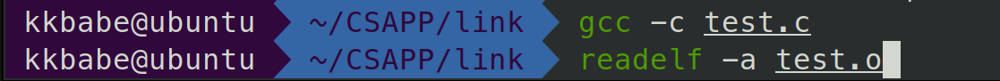
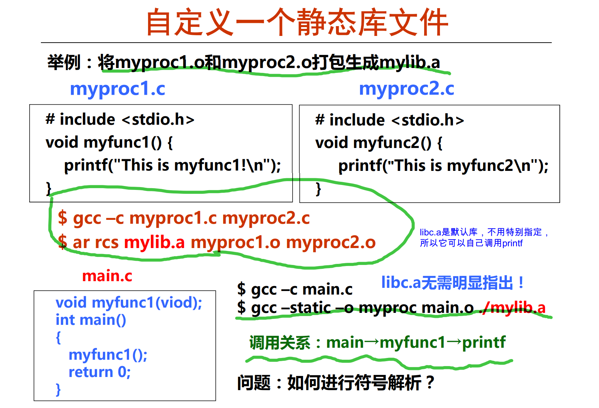
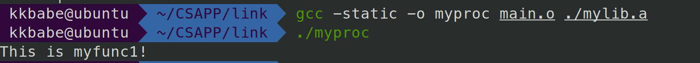
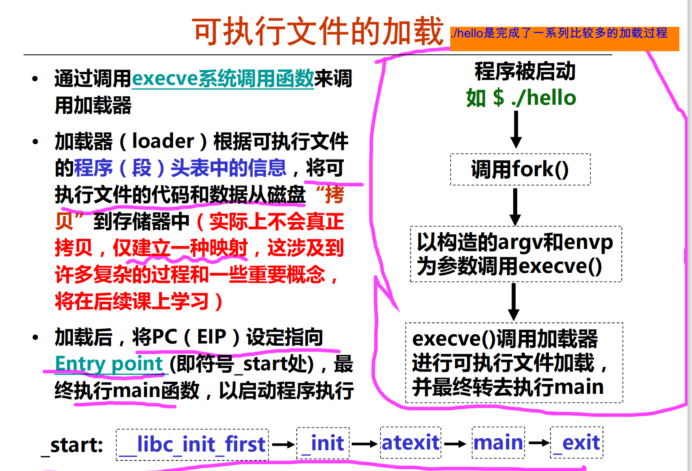

[程序的链接 - 小胖西瓜 - 博客园 (cnblogs.com)](https://www.cnblogs.com/shuqin/p/12012906.html)

[7.7 重定位 - 深入理解计算机系统（CSAPP） (gitbook.io)](https://hansimov.gitbook.io/csapp/part2/ch07-linking/7.7-relocation)

[【读薄 CSAPP】肆 链接 | 小土刀 2.0 (wdxtub.com)](https://wdxtub.com/csapp/thin-csapp-4/2016/04/16/)

# 7.1 编译器驱动程序

考虑图 7-1 中的 C 语言程序。它将作为贯穿本章的一个小的运行示例，帮助我们说明关于链接是如何工作的一些重要知识点。


> 可以看到:
>
> * `main.c`中声明了一个sum函数，定义了一个array数组，在main中返回sum(array,2)
> * `sum.c`中就是得到sum值

code/link/main.c

```c
int sum(int *a, int n);

int array[2] = {1, 2};

int main()
{
    int val = sum(array, 2);
    return val;
}
```

code/link/sum.c

```c
int sum(int *a, int n)
{
    int i, s = 0;
    
    for (i = 0; i < n; i++) {
        s += a[i];
    }
    return s;
}
```

大多数编译系统提供编译器驱动程序（compiler driver），它代表用户在需要时调用语言预处理器、编译器、汇编器和链接器。比如，要用 GNU 编译系统构造示例程序，我们就要通过在 shell 中输入下列命令来调用 GCC 驱动程序：

```shell
linux> gcc -Og -o prog main.c sum.c
```


## 1.预处理(Pre-processor) -E

```shell
gcc -E main.c -o main.i
```


可以看到，这里的gloval.h表示，如果已经定义过INITIALIZE，就执行下面的代码，如果没有定义过，就执行else的代码.预处理时，我们的c1.c进行预处理的结果是，把#include "global.h"展开成根据是否def INITIALIZE的两种情况，插入到原来的代码中 (ifdef的可以看这个blog[(2条消息) 条件编译#ifdef的妙用详解_透彻_司马如风-CSDN博客_ifdef](https://blog.csdn.net/qq_36662437/article/details/81476572))


第一个阶段是预处理阶段，在正式的编译阶段之前进行。预处理阶段将根据已放置在文件中的预处理指令来修改源文件的内容。主要是以下几方面的处理：

1. 宏定义指令，如 `#define a b` 这种伪指令，预编译所要做的是将程序中的所有 `a` 用 `b` 替换，但作为字符串常量的 `a` 则不被替换。还有 `#undef`，则将取消对某个宏的定义，使以后该串的出现不再被替换

2. 条件编译指令，如 `#ifdef`, `#ifndef`, `#else`, `#elif`, `#endif`等。这些伪指令的引入使得程序员可以通过定义不同的宏来决定编译程序对哪些代码进行处理。预编译程序将根据有关的文件，将那些不必要的代码过滤掉

3. 头文件包含指令，如 `#include "FileName"` 。该指令将头文件中的定义统统都加入到它所产生的输出文件中，以供编译程序对之进行处理

4. 特殊符号，预编译程序可以识别一些特殊的符号。例如在源程序中出现的 `LINE` 标识将被解释为当前行号（十进制数），`FILE` 则被解释为当前被编译的C源程序的名称。预编译程序对于在源程序中出现的这些串将用合适的值进行替换

   

头文件的目的主要是为了使某些定义可以供多个不同的C源程序使用，这涉及到头文件的定位即搜索路径问题。头文件搜索规则如下：

1. 所有头文件的搜寻会从 `-I` 开始
2. 然后找环境变量 `C_INCLUDE_PATH`, `CPLUS_INCLUDE_PATH`, `OBJC_INCLUDE_PATH` 指定的路径
3. 再找默认目录(`/usr/include`, `/usr/local/include`, `/usr/lib/gcc-lib/i386-linux/2.95.2/include` 等等)


## 2.编译(Compile) -S

```shell
gcc -S main.c
```

第二个阶段编译、优化阶段，编译程序所要作得工作就是通过词法分析和语法分析，在确认所有的指令都符合语法规则之后，将其翻译成等价的中间代码表示或汇编代码。


## 3.汇编(Assembler) -c

```shell
gcc -c main.s
```


汇编实际上指汇编器(as)把汇编语言代码翻译成目标机器指令的过程。目标文件中所存放的也就是与源程序等效的目标的机器语言代码。目标文件由段组成。通常一个目标文件中至少有两个段：

- 代码段：该段中所包含的主要是程序的指令。该段一般是可读和可执行的，但一般却不可写
- 数据段：主要存放程序中要用到的各种全局变量或静态的数据。一般数据段都是可读，可写，可执行的


## 4.链接器(Linker)

待会会介绍


## 5.加载器(Loader)

- **加载器**：将可执行程序加载到内存并进行执行，`loader` 和 `ld-linux.so`

shell 调用操作系统中一个叫做**加载器**（loader）的函数，它将可执行文件 prog 中的代码和数据复制到内存，然后将控制转移到这个程序的开头。


# 7.2 静态链接

> 为什么要有链接？
>
> - 模块化角度考虑。我们可以把程序分散到不同的小的源代码中，而不是一个巨大的类中。这样带来的好处是可以复用常见的功能/库，比方说 Math library, standard C library.
> - 效率角度考虑。改动代码时只需要重新编译改动的文件，其他不受影响。而常用的函数和功能可以封装成库，提供给程序进行调用（节省空间）


像 Linux LD 程序这样的**静态链接器**（static linker）以一组可重定位目标文件和命令行参数作为输入，生成一个完全链接的、可以加载和运行的可执行目标文件作为输出。输入的可重定位目标文件由各种不同的代码和数据节（section）组成，每一节都是一个连续的字节序列。指令在一节中，初始化了的全局变量在另一节中，而未初始化的变量又在另外一节中。

为了构造可执行文件，链接器必须完成两个主要任务： 

- **符号解析（symbol resolution）。**目标文件定义和引用符号，每个符号对应于一个函数、一个全局变量或一个**静态变量**（即 C 语言中任何以 static 属性声明的变量）。符号解析的目的是将每个符号引用正好和一个符号定义关联起来。
- **重定位（relocation）。**编译器和汇编器生成从地址 0 开始的代码和数据节。链接器通过把每个符号定义与一个内存位置关联起来，从而重定位这些节，然后修改所有对这些符号的引用，使得它们指向这个内存位置。链接器使用汇编器产生的**重定位条目**（relocation entry）的详细指令，不加甄别地执行这样的重定位。

接下来的章节将更加详细地描述这些任务。在你阅读的时候，要记住关于链接器的一些基本事实：<u>目标文件纯粹是字节块的集合</u>。这些块中，有些包含**程序代码**，有些包含**程序数据**，而其他的则包含**引导链接器和加载器的数据结构**。<u>链接器将这些块连接起来，确定被连接块的运行时位置，并且修改代码和数据块中的各种位置</u>。链接器对目标机器了解甚少。产生目标文件的编译器和汇编器已经完成了大部分工作。


# 7.3 目标文件

目标文件有三种形式：

- **可重定位目标文件。 Relocatable object file (`.o` file)**
  - 包含二进制代码和数据，其形式可以在编译时与其他可重定位目标文件合并起来，创建一个可执行目标文件。
- **可执行目标文件。 Executable object file (`a.out` file)**
  - 包含二进制代码和数据，其形式可以被直接复制到内存并执行。
- **共享目标文件 .Shared object file (`.so` file)**
  - 一种特殊类型的**可重定位目标文件**，可以在**加载或者运行时被动态地加载进内存并链接**。


编译器和汇编器生成可重定位目标文件（包括共享目标文件）。链接器生成可执行目标文件。从技术上来说，一个**目标模块**（object module）就是一个字节序列，而一个**目标文件**（object file）就是一个以文件形式存放在磁盘中的目标模块。不过，我们会互换地使用这些术语。


# 7.4 可重定位目标文件

下图展示了一个典型的 ELF 可重定位目标文件的格式。


- **ELF header**：64字节。主要的信息有：**节头部表**（section header table）的文件偏移【节头部表记录了各个section的size和offset以及其他信息，相当于是section的目录】，以及节头部表中条目的大小和数量。不同节的位置和大小是由节头部表描述的，其中目标文件中每个节都有一个固定大小的**条目**（entry）。

  

* **.text：**已编译程序的机器代码。

* **.rodata：**只读数据，比如 printf 语句中的格式串和switch语句的跳转表。

* **.data：**已初始化的全局和静态 C 变量。局部 C 变量在运行时被保存在栈中，既不岀现在 .data 节中，也不岀现在 .bss 节中。

* **.bss：**未初始化的全局和静态 C 变量，以及所有被初始化为 0 的全局或静态变量。在目标文件中这个节不占据实际的空间，它仅仅是一个占位符。目标文件格式区分已初始化和未初始化变量是为了空间效率：在目标文件中，未初始化变量不需要占据任何实际的磁盘空间。运行时，在内存中分配这些变量，初始值为 0。只记录<u>size和文件offset就行啦</u>

* **.symtab：**一个符号表，它存放在程序中定义和引用的函数和全局变量的信息。然而，和编译器中的符号表不同，.symtab 符号表不包含局部变量的条目。

  

  可以看到，符号表就是记录了所有全局变量和函数名，Ndx列记录了Section的编号，Value记录了这个符号在这个Section中的偏移。例如，data_items位于数据段的0位置，start_loop位于代码段的0xf位置

* **.rel.text：**一个 .text 节中位置的列表，当链接器把这个目标文件和其他文件组合时，需要修改这些位置。一般而言，任何**调用外部函数或者引用全局变量的指令都需要修改**。另一方面，调用本地函数的指令则不需要修改（因为是相对偏移，位置无关）。注意，可执行目标文件中并不需要重定位信息（因为都已经改成真正的地址了），因此通常省略，除非用户显式地指示链接器包含这些信息。

  

  表示在代码段的0x09开始的4字节，以及0x1a开始的4字节，存着的是.data域的0偏移量的符号，之后链接的时候，我们确定了这个符号的最终位置后，根据这个.rel.text的信息，去这些地方重定位.

* **.rel.data：**被模块引用或定义的所有全局变量的重定位信息。一般而言，任何已初始化的全局变量，如果它的初始值是一个全局变量地址或者外部定义函数的地址，都需要被修改。

* **.debug：**一个调试符号表，其条目是程序中定义的局部变量和类型定义，程序中定义和引用的全局变量，以及原始的 C 源文件。只有以 - g 选项调用编译器驱动程序时，才 会得到这张表。

* **.line：**原始 C 源程序中的行号和 .text 节中机器指令之间的映射。只有以 -g 选项调用编译器驱动程序时，才会得到这张表。

* **.strtab：**一个字符串表，其内容包括 **.symtab** 和 **.debug** 中的符号表，以及节头部表中的节名字。


# 7.5 符号和符号表

链接器实际上会处理三种不同的符号，对应于代码中不同写法的部分：

- 全局符号 Global symbols
  - 在当前模块中定义，且可以被其他代码引用的符号，例如非静态 C 函数和非静态全局变量
- 外部符号 External symbols
  - 同样是全局符号，但是是在其他模块（也就是其他的源代码）中定义的，但是可以在当前模块中引用
- 本地符号 Local symbols
  - 在当前模块中定义，只能被当前模块引用的符号，例如静态函数和静态全局变量
  - 注意，Local linker symbol 并不是 local program variables

认识到本地链接器符号和本地程序变量不同是很重要的。.symtab 中的符号表不包含对应于本地非静态程序变量的任何符号。这些符号在运行时在栈中被管理，链接器对此类符号不感兴趣。

有趣的是，定义为带有 **C static 属性**的本地过程变量是不在栈中管理的。相反，编译器在 .data 或 .bss 中为每个定义分配空间，并在符号表中创建一个有唯一名字的本地链接器符号。 比如，假设在同一模块中的三个函数各自定义了一个静态局部变量 x：

```c
int f()
{
    static int x = 0;
    return x;
}

int g()
{
    static int x = 1;
    return x;
}

int h()
{
    static int x = 2;
    return x;
}
```

在这种情况中，编译器向汇编器输出两个不同名字的局部链接器符号。比如，它可以用 x.1 表示函数 f 中的定义，而用 x.2 表示函数 g 中的定义。




可以看到，确实是不同的名字。所以其实static是一个文件的作用域，而且这个文件中不同的作用域，可以创建不同的static，它们彼此是独立占一个.data或.bss的位置.

> ## 给 C 语言初学者 - 利用 static 属性隐藏变量和函数名字
>
> C 程序员使用 static 属性隐藏模块内部的变量和函数声明，就像你在 Java 和 C++ 中使用 public 和 private 声明一样。在 C 中，源文件扮演模块的角色。任何带有 static 属性声明的全局变量或者函数都是模块私有的。类似地，任何不带 static 属性声明的全局变量和函数都是公共的，可以被其他模块访问。尽可能用 static 属性来保护你的变量和函数是很好的编程习惯。 


:eagle:（重要！！）

**.symtab**中，每个符号都被分配到目标文件的某个节，由 section 字段表示，该字段也是一个到节头部表的索引。有三个特殊的**伪节**（pseudosection），它们在**节头部表中是没有条目的**：

* **ABS** 代表不该被重定位的符号；
* **UNDEF** 代表未定义的符号，也就是在本目标模块中引用，但是却在其他地方定义的符号；
* **COMMON**表示还未被分配位置的未初始化的数据目标。对于 COMMON 符号，value 字段给出对齐要求，而 size 给出最小的大小。注意，只有可重定位目标文件中才有这些伪节，可执行目标文件中是没有的。


> ## COMMON .bss 和 .data
>
> 1. COMMON：未初始化的全局变量
> 2. .bss：未初始化的静态变量，以及初始化为0的全局或静态变量
> 3. .data：初始化了且非0的全局或静态变量


> ##  **习题**
>
> 这个题目针对 m.o 和 swap.o 模块。对于每个在 swap.o 中定义或引用的符号，请指出它是否在模块 swap.o 中的 .symtab 节中有一个符号表条目。如果是，请指出定义该符号的模块（swap.o 或者 m.o）、符号类型（局部、全局或者外部）以及它在模块中被分配到的节（.text、.data、.bss 或 COMMON）。

`m.c`

```c
void swap();

int buf[2] = {1, 2};

int main()
{
    swap();
    return 0;
}
```

`swap.c`

```c
extern int buf[];

int *bufp0 = &buf[0];
int *bufp1;

void swap()
{
    int temp;
    
    bufp1 = &buf[1];
    temp = *bufp0;
    *bufp0 = *bufp1;
    *bufp1 = temp;
}
```


# 7.6 符号解析

链接器解析符号引用的方法是将每个**引用**与它输入的可重定位目标文件的**符号表中的一个确定的符号定义关联起来**。对那些和引用定义在相同模块中的**局部符号的引用，符号解析是非常简单明了的**。**编译器**只允许每个模块中每个**局部符号有一个定义**。**静态局部变量也会有本地链接器符号，编译器还要确保它们拥有唯一的名字**。

不过，对**全局符号的引用解析**就棘手得多。当编译器遇到一个**不是在当前模块中定义的符号**（变量或函数名）时，会<u>假设该符号是在其他某个模块中定义</u>的，**生成一个链接器符号表条目（UNDEF），并把它交给链接器处理。**<u>如果链接器在它的任何输入模块中都找不到这个被引用符号的定义，就输出一条（通常很难阅读的）错误信息并终止</u>。比如，如果我们试着在一台 Linux 机器上编译和链接下面的源文件：

```c
void foo(void);

int main() {
    foo();
    return 0;
}
```

那么编译器会没有障碍地运行，但是当链接器无法解析对 foo 的引用时，就会终止：


对全局符号的符号解析很棘手，还因为多个目标文件可能会定义相同名字的全局符号。在这种情况中，链接器必须要么标志一个错误，要么以某种方法选出一个定义并抛弃其他定义。Linux 系统采纳的方法涉及编译器、汇编器和链接器之间的协作，这样也可能给不警觉的程序员带来一些麻烦


> ## 旁注 - 对 C++ 和 Java 中链接器符号的重整
>
> C++ 和 Java 都允许重载方法，这些方法在源代码中有相同的名字，却有不同的参数列表。那么链接器是如何区别这些不同的重载函数之间的差异呢？C++ 和 Java 中能使用重载函数，是因为编译器将每个唯一的方法和参数列表组合编码成一个对链接器来说唯一的名字。这种编码过程叫做重整（mangling），而相反的过程叫做恢复（demangling）。
>
> 幸运的是，C++ 和 Java 使用兼容的重整策略。一个被重整的类名字是由名字中字符的整数数量，后面跟原始名字组成的。比如，类 Foo 被编码成 3Foo。方法被编码为原始方法名，后面 "_ _"，加上被重整的类名，再加上每个参数的单字母编码。比如，Foo::bar(int，long) 被编码为 bar__3Fooil。重整全局变量和模板名字的策略是相似的。


## 7.6.1 链接器如何解析多重定义的全局符号

链接器的输入是一组可重定位目标模块。每个模块定义一组符号，有些是局部的（只对定义该符号的模块可见），有些是全局的（对其他模块也可见）。如果多个模块定义同名的全局符号，会发生什么呢？下面是 Linux 编译系统采用的方法。

在编译时，编译器向汇编器输岀每个全局符号，或者是强（strong）或者是弱（weak），而汇编器把这个信息隐含地编码在可重定位目标文件的符号表里。**函数和已初始化的全局变量是强符号，未初始化的全局变量是弱符号(.COMMON)**。

根据强弱符号的定义，Linux 链接器使用下面的规则来处理多重定义的符号名：

- **规则 1：**不允许有多个同名的强符号。

- **规则 2：**如果有一个强符号和多个弱符号同名，那么选择强符号。

- **规则 3：**如果有多个弱符号同名，那么从这些弱符号中任意选择一个。

  

比如，假设我们试图编译和链接下面两个 C 模块：

```c
/* foo1.c */
int main()
{
    return 0;
}
```

```c
/* bar1.c */
int main()
{
    return 0;
}
```

在这个情况中，链接器将生成一条错误信息，因为强符号 main 被定义了多次（规则 1）：


相似地，链接器对于下面的模块也会生成一条错误信息，因为强符号 x 被定义了两次（规则 1）：

```c
/* foo2.c */
int x = 15213;
int main(){    return 0;}
```

```c
/* bar2.c */
int x = 15213;
void f(){}
```


然而，如果在一个模块里 x 未被初始化，那么链接器将安静地选择在另一个模块中定义的强符号（规则 2）：

```c
/* foo3.c */
#include <stdio.h>
void f(void);

int x = 15213;

int main()
{
    f();
    printf("x = %d\n", x)
    return 0;
}
```


```c
/* bar3.c */
int x;

void f()
{
    x = 15212;
}
```

在运行时，函数 f 将 x 的值由 15213 改为 15212，这会给 main 函数的作者带来不受欢迎的意外！注意，链接器通常不会表明它检测到多个 x 的定义：

```shell
linux> gcc -o foobar3 foo3.c bar3.c
linux> ./foobar3
x = 15212
```


如果 x 有两个弱定义，也会发生相同的事情（规则 3）：

```c
/* foo4.c */
#include <stdio.h>
void f(void);

int x;

int main()
{
    x = 15213;
    f();
    printf("x = %d\n", x);
    return 0;
}
```

```c
/* bar4.c */
int x;

void f()
{
    x = 15212;
}
```

规则 2 和规则 3 的应用会造成一些不易察觉的运行时错误，对于不警觉的程序员来说，是很难理解的，尤其是如果重复的符号定义还有不同的类型时。考虑下面这个例子，其中 x 不幸地在一个模块中定义为 int，而在另一个模块中定义为 double：

```c
/* foo5.c */
#include <stdio.h>
void f(void);

int y = 15212;
int x = 15213;

int main()
{
    f();
    printf("x = 0x%x y = 0x%x \n",
            x, y);
    return 0;
}
```

```c
/* bar5.c */
double x;

void f()
{
    x = -0.0;
}
```

在一台 x86-64/Linux 机器上，double 类型是 8 个字节，而 int 类型是 4 个字节。在我们的系统中，x 的地址是 0x601020，y 的地址是 0x601024。因此，bar5.c 的第 6 行中的赋值 x=-0.0 将用负零的双精度浮点表示覆盖内存中 x 和 y 的位置（foo5.c 中的第 5 行和第 6 行）！

```c
linux> gcc -Wall -Og -o foobar5 foo5. c bar5 .c
/usr/bin/ld: Warning: alignment 4 of symbol 'x' in /tmp/cclUFK5g.o
is smaller than 8 in /tmp/ccbTLcb9.o
linux> ./foobar5
x = 0x0 y = 0x80000000
```

这是一个细微而令人讨厌的错误，尤其是因为它只会触发链接器发出一条警告，而且通常要在程序执行很久以后才表现出来，且远离错误发生地。在一个拥有成百上千个模块的大型系统中，这种类型的错误相当难以修正，尤其因为许多程序员根本不知道链接器是如何工作的。当你怀疑有此类错误时，用像 GCC-fno-common 标志这样的选项调用链接器，这个选项会告诉链接器，在遇到多重定义的全局符号时，触发一个错误。或者使用 -Werror 选项，它会把所有的警告都变为错误。

**如果可能，尽量避免使用全局变量**

如果一定要用的话，注意下面几点：

- 使用静态变量
- 定义全局变量的时候初始化
- 注意使用 `extern` 关键字


在 7.5 节中，我们看到了编译器如何按照一个看似绝对的规则来把符号分配为 COMMON 和 .bss。实际上，采用这个惯例是由于在某些情况中链接器允许多个模块定义向名能全局符号。当编译器在翻译某个模块时，遇到一个**弱全局符号**，比如说 x，它并不知道其他模块是否也定义了 x，如果是，它无法预测链接器该使用 x 的多重定义中的哪一个。所以编祥器把 x 分配成 **COMMON**，把决定权留给链接器。另一方面，如果 x 初始化为 0，那么它是一个强符号（因此根据规则 2 必须是唯一的），所以编译器可以很自信地将它分配成 .bss。类似地，静态符号的构造就必须是唯一的，所以编译器可以自信地把它们分配成 .data 或 .bss。


## 7.6.2 与静态链接库

迄今为止，我们都是假设链接器读取一组**可重定位目标文件**，并把它们链接起来，形成一个输出的可执行文件。实际上，所有的编译系统都提供一种机制，**将所有相关的目标模块打包成为一个单独的文件**，称为**静态库**（staticlibrary），**它可以用做链接器的输入**。当链接器构造一个输出的可执行文件时，它只复制静态库里被应用程序引用的目标模块。

相关的函数可以被编译为独立的目标模块，然后封装成一个单独的**静态库文件**。然后，应用程序可以通过在命令行上指定单独的文件名字来使用这些在库中定义的函数。比如，使用 C 标准库和数学库中函数的程序可以用形式如下的命令行来编译和链接：

```shell
linux> gcc main.c /usr/lib/libm.a /usr/lib/libc.a
```

（实际上，C 编译器驱动程序总是传送 libc.a 给链接器，所以前面提到的对 libc.a 的引用是不必要的）。

在 Linux 系统中，静态库以一种称为**存档**（**archive**）的特殊文件格式存放在磁盘中。**存档文件是一组连接起来的可重定位目标文件的集合**，**有一个头部用来描述每个成员目标文件的大小和位置**。存档文件名由后缀 **.a** 标识。


为了使我们对库的讨论更加形象具体，考虑下面的两个向量例程。每个例程，定义在它自己的目标模块中，对两个输入向量进行一个向量操作，并把结果存放在一个输出向量中。每个例程有一个副作用，会记录它自己被调用的次数，每次被调用会把一个全局变量加 1。（当我们在 7.12 节中解释位置无关代码的思想时会起作用。）

`addvec.c:`

```c
int addcnt = 0;		//记录调用次数
// z[i] = x[i]+y[i]
void addvec(int *x, int *y,
            int *z, int n)	
{
    int i;
    
    addcnt++;
    
    for ( i = 0; i < n; i++)
        z[i] = x[i] + y[i];
}
```

`multvec.c:`

```c
int multcnt = 0;	//记录调用次数
//z[i] = x[i]*y[i]
void multvec(int *x，int *y,
             int *z，int n)
{
    int i;

    multcnt++;

    for (i = 0; i < n; i++)
        z[i] = x[i] * y[i];
}
```

要**创建这些函数的一个静态库**，我们将使用 AR 工具，如下：

```shell
linux> gcc -c addvec.c multvec.c				#生成2个.o文件
linux> ar rcs libvector.a addvec.o multvec.o 	#打包成libvector.a静态库
```


为了使用这个库，我们可以编写一个应用`main2.c`，它调用 addvec 库例程。包含（或头）文件 vector .h 定义了 libvector.a 中例程的函数原型

`vector.h`

```c
void addvec(int *x, int *y,int *z, int n);	
void multvec(int *x, int *y,int *z, int n);
```

`main2.c`

```c
#include <stdio.h>
#include "vector.h"

int x[2] = {1, 2};
int y[2] = {3, 4};
int z[2];

int main()
{
    addvec(x, y, z, 2);
    printf("z = [%d %d]\n", z[0], z[1]);
    return 0;
}
```

为了创建这个可执行文件，我们要编译和链接输入文件 main.o 和 libvector.a：

```c
linux>gcc -c main2.c
linux>gcc -static -o prog2c main2.o ./libvector.a
```


或者等价地使用：

```c
linux>gcc -c main2.c
linux>gcc -static -o prog2c main2.o -L. -lvector
```


**-static** 参数告诉编译器驱动程序，链接器应该构建一个完全链接的可执行目标文件，它可以加载到内存并运行，在加载时无须更进一步的链接。**-lvector** 参数是 libvector.a 的缩写，**-L.** 参数告诉链接器在当前目录下查找 libvector.a。


如图所示，当链接器运行时，它判定 main2.o 引用了 addvec.o 定义的 addvec 符号，所以复制 addvec.o 到可执行文件。因为程序不引用任何由 multvec.o 定义的符号，所以链接器就不会复制这个模块到可执行文件。链接器还会复制 libc.a 中的 printf.o 模块，以及许多 C 运行时系统中的其他模块。


## 7.6.3 链接器如何使用静态库来解析引用




`myproc1.c`

```c
#include <stdio.h>
void myfunc1() { 
    printf("This is myfunc1!\n"); 
}
```

`myproc2.c`

```c
#include <stdio.h>
void myfunc2() { 
    printf("This is myfunc2\n"); 
}
```

`main.c`

```c
void myfunc1(viod); 
int main() 
{ 
    myfunc1(); 
    return 0; 
}
```




* E（will be merged to form the executable）：所有目标文件的集合
* U（a set U of unresolved symbols）：当前所有未解析的引用符号的集合
* D（a set D of symbols that have been defined in previous input files）：当前所有定义的符号的集合

开始时，EUD为空。首先扫描main.o，把他加入到E中，同时把myfun1加入U，main加入D.

接着扫描到mylib.a，将U中的所有符号（myfunc1）与mylib.a的所有目标模块(myproc1.o myproc2.o)依次匹配，发现在myproc1.o中定义了myfunc1，故myproc1.o加入E，myfunc1从U转移到了D。在myproc1.o中发现还有未解析的符合printf，将其加入到U.

**不断在mylib.a的各模块上进行迭代以匹配U中未解析的引用符号，直到U和D都不再变化了**（这样的原因是,我们将myproc1.o加入到了E，并以此来解析myfunc1，但是如果myproc1又用到了myproc2的符号，那需要再迭代一遍，把myproc2也加入到目标文件，再次扫描，确保U和D不会变了，就代表mylib.a中能链接的都链接了）

此时U中只有一个未解析符号printf，而D中有main和myfun，因为模块myproc2.o没有被加入到E中，因而它被丢弃，所以继续去扫描libc.a。

我们找到了printf.o定义了printf，所以将printf也从U移到D，并将printf.o加入E，同时把它定义的所有符号加入D，而所有未解析的符号加入U。处理完libc.a时，U一定是空的.


**这里，有两个关键点需要知道**

**1.我们链接.o文件时，是把整个.o文件都拿过来，而不是只拿被引用的那些定义！！！**

**2.实际上我们一开始，在_start中有一个未解析的符号main，所以其实一开始U就是main，然后我们逐步迭代去扫描.a静态库，找到需要加入.o文件并加入...，如果我们U和D不变了，就去下一个.a静态库扫描，如果这已经是最后一个了，那么看此时U是不是空的，如果是空的，链接成功，否则失败**.如下图


所以最终，E中是main.o myproc1.o printf.o 以及 printf.o调用的一些.o文件

D中是mian，myproc1，printff以及其引用的符号


```shell
gcc -static -o myproc ./mylib.a main.o
# 结果如下
```


这里说的很清楚，在main.o的main函数中，存在着未解析的符号myfunc1，这是因为我们把./mylib.a放在了前面，所以一开始是未解析的是main，在.a文件中没有找到main，就丢弃了，去main.o找

* **注意：我们的丢弃只会出现在.a文件的情况，如果是main.o和一个myproc1.o互换位置都是对的，因为它们就像在一个.a文件那样不断迭代**

在这里，我们在后面再加个./mylib.a就对了


假设调用关系是：func.o调用了libx.a和liby.a :o:libx.a调用了libz.a，则只要libz.a在libx.a后面即可

假设调用关系是：func.o调用了libx.a和liby.a :o:libx.a调用了liby.a :o:liby.a又调用libx.a，所以

```shell
func.o libx.a liby.a libx.a
```


# 7.7 重定位

## 7.7.1 重定位条目


当汇编器生成一个目标模块时，它并不知道数据和代码最终将放在内存中的什么位置。它也不知道这个模块引用的任何外部定义的函数或者全局变量的位置。所以，无论何时汇编器遇到对最终位置未知的目标引用，它就会生成一个**重定位条目，告诉链接器在将目标文件合并成可执行文件时如何修改这个引用**。代码的重定位条目放在 .rel.text 中。已初始化数据的**重定位条目**放在 .rel.data 中。

下面展示了 **ELF 重定位条目的格式**。**offset** 是需要被修改的引用的节偏移。symbol 标识被修改引用应该指向的符号。**type** 告知链接器如何修改新的引用。**addend** 是一个有符号常数，一些类型的重定位要使用它对被修改引用的值做偏移调整。

```c
typedef struct {
        long offset;            // 节内偏移
        long type:32;           // 重定位类型
        long symbol:32;         // 被修改引用指向的符号
        long addend;            // 重定位使用的调整偏移值
} Elf64_Rela;
```

`main.c`

```c++
int sum(int *a, int n);
int array[2] = {1, 2};
int main() 
{
    int val = sum(array, 2);
    return val;
}
```

`sum.c`

```c
int sum(int *a, int n)
{
    int i, s = 0;
    for (i = 0; i < n; i++) {
        s += a[i];
    }
    return s;
}
```

我们来看看`readelf  -a main.o`


这里的offset表示该符号引用在代码段的偏移量，Sym.Name是一个符号，我们用Sym.Name+Append来确定这个offset需要填入的值。

ELF 定义了 32 种不同的**重定位类型**，有些相当隐秘。我们只关心其中两种最基本的重定位类型：

* ~~**R_X86_64_32**（该类型在新版的GCC上已经没有看到了）. 重定位一个使用32位绝对地址的引用~~

* **R_X86_64_32**。重定位一个使用 **32 位绝对地址**的引用。通过**绝对寻址**，**CPU 直接使用在指令中编码的 32 位值作为有效地址，不需要进一步修改**。
* **R_X86_64_PLT32. 过程链接表延迟绑定。 这是一个PLT+GOT的延迟绑定，程序运行时才确定调用的sum函数的地址~**

当汇编器遇到对最终位置未定义的目标引用时，就会生成一个 *重定位条目*，告诉链接器在合并目标文件时如何修改这个引用，重定位的条目 代码段放在 .rel.text 中，已初始化的数据放在 .rel.data 中。

> <看上面的例子，我们array-4是一个PC32，即32位相对寻址>
>
> 
>
> 可以看到，我们是用rip+4字节来表示array的地址，所以是一个相对寻址
>
> 
>
> <再来看Linux C一站式编程的例子>
>
> 
>
> 
>
> 可以看到，我们的0x1a的地方是32位绝对寻址.


## 7.7.2 重定位符号引用

下面展示了链接器的重定位算法的伪代码。第 1 行和第 2 行在每个节 s 以及与每个节相关联的重定位条目 r 上迭代执行。为了使描述具体化，假设每个节 s 是一个字节数组，每个重定位条目 r 是一个类型为 Elf64_Rela 的结构.另外，还假设当算法运行时，链接器已经为每个节（用 ADDR(s) 表示）和每个符号都选择了运行时地址（用 ADDR(r.symbol) 表示）。第 3 行计算的是需要被重定位的 4 字节引用的数组 s 中的地址。如果这个引用使用的是 PC 相对寻址，那么它就用第 5 ~ 9 行来重定位。如果该引用使用的是绝对寻址，它就通过第 11 ~ 13 行来重定位。

```c
foreach section s {	//section s
    foreach relocation entry r { //relocation entry r
        refptr = s + r.offset;  //s是一个数组,r.offset是这个数组的偏移， 是0,1,2,...，表示s[0],s[1],s[2]
        /* 相对地址 */
        if (r.type == R_X86_64_PC32){
            refaddr = ADDR(s) + r.offset; //引用者的地址refaddr
            *refptr = (unsigned) (ADDR(r.symbol) + r.addend - refaddr);//被引用者的地址=该符号的绝对地址+r.append-引用者的地址
        }

        /* 绝对地址重定位 */
        if (r.type ==R_X86_64_32)
            *refptr = (unsigned) (ADDR(r.symbol) + r.addend); //被引用者的地址=符号地址+r.append
    }
}
```

让我们来看看链接器如何用这个算法来重定位图 7-1 示例程序中的引用。图 7-11 给出了（用 `objdump-dx main.o` 产生的）GNU OBJDUMP 工具产生的 main.o 的反汇编代码。

```assembly
0000000000000000 <main>:         
   0:   48 83 ec 08             sub    $0x8,%rsp
   4:   be 02 00 00 00          mov    $0x2,%esi
   9:   bf 00 00 00 00          mov    $0x0,%edi        %edi = &array
                        a: R_X86_64_32 array            Relocation entry
   e:   e8 00 00 00 00          callq  13 <main+0x13>   sum()
                        f: R_X86_64_PC32 sum-0x4        Relocation entry
  13:   48 83 c4 08             add $0x8,%rsp
  17:   c3                      retq
```

main 函数引用了两个全局符号：array 和 sum。为每个引用，汇编器产生一个重定位条目，显示在引用的后面一行上。✦这些重定位条目告诉链接器对 sum 的引用要使用 32 位 PC 相对地址进行重定位，而对 array 的引用要使用 32 位绝对地址进行重定位。接下来两节会详细介绍链接器是如何重定位这些引用的。

### 1.重定位 PC 相对引用

函数 main 调用 sum 函数，sum 函数是在模块 sum.o 中定义的。call 指令开始于节偏移 0xe 的地方’包括 1 字节的操作码 0xe8，后面跟着的是对目标 sum 的 32 位 PC 相对引用的占位符。

相应的重定位条目 r 由 4 个字段组成：

```c
r.offset = 0xf
r.symbol = sum
r.type   = R_X86_64_PC32
r.addend = -4
```

这些字段告诉链接器修改开始于偏移量 0xf 处的 32 位 PC 相对引用，这样在运行时它会指向 sum 例程。现在，假设链接器已经确定

```c
ADDR(s) = ADDR(.text) = 0x4004d0
```

和

```c
ADDR(r.symbol) = ADDR(sum) = 0x4004e8
```

使用图 7-10 中的算法，链接器首先计算出引用的运行时地址（第 7 行）：

```c
引用者的地址 = refaddr = ADDR(s)  + r.offset
        			 = 0x4004d0 + 0xf
        			 = 0x4004df
```

然后，更新该引用，使得它在运行时指向 sum 程序（第 8 行）：

```c
*refptr = (unsigned) (ADDR(r.symbol) + r.addend - refaddr)
        = (unsigned) (0x4004e8       + (-4)     - 0x4004df)
        = (unsigned) (0x5)
```

在得到的可执行目标文件中，call 指令有如下的重定位的形式：

```sh
4004de:  e8 05 00 00 00      callq  4004e8 <sum>       sum()
```

我们sum的地址是**4004e8**，**4004de+5(这条指令占5字节)**=**4004e3**，这是当前**rip**的值，**rip+5(相对偏移)=4004e8**，这确实是sum的地址.


### 2.重定位绝对引用

重定位绝对引用相当简单。例如，图 7-11 的第 4 行中，mov 指令将 array 的地址（一个 32 位立即数值）复制到寄存器％edi 中。mov 指令开始于节偏移量 0x9 的位置，包括 1 字节操作码 Oxbf，后面跟着对 array 的 32 位绝对引用的占位符。

```c
r.offset = 0xa
r.symbol = array
r.type   = R_X86_64_32
r.addend = 0
```

这些字段告诉链接器要修改从偏移量 0xa 开始的绝对引用，这样在运行时它将会指向 array 的第一个字节。现在，假设链接器巳经确定

```c
ADDR(r.symbol) = ADDR(array) = 0x601018
```

链接器使用图 7-10 中算法的第 13 行修改了引用：

```c
*refptr = (unsigned) (ADDR(r.symbol) + r.addend)
        = (unsigned) (0x601018       + 0)
        = (unsigned) (0x601018)
```

在得到的可执行目标文件中，该引用有下面的重定位形式：

```assembly
4004d9:  bf 18 10 60 00	      mov   $0x601018,%edi         %edi = &array
```

综合到一起，图 7-12 给出了最终可执行目标文件中已重定位的 .text 节和 .data 节。在加载的时候，加载器会把这些节中的字节直接复制到内存，不再进行任何修改地执行这些指令。

`已重定位的.text节:`

```c
00000000004004d0 <main>:
  4004d0:  48 83 ec 08          sub    $0x8,%rsp
  4004d4:  be 02 00 00 00       mov    $0x2,%esi
  4004d9:  bf 18 10 60 00       mov    $0x601018,%edi    %edi = &array
  4004de:  e8 05 00 00 00       callq  4004e8 <sum>      sum()
  4004e3:  48 83 c4 08          add    $0x8,%rsp
  4004e7:  c3                   retq

00000000004004e8 <sum>:
  4004e8:  b8 00 00 00 00       mov    $0x0,%eax
  4004ed:  ba 00 00 00 00       mov    $0x0,%edx
  4004f2:  eb 09                jmp    4004fd <sum+0x15>
  4004f4:  48 63 ca             movslq %edx,%rcx
  4004f7:  03 04 8f             add    (%rdi,%rcx,4),%eax
  4004fa:  83 c2 01             add    $0x1,%edx
  4004fd:  39 f2                cmp    %esi,%edx
  4004ff:  7c f3                jl     4004f4 <sum+0xc>
  400501:  f3 c3                repz retq
```

`已重定位的.data节:`

```c
0000000000601018 <array>:
  601018:  01 00 00 00 02 00 00 00
```


这道题是测试你对链接器重定位PC相对引用的理解的。给定

**ADDR(s) = ADDR(.text) = 0x4004d0**

和

**ADDR(r.symbol) = ADDR(swap) = 0x4004e8**

链接器首先计算引用的运行时地址：

```c
refaddr = ADDR(s)  + r.offset
        = 0x4004d0 + 0xa
        = 0x4004da
```

然后修改此引用：

```c
*refptr = (unsigned) (ADDR(r.symbol) + r.addend - refaddr)
        = (unsigned) (0x4004e8       + (-4)     - 0x4004da)
        = (unsigned) (0xa)
```

因此，得到的可执行目标文件中，对 swap 的 PC 相对引用的值为 0xa：

```c
4004d9: e8 0a 00 00 00          callq 4004e8 <swap>
```


# 7.8 可执行目标文件


# 7.9 加载可执行目标文件





> ## 旁注 - 加载器实际是如何工作的？
>
> 我们对于加载的描述从概念上来说是正确的，但也不是完全准确，这是有意为之。要理解加载实际是如何工作的，你必须理解**进程、虚拟内存和内存映射**的概念，这些我们还没有加以讨论。在后面第 8 章和第 9 章中遇到这些概念时，我们将重新回到加载的问题上，并逐渐向你揭开它的神秘面纱。
>
> 对于不够有耐心的读者，下面是关于加载实际是如何工作的一个概述：Linux 系统中的每个程序都运行在一个进程上下文中，有自己的**虚拟地址空间**。当 shell 运行一个程序时，父 shell 进程生成一个子进程，它是父进程的一个复制。**子进程通过 execve 系统调用启动加载器**。**加载器删除子进程现有的虚拟内存段，并创建一组新的代码、数据、堆和栈段。新的栈和堆段被初始化为零。通过将虚拟地址空间中的页映射到可执行文件的页大小的片（chunk），新的代码和数据段被初始化为可执行文件的内容**。最后，**加载器跳转到_start 地址，它最终会调用应用程序的 main 函数。除了一些头部信息，在加载过程中没有任何从磁盘到内存的数据复制。直到 CPU 引用一个被映射的虚拟页时才会进行复制，此时，操作系统利用它的页面调度机制自动将页面从磁盘传送到内存。**


# 7.10 动态链接共享库

我们在 7.6.2 节中研究的静态库解决了许多关于如何让大量相关函数对应用程序可用的问题。然而，静态库仍然有一些明显的缺点。静态库和所有的软件一样，需要定期维护和更新。如果应用程序员想要使用一个库的最新版本，他们必须以某种方式了解到该库的更新情况，然后显式地将他们的程序与更新了的库重新链接。

另一个问题是几乎每个 C 程序都使用标准 I/O 函数，比如 printf 和 scanf。在运行时，这些函数的代码会被复制到每个运行进程的文本段中。在一个运行上百个进程的典型系统上，这将是对稀缺的内存系统资源的极大浪费。（内存的一个有趣属性就是不论系统的内存有多大，它总是一种稀缺资源。磁盘空间和厨房的垃圾桶同样有这种属性。）

**共享库**（shared library）是致力于解决静态库缺陷的一个现代创新产物。**共享库是一个目标模块，在运行或加载时，可以加载到任意的内存地址，并和一个在内存中的程序链接起来**。这个过程称为**动态链接**（dynamic linking），是由一个叫做**动态链接器**（dynamic linker）的程序来执行的。共享库也称为**共享目标**（shared object），在 Linux 系统中通常用 **.so** 后缀来表示。微软的操作系统大量地使用了共享库，它们称为 **DLL**（动态链接库）<dynamic linker library>。
$$
共享库中的文件是.o可重定位目标文件，还没有进行链接
$$
共享库是以两种不同的方式来“共享”的。首先，在任何给定的文件系统中，对于一个库只有一个. so 文件。所有引用该库的**可执行目标文件共享这个 .so 文件中的代码和数据**，而不是像静态库的内容那样被复制和嵌入到引用它们的可执行的文件中。其次，在内存中，**一个共享库的 .text 节的一个副本可以被不同的正在运行的进程共享**。在第 9 章我们学习**虚拟内存**时将更加详细地讨论这个问题。

图 7-16 概括了图 7-7 中示例程序的动态链接过程。


为了构造图 7-6 中示例向量例程的共享库 libvector.so，我们调用编译器驱动程序，给编译器和链接器如下特殊指令：

```sh
linux> gcc -shared -fpic -o libvector.so addvec.c multvec.c
```

**-fpic** 选项指示编译器生成与位置无关的代码（下一节将详细讨论这个问题）。

**-shared** 选项指示链接器创建一个共享的目标文件。一旦创建了这个库，随后就要将它链接到图 7-7 的示例程序中：

```sh
linux> gcc -o prog2l main2.c ./libvector.so
```


这样就创建了一个可执行目标文件 prog2l，而此文件的形式使得它在运行时可以和 libvector.so 链接。基本的思路是当创建可执行文件时，静态执行一些链接，然后在程序加载时，动态完成链接过程。认识到这一点是很重要的：此时，没有任何 libvector.so 的代码和数据节真的被复制到可执行文件 prog2l 中。反之，**链接器复制了一些重定位和符号表信息，它们使得运行时可以解析对 libvector.so 中代码和数据的引用。**

> 其实就是把动态链接的信息存在可执行文件中，然后执行的时候去动态地链接

**当加载器加载**和运行可执行文件 prog2l 时，它利用 7.9 节中讨论过的技术，**加载部分链接的可执行文件 prog2l**。接着，它注意到 prog2l 包含一个 **.interp 节这一节包含动态链接器的路径名**，动态链接器本身就是一个共享目标（如在 Linux 系统上的 ld-linux.so）. 加载器不会像它通常所做地那样将控制传递给应用，而是加载和运行这个动态链接器。然后，**动态链接器通过执行下面的重定位完成链接任务：**

* 重定位 **libc.so** 的文本和数据到某个内存段。
* 重定位 **libvector.so**的文本和数据到另一个内存段。
* 重定位 **prog2l** 中所有对由 **libc.so 和 libvector.so 定义的符号的引用。**

最后，动态链接器将控制传递给应用程序。从这个时刻开始，共享库的位置就固定了，并且在程序执行的过程中都不会改变。


> 实际上，动态链接器的位置既不是由系统配置指定，也不是由环境参数决定，而是由ELF可执行文件决定。在动态链接的ELF可执行文件中，有一个专门的段叫做“.interp”段，.interp 段的内容很简单，里面保存的就是一个字符串，这个字符串就是可执行文件所需要的动态链接器的路径。在Linux中，操作系统在对可执行文件的进行加载的时候，它会去寻找装载该可执行文件所需要相应的动态链接器，即**“.interp”段指定的路径**的共享对象


# 7.11 从应用程序中加载和链接共享库

到目前为止，我们已经讨论了在应用程序被加载后执行前时，动态链接器加载和链接共享库的情景。然而，应用程序还可能在它运行时要求动态链接器加载和链接某个共享库，而无需在编译时将那些库链接到应用中。

动态链接是一项强大有用的技术。下面是一些现实世界中的例子：

* **分发软件。**微软 Wmdows 应用的开发者常常利用共享库来分发软件更新。他们生成一个共库的新版本，然后用户可以下载，并用它替代当前的版本。下一次他们运行应用程序时，应用将自动链接和加载新的共享库。

* **构建高性能 Web 服务器。**许多 Web 服务器生成动态内容，比如个性化的 Web 页面、账户余额和广告标语 s 早期的 Web 服务器通过使用 fork 和 execve 创建一个子进程，并在该子进程的上下文中运行 CGI 程序来生成动态内容。然而，现代高性能的 Web 服务器可以使用基于动态链接的更有效和完善的方法来生成动态内容。

其思路是将**每个生成动态内容的函数打包在共享库中**。当一个来自 Web 浏览器的请求到达时，**服务器动态地加载和链接适当的函数，然后直接调用它，而不是使用 fork 和 execve 在子进程的上下文中运行函数**。函数会一直缓存在服务器的地址空间中，所以只要一个简单的函数调用的开销就可以处理随后的请求了。这对一个繁忙的网站来说是有很大影响的。更进一步地说，**在运行时无需停止服务器，就可以更新已存在的函数，以及添加新的函数。**

Linux 系统为动态链接器提供了一个简单的接口，允许应用程序在**运行时加载和链接共享库**。

```c
#include <dlfcn.h>
/*动态装入的共享库文件*/
void *dlopen(const char *filename, int flag);

// 返回：若成功则为指向句柄的指针，若出错则为 NULL。
```

**dlopen 函数加载和链接共享库 filename** 。用已用带 **RTLD_GLOBAL** 选项打开了的库**解析 filename 中的外部符号**。<u>如果当前可执行文件是带 **- rdynamic** 选项编译的，那么对符号解析而言，它的全局符号也是可用的</u>。**flag** 参数必须要么包括 **RTLD_NOW，该标志告诉链接器立即解析对外部符号的引用**，要么包括 **RTLD_LAZY 标志，该标志指示链接器推迟符号解析直到执行来自库中的代码**。**这两个值中的任意一个都可以和 RTLD_GLOBAL 标志取或。**


```c
#include <dlfcn.h>

void *dlsym(void *handle, char *symbol);

// 返回：若成功则为指向符号的指针，若出错则为 NULL。
```

**dlsym 函数的输入是一个指向前面已经打开了的共享库的句柄和一个 symbol 名字，如果该符号存在，就返回符号的地址，否则返回 NULL。**


```c
#include <dlfcn.h>

int dlclose (void *handle);

// 返回:若成功则为0，若出错则为-1.
```

**如果没有其他共享库还在使用这个共享库，dlclose函数就卸载该共享库**


```c
include <dlfcn.h>

const char *dlerror(void);

// 返回：如果前面对 dlopen、dlsym 或 dlclose 的调用失败，
// 则为错误消息，如果前面的调用成功，则为 NULL。
```

**dlerror 函数返回一个字符串，它描述的是调用 dlopen、dlsym 或者 dlclose 函数时发生的最近的错误，如果没有错误发生，就返回 NULL。**


**示例程序：dll.c**

```c
#include <stdio.h>
#include <stdlib.h>
#include <dlfcn.h>

int x[2] = {1, 2};
int y[2] = {3, 4};
int z[2];

int main()
{
    void *handle;
    void (*addvec)(int *, int *, int *, int);
    char *error;

    /* Dynamically load the shared library containing addvec() */
    handle = dlopen("./libvector.so", RTLD_LAZY);
    if (!handle) {
        fprintf(stderr, "%s\n", dlerror());
        exit(1);
    }

    /* Get a pointer to the addvec() function we just loaded */
    addvec = dlsym(handle, "addvec");
    if ((error = dlerror()) != NULL) {
        fprintf(stderr, "%s\n", error);
        exit(1);
    }

    /* Now we can call addvec() just like any other function */
    addvec(x, y, z, 2);
    printf("z = [%d %d]\n", z[0], z[1]);

    /* Unload the shared library */
    if (dlclose(handle) < 0) {
        fprintf(stderr, "%s\n", dlerror());
        exit(1);
    }
    return 0;
}
```

这段代码是很明确的，我们调用**handle = dlopen("./libvector.so", RTLD_LAZY)**来动态装入./libvector.so共享库文件，并返回句柄handle。然后，调用 **addvec = dlsym(handle, "addvec");**来从这个共享库得到addvec函数地地址。那么，我们就可以用这个addvec函数了。最后，我们调用 **dlclose(handle)**来关闭这个共享库


> ## 旁注 - 共享库和 Java 本地接口
>
> Java 定义了一个标准调用规则，叫做 **Java 本地接口（Java Native Interface，JNI）**，它允许 **Java 程序调用“本地的” C 和 C++ 函数**。JNI 的基本思想是**将本地 C 函数（如 foo）编译到一个共享库中（如 foo.so）**。 **当一个正在运行的 Java 程序试图调用函数 foo 时，Java 解释器利用 dlopen 接口（或者与其类似的接口）动态链接和加载 foo.so，然后再调用 foo。**


# 7.12 位置无关代码(从这开始质量不高了，以后回来重新学后面的)

共享库的一个主要目的就是允许多个正在运行的进程共享内存中相同的库代码，因而节约宝贵的内存资源。那么，多个进程是如何共享程序的一个副本的呢？一种方法是给每个共享库分配一个事先预备的专用的地址空间片，然后要求加载器总是在这个地址加载共享库。虽然这种方法很简单，但是它也造成了一些严重的问题。它对地址空间的使用效率不高，因为即使一个进程不使用这个库，那部分空间还是会被分配出来。它也难以管理。我们必须保证没有片会重叠。每次当一个库修改了之后，我们必须确认已分配给它的片还适合它的大小。如果不适合了，必须找一个新的片。并且，如果创建了一个新的库，我们还必须为它寻找空间。随着时间的进展，假设在一个系统中有了成百个库和库的各个版本库，就很难避免地址空间分裂成大量小的、未使用而又不再能使用的小洞。更糟的是，对每个系统而言，库在内存中的分配都是不同的，这就引起了更多令人头痛的管理问题。

要避免这些问题，**现代系统**以这样一种方式编译共享模块的代码段，使得可以**把它们加载到内存的任何位置而无需链接器修改**。使用这种方法，**无限多个进程可以共享一个共享模块的代码段的单一副本**。（当然，每个进程仍然会有它自己的读/写数据块。）

**可以加载而无需重定位的代码称为位置无关代码（Position-Independent Code，PIC）**。用户对 GCC 使用 **-fpic 选项指示 GNU 编译系统生成 PIC 代码**。**共享库的编译必须总是使用该选项。**

位置无关代码的生成:

1. 在 x86-64 下, 对同一目标模块中符号的引用不需要做特殊的处理, 使用PC相对寻址来编译,由静态链接器重定位即可.
2. 对共享模块定义的外部过程和对全局变量的引用需要特殊处理, 如下


## PIC 数据引用

这里使用两个新的例子

```c
// gcc -fpic -shared -Og -o libvector.so addvec.c multvec.c

// addvec.c
int addcnt = 0;

void addvec(int *x, int *y, int *z, int n) {
    addcnt++;
    for (int i = 0; i < n; i++)
        z[i] = x[i] + y[i];
}

// multvec.c
int multcnt = 0;

void multvec(int *x, int *y, int *z, int n) {
    multcnt++;
    for (int i = 0; i < n; i++)
        z[i] = x[i] * y[i];
}
```

使用 `objdump -dx libvector.so` 得到部分汇编指令

```sh
Part1——Section：
Idx Name          Size      VMA               LMA               File off  Algn
 16 .got          00000030  0000000000003fd0  0000000000003fd0  00002fd0  2**3
                  CONTENTS, ALLOC, LOAD, DATA
 18 .data         00000008  0000000000004018  0000000000004018  00003018  2**3
                  CONTENTS, ALLOC, LOAD, DATA

Part2——Symbol Table：
0000000000003fd0 l    d  .got	0000000000000000 .got


Part3——Disassembly of section .text:
00000000000010f9 <addvec>:
    10f9:	f3 0f 1e fa          	endbr64 
    10fd:	4c 8b 05 dc 2e 00 00 	mov    0x2edc(%rip),%r8 	# 3fe0 <addcnt-0x44>
    .....................
    
000000000000112b <multvec>:
    112b:	f3 0f 1e fa          	endbr64 
    112f:	4c 8b 05 a2 2e 00 00 	mov    0x2ea2(%rip),%r8 	# 3fd8 <multcnt-0x50>
    ......................
```

一个目标文件加载进内存时，**数据段和代码段的偏移总是保持不变的**。因此代码段和数据段中任何变量之间的距离都是一个 **运行时常量**，与代码段和数据段所在内存的绝对位置时无关的。

编译器利用以上事实在**数据段开始的地方**生成了一张 **全局偏移量表（Global Offset Table, GOT）**, 在 GOT 中，每个被这个目标模块引用的全局变量都有一个 **8字节** 条目，编译器为GOT中的每个条目都生成了一个**重定位记录**。

在 `libvector.so` 中, `addcnt` 和 `multcnt` 的地址分别为 3fe0 和 3fd8。由于got表的起点为3fd0，所以分别为GOT表中的第三和第二个条目，并且利用数据段和代码段之间运行时不变的距离产生直接PC相对引用，同前一个示例中 `array`.


## PIC 函数调用

GCC 使用一种 *延迟绑定(lazy binding)* 的技术，**将过程地址的绑定推迟到第一次调用该过程时**，这样也可以避免动态链接器在加载时进行很多不必要的重定位。

延迟绑定时通过两个数据结构之间的交互来完成的：**全局偏移量表GOT(Global Offset Table)** 和 **过程链接表（Procedure Linkage Table, PLT）**. 如果一个目标模块调用定义在共享库中的任何函数，那么就会产生 **自己的** GOT 和 PLT  **. GOT 是数据段的一部分，PLT 是代码段的一部分。**

部分反汇编指令如下:

```c
// gcc main2.c ./libvector.so
// objdump -dx a.out
Sections:
Idx Name          Size      VMA               LMA               File off  Algn
 10 .init         00000017  0000000000001000  0000000000001000  00001000  2**2
                  CONTENTS, ALLOC, LOAD, READONLY, CODE
 11 .plt          00000030  0000000000001020  0000000000001020  00001020  2**4
                  CONTENTS, ALLOC, LOAD, READONLY, CODE
 12 .plt.got      00000008  0000000000001050  0000000000001050  00001050  2**3
                  CONTENTS, ALLOC, LOAD, READONLY, CODE
 13 .text         00000191  0000000000001060  0000000000001060  00001060  2**4
                  CONTENTS, ALLOC, LOAD, READONLY, CODE
 21 .got          00000028  0000000000003fd8  0000000000003fd8  00002fd8  2**3
                  CONTENTS, ALLOC, LOAD, DATA
 22 .got.plt      00000028  0000000000004000  0000000000004000  00003000  2**3
                  CONTENTS, ALLOC, LOAD, DATA
 23 .data         00000020  0000000000004028  0000000000004028  00003028  2**3
                  CONTENTS, ALLOC, LOAD, DATA

Disassembly of section .plt:

0000000000001020 <.plt>:
    1020:	ff 35 e2 2f 00 00    	pushq  0x2fe2(%rip)        # 4008 <_GLOBAL_OFFSET_TABLE_+0x8>
    1026:	ff 25 e4 2f 00 00    	jmpq   *0x2fe4(%rip)        # 4010 <_GLOBAL_OFFSET_TABLE_+0x10>
    102c:	0f 1f 40 00          	nopl   0x0(%rax)

0000000000001030 <printf@plt>:
    1030:	ff 25 e2 2f 00 00    	jmpq   *0x2fe2(%rip)        # 4018 <printf@GLIBC_2.2.5>
    1036:	68 00 00 00 00       	pushq  $0x0
    103b:	e9 e0 ff ff ff       	jmpq   1020 <.plt>

0000000000001040 <addvec@plt>:
    1040:	ff 25 da 2f 00 00    	jmpq   *0x2fda(%rip)        # 4020 <addvec>
    1046:	68 01 00 00 00       	pushq  $0x1
    104b:	e9 d0 ff ff ff       	jmpq   1020 <.plt>

0000000000001145 <main>:
    1163:	e8 d8 fe ff ff       	callq  1040 <addvec@plt>
    ···
    1180:	e8 ab fe ff ff       	callq  1030 <printf@plt>

```

GOT 和 PLT 协同工作的步骤如下, **第一次调用 addvec**：

1. 不直接调用 addvec, 程序调用进入 PLT[2] （即0x4010）, 这个是 addvec 的PLT条目。
2. 第一条PLT指令通过 GOT[4] 进行间接调转。将控制传送给 PLT[2] 中的下一条指令。
3. 在把 addvec 的 ID(0x1) 压入栈中之后，PLT[2] 跳转到 PLT[0].
4. PLT[0] 通过 GOT[1] 间接的把动态链接器的一个参数压入栈中，然后通过 GOT[2] 间接跳转进动态链接器中。动态链接再通过某种计算来确定 addvec 的运行时位置，再用这个地址重写 GOT[4]，最后将控制传递给 addvec.
