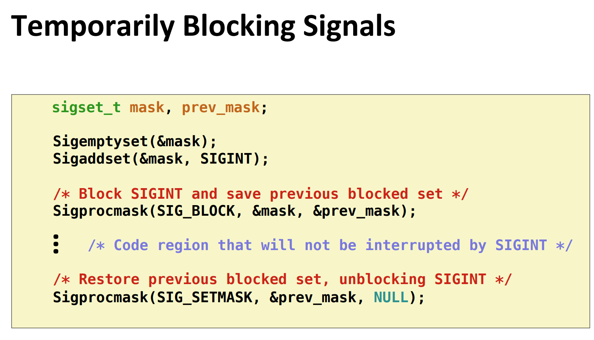
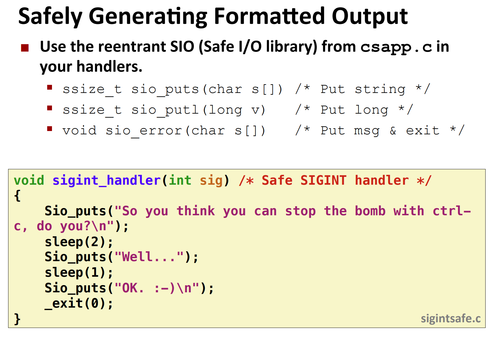

# 8.5 信号

> 对于前台进程来说，我们可以在其执行完成后进行回收，而对于后台进程来说，因为不能确定具体执行完成的时间，所以终止之后就成为了僵尸进程，无法被回收并因此造成内存泄露。
>
> 这怎么办呢？同样可以利用异常控制流，当后台进程完成时，内核会中断常规执行并通知我们，具体的通知机制就是『信号』(signal)。

到目前为止对**异常控制流**的学习中，我们已经看到了硬件和软件是如何合作以提供基本的**低层异常机制**的。我们也看到了操作系统如何利用异常来支持进程上下文切换的异常控制流形式。在本节中，我们将研究一种更**高层的软件形式的异常**，称为 **Linux 信号**，它**允许进程和内核中断其他进程**。

一个**信号**就是一条小消息，信号是 Unix、类 Unix 以及其他 POSIX 兼容的操作系统中进程间通讯的一种有限制的方式。它是一种**异步的通知机制**，用来**提醒进程一个事件已经发生**。当一个信号发送给一个进程，操作系统中断了进程正常的控制流程，此时，任何非原子操作都将被中断。**如果进程定义了信号的处理函数，那么它将被执行，否则就执行默认的处理函数。**

**每种信号类型都对应于某种系统事件**。

低层的**硬件异常**是由**内核异常处理程序处理**的，正常情况下，**对用户进程而言是不可见的**。

**信号**提供了一种机制，**通知用户进程发生了这些异常**。

* 比如，如果一个进程试图**除以 0**，那么**内核**就发送给它一个 **SIGFPE** 信号（号码 8）。

* 如果一个进程执行一条**非法指令**，那么**内核**就发送给它一个 **SIGILL** 信号（号码 4）。
* 如果进程进行**非法内存引用**，内核就发送给它一个 **SIGSEGV** 信号（号码 11）。
* 其他信号对应于内核或者其他用户进程中**较高层的软件事件**。
  * 比如，如果当进程在前台运行时，你键入 **Ctrl+C**（也就是同时按下 Ctrl 键和 C 键），那么内核就会发送一个 **SIGINT** 信号（号码 2）给这个前台进程组中的每个进程。
  * 一个进程可以通过向另一个进程发送一个 **SIGKILL** 信号（号码 9）**强制终止**它。
  * 当一个**子进程终止或者停止时**，内核会发送一个 **SIGCHLD** 信号（号码 17）**给父进程**。


## 8.5.1 信号术语

传送一个信号到目的进程是由两个不同步骤组成的：

1. **发送信号。**内核通过更新目的进程上下文中的某个状态，发送（递送）一个信号给目的进程。发送信号可以有如下两种原因：

   * **内核检测到一个系统事件**，比如除零错误或者子进程终止。
   * 一个进程调用了 **kill 函数**（在下一节中讨论），显式地**要求内核发送一个信号给目的进程。**

   一个进程也可以发送信号给它自己。

2. **接收信号。**当目的进程被内核强迫以某种方式对信号的发送做出反应时，它就**接收**了信号。进程可以**忽略**这个信号，**终止**或者通过执行一个称为**信号处理程序**（signal handler）的用户层函数捕获这个信号。图 8-27 给出了信号处理程序捕获信号的基本思想。


**待处理信号**：发出而没有被接收的信号

**在任何时刻，一种类型至多只会有一个待处理信号。如果一个进程有一个类型为 k 的待处理信号，那么任何接下来发送到这个进程的类型为 k 的信号都不会排队等待；他们只是被简单地丢弃。一个进程可以有选择性地阻塞接受某种信号。当一种信号被阻塞时，它仍可以被发送，但是产生的待处理信号不会被接收，直到进程取消对这种信号的阻塞。**

**一个待处理信号最多只能被接受一次。内核为每个进程在 pending 位向量中维护者待处理信号的集合，而在 blocked 位向量中维护着被阻塞的信号集合。只要传送了一个类型为 k 的信号，内核就会设置 pending 中的 k 位，而只要接受了一个类型位 k 的信号，内核就会清楚 pending 中的第 k 位。**


> ✦ blocked 位向量✦：也称为信号掩码（signal mask）。


## 8.5.2 发送信号

Unix 系统提供了大量向进程发送信号的机制。所有这些机制都是基于**进程组（process group）**这个概念的。


### 1.进程组

每个进程都只属于一个进程组，进程组是由一个正整数进程组 ID 来标识的。**getpgrp** 函数**返回当前进程的进程组 ID**：

```c
#include <unistd.h>
pid_t getpgrp(void);

// 返回：调用进程的进程组 ID。
```

**默认地，一个子进程和它的父进程同属于一个进程组。一个进程可以通过使用 setpgid 函数来改变自己或者其他进程的进程组：**

```c
#include <unistd.h>
int setpgid(pid_t pid, pid_t pgid);

// 返回：若成功则为o，若错误则为 -1。
```

**setpgid 函数将进程 pid 的进程组改为 pgid**。如果 **pid 是 0，那么就使用当前进程的 PID**。如果 **pgid 是 0，那么就用 pid 指定的进程的 PID 作为进程组 ID。**

例如，如果进程 15213 是调用进程，那么 setpgid (0,0) 会创建一个新的进程组，其进程组 ID 是 15213，并且把进程 15213 加入到这个新的进程组中。


### 2.用 /bin/kill 程序发送信号


```shell
kill -信号编号 pid
```


### 3.从键盘发送信号

Unix shell 使用**作业**（job）这个抽象概念来表示为对一条命令行求值而创建的进程。在任何时刻，至多只有一个前台作业和 0 个或多个后台作业。比如，键入：

```sh
linux> ls | sort
```

会创建一个由**两个进程组成的前台作业**，这两个进程是通过 Unix 管道连接起来的：一个进程运行 ls 程序，另一个运行 sort 程序。shell 为每个作业创建一个独立的进程组。进程组 ID 通常取自作业中父进程中的一个。比如，图 8-28 展示了有一个前台作业和两个后台作业的 shell。前台作业中的父进程 PID 为 20，进程组 ID 也为 20。父进程创建两个子进程，每个也都是进程组 20 的成员。


可以看到，对于前台作业，它的每个子进程的pgid用的都是这个前台作业的pgid


在键盘上输入 **Ctrl+C** 会导致内核发送一个 **SIGINT** 信号到**前台进程组中的每个进程**。默认情况下，结果是终止前台作业。类似地，输入 **Ctrl+Z** 会发送一个 **SIGTSTP** 信号到前台进程组中的每个进程。默认情况下，结果是停止（挂起）前台作业。


### 4. 用 kill 函数发送信号

进程通过调用 kill 函数发送信号给其他进程（包括它们自己）

```c
#include <sys/types.h>
#include <signal.h>

int kill(pid_t pid, int sig);

// 返回：若成功则为 0，若错误则为 -1。
```

如果 **pid 大于零**，那么 kill 函数发送信号号码 sig 给**进程 pid**。

如果 **pid 等于零**，那么 kill 发送信号 sig 给调用进程所在**进程组中的每个进程**，包括调用进程自己。

如果 **pid 小于零**，**kill 发送信号 sig 给进程组 |pid|（pid 的绝对值）中的每个进程**。


图 8-29 展示了一个示例，父进程用 kill 函数发送 SIGKILL 信号给它的子进程。

```c
#include "csapp.h"

int main()
{
    pid_t pid;

    /* Child sleeps until SIGKILL signal received, then dies */
    if ((pid = Fork()) == 0) {
        Pause(); /* Wait for a signal to arrive */
        printf("control should never reach here!\n");
        exit(0);
    }

    /* Parent sends a SIGKILL signal to a child */
    Kill(pid, SIGKILL);
    exit(0);
}
```

这段代码就是，子进程pause，父进程kill子进程，所以不会打出那个字符串


### 5.用 alarm 函数发送信号

进程可以通过调用 **alarm** 函数向**它自己发送 SIGALRM** 信号。

```c
#include <unistd.h>unsigned int alarm(unsigned int secs);
// 返回：前一次闹钟剩余的秒数，若以前没有设定闹钟，则为0。
```

alarm 函数安排内核在 secs 秒后发送一个 SIGALRM 信号给调用进程。

如果 secs 是零，那么不会调度安排新的闹钟（alarm）。

在任何情况下，对 alarm 的调用都将取消任何待处理的（pending）闹钟，并且返回任何待处理的闹钟在被发送前还剩下的秒数（如果这次对 alarm 的调用没有取消它的话）；如果没有任何待处理的闹钟，就返回零。


## 8.5.3 接收信号

**所有的上下文切换都是通过调用某个异常处理程序(exception handler)完成的**

当内核把进程 p 从**内核模式切换到用户模式时**（例如，从系统调用返回或是完成了一次上下文切换），它会检查进程 p 的**未被阻塞的待处理信号的集合**，内核会计算对易于某个进程 p 的 pnb 值：`pnb = pending & ~blocked`

- 如果 `pnb == 0`，说明没有信号要处理，那么就把控制交给进程 p 的逻辑流中的下一条指令	

- 如果 `pnb != 0`

  - 选择 `pnb` 中最小的非零位 k，并强制进程 p 接收信号 k

  - 接收到信号之后，进程 p 会执行对应的动作

  - 对 `pnb` 中所有的非零位进行这个操作

  - 最后把控制交给进程 p 的逻辑流中的下一条指令

    

每个信号类型都有一个预定义的**默认行为**，是下面中的一种：

- 进程终止。

- 进程终止并转储内存。

- 进程停止（挂起）直到被 SIGCONT 信号重启。

- 进程忽略该信号。

  


比如，收到 SIGKILL 的默认行为就是终止接收进程。另外，接收到 SIGCHLD 的默认行为就是忽略这个信号。进程可以通过使用 signal 函数修改和信号相关联的默认行为。唯一的例外是 SIGSTOP 和 SIGKILL，它们的默认行为是不能修改的。


> [[读书笔记\]CSAPP：19[VB]ECF：信号和非本地跳转 - 知乎 (zhihu.com)](https://zhuanlan.zhihu.com/p/117269612)
>
> ## 信号处理程序:
>
> 我们之前已经看过了进程之间的并发了，只要两个进程的逻辑流在时间上是重叠的，则这两个进程的逻辑流是并发流。由于进程有各自独立的地址空间，所以比较不用担心一个进程受到别的进程的影响，所以并发流不会互相妨碍。
>
> 而信号也是并发的一个例子，信号处理程序是一个独立的逻辑流（不是进程），与主程序并发运行。比如我们在进程A中执行一个`while`循环，当该进程受到一个信号时，内核会将控制权转移给该信号的处理程序，所以该信号处理程序是并发执行的，当信号处理程序结束时，再将控制转移给主程序。由于信号处理程序与主程序在同一进程中，所以具有相同的上下文，所以会共享程序中的所有全局变量。
>
> 
>
> **注意：**信号处理程序与主程序在相同进程中并发执行。
>
> 
>
> 将信号处理程序看成并发流的另一种方式是使用上下文切换图。当有个信号传递给进程A时，只是简单的设置了`pending`位向量对应的位，并不会有额外操作，当进程A后面执行上下文切换，到达进程B后，进程B执行若干指令后，通过上下文切换到达进程A，此时就会根据`pending`位向量记录的未处理信号集合来依次调用对应的信号处理程序，过后再将其传递到下一条指令的地址。所以信号处理程序和其他程序都处于相同的进程中。
>
> 
>
> 信号发送的对象是进程，因为信号处理程序执行在相同的进程中，所以当该进程接收到信号时，信号处理程序是可以被别的信号处理程序中断的，构成以下多层嵌套的信号处理程序，由于这些信号处理程序和主程序处于相同的进程中，所以共享相同的全局变量，这就使得全局变量的状态较难控制。
>
> 


```c
#include <signal.h>
typedef void (*sighandler_t)(int);

sighandler_t signal(int signum, sighandler_t handler);//修改和信号相关联的默认行为

// 返回：若成功则为指向前次处理程序的指针，若出错则为 SIG_ERR（不设置 errno）。
```


直接看一个例子吧：

```c
#include "csapp.c"
void sigint_handler(int sig) // SIGINT 处理器
{
    printf("想通过 ctrl+c 来关闭我？\n");
    sleep(2);
    fflush(stdout);
    sleep(1);
    printf("OK. :-)\n");
    exit(0);
}

int main()
{
    // 设定 SIGINT 处理器
    if (signal(SIGINT, sigint_handler) == SIG_ERR)
        unix_error("signal error");
        
    // 等待接收信号
    pause();
    return 0;
}
```


**signal** 函数可以通过下列三种方法之一来改变和信号 signum 相关联的行为：

- 如果 handler 是 **SIG_IGN**，那么**忽略**类型为 signum 的信号。
- 如果 handler 是 **SIG_DFL**，那么类型为 signum 的信号行为恢复为**默认行为**。
- 否则，handler 就是**用户定义的函数的地址**，这个函数被称为**信号处理程序**，只要进程接收到一个类型为 signum 的信号，就会调用这个程序。通过把处理程序的地址传递到 signal 函数从而改变默认行为，这叫做**设置信号处理程序**（installing the handler）。调用信号处理程序被称为**捕获信号**。执行信号处理程序被称为**处理信号**。

比如：


**信号处理程序可以被其他信号处理程序中断**，如图 8-31 所示。在这个例子中，主程序捕获到信号 s，该信号会中断主程序，将控制转移到处理程序 S。S 在运行时，程序捕获信号 t≠s，该信号会中断 S，控制转移到处理程序 T。当 T 返回时，S 从它被中断的地方继续执行。最后，S 返回，控制传送回主程序，主程序从它被中断的地方继续执行。


```c
#include "csapp.h"

/* SIGINT handler */
void handler(int sig)
{
    return; /* Catch the signal and return */
}

unsigned int snooze(unsigned int secs) {
    unsigned int rc = sleep(secs);

    printf("Slept for %d of %d secs.\n", secs - rc, secs);

    return rc;
}

int main(int argc, char **argv) {
    
    if (argc != 2) {
        fprintf(stderr, "usage: %s <secs>\n", argv[0]);
        exit(0);
    }

    if (signal(SIGINT, handler) == SIG_ERR) /* Install SIGINT */
        unix_error("signal error\n"); /* handler */
    (void)snooze(atoi(argv[1])); 26 exit(0);
}
```


## 8.5.4 阻塞和解除阻塞信号

Linux 提供阻塞信号的隐式和显式的机制：

- **隐式阻塞机制。**内核默认阻塞任何当前处理程序正在处理信号类型的待处理的信号。例如，图 8-31 中，假设程序捕获了信号 s，当前正在运行处理程序 S。如果发送给该进程另一个信号 s，那么直到处理程序 S 返回，s 会变成待处理而没有被接收。
- **显式阻塞机制。**应用程序可以使用 **sigprocmask** 函数和它的辅助函数，明确地阻塞和解除阻塞选定的信号。


通过`sigprocmask`函数来操作。

```c
#include<signal.h>
int sigprocmask(int how,const sigset_t *set,sigset_t *oldset);
```

* `sigprocmask`函数改变当前已阻塞信号的集合(8.5.1节描述的`blocked`位向量）。
* 具体行为依赖`how`值：
  * `SIG_BLOCK`:添加`set`中的信号到`blocked`中。
  * `SIG_UNBLOCK`: 从`blocked`删除`set`中的信号。
  * `SIG_SETMASK`: `blocked=set`。
* 如果`oldset`非空，`block位向量`以前的值会保存到`oldset`中。


还有以下函数操作set集合

```c
#include<signal.h>

int sigemptyset(sigset_t *set);//置空
int sigfillset(sigset_t *set);//每个信号全部填入
int sigaddset(sigset_t *set,int signum);//添加
int sigdelset(sigset_t *set,int signum);//删除
//成功输出0，出错输出-1
int sigismember(const sigset_t *set,int signum);//判断
//若signum是set的成员，输出1，不是输出0，出错输出-1。
```

使用下述函数对 set 信号集合进行操作：

* **sigemptyset 初始化 set 为空集合**。
* **sigfillset** 函数把每个信号都添加到 set 中。
* **sigaddset** 函数把 signum 添加到 set。
* **sigdelset** 从 set 中删除 signum
* 如果 signum 是 set 的成员，那么 **sigismember** 返回 1，否则返回 0。


下面展示如何用 **sigprocmask 来临时阻塞接收 SIGINT 信号**。




## 8.5.5 编写信号处理程序

信号处理是 Linux 系统编程最棘手的一个问题。处理程序有几个属性使得它们很难推理分析：

1. 处理程序与主程序并发运行，共享同样的全局变量，因此可能与主程序和其他处理程序互相干扰；
2. 如何以及何时接收信号的规则常常有违人的直觉；
3. 不同的系统有不同的信号处理语义。

在本节中，我们将讲述这些问题，介绍编写安全、正确和可移植的信号处理程序的一些基本规则。


### 1. 安全的信号处理

信号处理程序很麻烦是因为它们和主程序以及其他信号处理程序并发地运行，如果处理程序和主程序并发地访问同样的全局数据结构，那么结果可能就不可预知，而且经常是致命的。

我们会在第 12 章详细讲述并发编程。这里我们的目标是给你一些保守的编写处理程序的原则，使得这些处理程序能安全地并发运行。如果你忽视这些原则，就可能有引入细微的并发错误的风险。如果有这些错误，程序可能在绝大部分时候都能正确工作。然而当它出错的时候，就会错得不可预测和不可重复，这样是很难调试的。一定要防患于未然！

* **G0. 处理程序要尽可能简单。**避免麻烦的最好方法是保持处理程序尽可能小和简单。**推荐做法：**处理程序修改全局标志指示出现的信号，然后直接返回，主程序会周期性检查并重置这个全局标志。

* **G1. 在处理程序中只调用异步信号安全的函数。**所谓**异步信号安全**的函数（或简称安全的函数）能够被信号处理程序安全地调用，原因有二：要么它是可重入的（例如只访问局部变量，见 12.7.2 节），要么它不能被信号处理程序中断。图 8-33 列出了 Linux 保证安全的系统级函数。注意，许多常见的函数（例如 printf、sprintf、malloc 和 exit）都不在此列。

  

* **G2. 保存和恢复 errno。**许多 Linux 异步信号安全的函数都会在出错返回时设置 errno。在处理程序中调用这样的函数可能会干扰主程序中其他依赖于 errno 的部分。解决方法是在进入处理程序时把 errno 保存在一个局部变量中，在处理程序返回前恢复它。注意，只有在处理程序要返回时才有此必要。如果处理程序调用 _exit 终止该进程，那么就不需要这样做了。

* **G3. 阻塞所有的信号，保护对共享全局数据结构的访问。**如果处理程序和主程序或其他处理程序共享一个全局数据结构，那么在访问（读或者写）该数据结构时，你的处理程序和主程序应该暂时阻塞所有的信号。这条规则的原因是从主程序访问一个数据结构 d 通常需要一系列的指令，如果指令序列被访问次的处理程序中断，那么处理程序可能会发现 d 的状态不一致，得到不可预知的结果。在访问 d 时暂时阻塞信号保证了处理程序不会中断该指令序列。

* **G4. 用 volatile 声明全局变量。**考虑一个处理程序和一个 main 函数，它们共享一个全局变量 g。处理程序更新 g，main 周期性地读 g。对于一个优化编译器而言，main 中 g 的值看上去从来没有变化过，因此使用缓存在寄存器中 g 的副本来满足对 g 的每次引用是很安全的。如果这样，main 函数可能永远都无法看到处理程序更新过的值。

  可以用 volatile 类型限定符来定义一个变量，告诉编译器不要缓存这个变量。例如：

  ```c
  volatile int g;
  ```

  volatile 限定符强迫编译器每次在代码中引用 g 时，都要从内存中读取 g 的值。一般来说，和其他所有共享数据结构一样，应该暂时阻塞信号，保护每次对全局变量的访问。

*  **用 sig_atomic_t 声明标志。**在处理信号(signal)的时候，有时对于一些[变量](https://baike.baidu.com/item/变量)的访问希望不会被中断，无论是[硬件中断](https://baike.baidu.com/item/硬件中断)还是软件中断，这就要求访问或改变这些变量需要在计算机的一条指令内完成。因为对这些变量要求一条指令完成，所以sig_atomic_t不可能是[结构体](https://baike.baidu.com/item/结构体)，只会是数字类型。在常见的处理程序设计中，处理程序会写全局**标志**来记录收到了信号。主程序周期性地读这个标志，响应信号，再清除该标志。对于通过这种方式来共享的标志，C 提供一种整型数据类型 sig_atomic_t，**对它的读和写保证会是原子的（不可中断的）**，因为可以用一条指令来实现它们：

  ```c
  volatile sig_atomic_t flag;
  ```

  因为它们是不可中断的，所以可以安全地读和写 sig_atomic_t 变量，而不需要暂时阻塞信号。注意，这里对原子性的保证只适用于单个的读和写，不适用于像 **flag++** 或 **flag=flag+10** 这样的更新，它们可能需要多条指令


> **综上所述：**是处理函数尽可能简单，在处理程序中调用安全函数，保存和恢复`errno`，保护对共享数据结构的访问，使用`volatile`和`sig_atomic_t`。


要记住我们这里讲述的规则是保守的，也就是说它们不总是严格必需的。例如，如果你知道处理程序绝对不会修改 errno，那么就不需要保存和恢复 errno。或者如果你可以证明 printf 的实例都不会被处理程序中断，那么在处理程序中调用 printf 就是安全的。对共享全局数据结构的访问也是同样。不过，一般来说这种断言很难证明。所以我们建议你采用保守的方法，遵循这些规则，使得处理程序尽可能简单，调用安全函数，保存和恢复 errno，保护对共享数据结构的访问，并使用 volatile 和 sig_atomic_t。


### 2. 正确的信号处理

信号的一个与直觉不符的方面是**未处理的信号是不排队的**。因为 pending 位向量中每种类型的信号只对应有一位，所以每种类型最多只能有一个未处理的信号。因此，如果两个类型 k 的信号发送给一个目的进程，而因为目的进程当前正在执行信号 k 的处理程序，所以信号 k 被阻塞了，那么第二个信号就简单地被丢弃了；它不会排队。关键思想是如果存在一个未处理的信号就表明**至少**有一个信号到达了。

要了解这样会如何影响正确性，来看一个简单的应用，它本质上类似于像 shell 和 Web 服务器这样的真实程序。基本的结构是父进程创建一些子进程，这些子进程各自独立运行一段时间，然后终止。父进程必须回收子进程以避免在系统中留下僵死进程。但是我们还希望父进程能够在子进程运行时自由地去做其他的工作。所以，我们决定用 SIGCHLD 处理程序来回收子进程，而不是显式地等待子进程终止。（回想一下，只要有一个子进程终止或者停止，内核就会发送一个 SIGCHLD 信号给父进程。）

图 8-36 展示了我们的初次尝试。父进程设置了一个 SIGCHLD 处理程序，然后创建了 3 个子进程。同时，父进程等待来自终端的一个输入行，随后处理它。这个处理被模型化为一个无限循环。当每个子进程终止时，内核通过发送一个 SIGCHLD 信号通知父进程。父进程捕获这个 SIGCHLD 信号，回收一个子进程，做一些其他的清理工作（模型化为 sleep 语句），然后返回。

```c
/* WARNING: This code is buggy! */

#include <csapp.c>
void handler1(int sig)
{
    int olderrno = errno;

    if ((waitpid(-1, NULL, 0)) < 0)
        sio_error("waitpid error");
    Sio_puts("Handler reaped child\n");
    Sleep(1);
    errno = olderrno;
}

int main()
{
    int i, n;
    char buf[MAXBUF];

    if (signal(SIGCHLD, handler1) == SIG_ERR)
        unix_error("signal error");

    /* Parent creates children */
    for (i = 0; i < 3; i++) {
        if (Fork() == 0) {
            printf("Hello from child %d\n", (int)getpid());
            exit(0);
        }
    }

    /* Parent waits for terminal input and then processes it */
    if ((n = read(STDIN_FILENO, buf, sizeof(buf))) < 0)
        unix_error("read");

    printf("Parent processing input\n");
    while (1)
        ;

    exit(0);
}
```


哪里出错了呢？问题就在于我们的代码没有解决信号不会排队等待这样的情况。所发生的情况是：父进程接收并捕获了第一个信号。当处理程序还在处理第一个信号时，第二个信号就传送并添加到了待处理信号集合里。然而，因为 SIGCHLD 信号被 SIGCHLD 处理程序阻塞了，所以第二个信号就不会被接收。此后不久，就在处理程序还在处理第一个信号时，第三个信号到达了。因为已经有了一个待处理的 SIGCHLD，第三个 SIGCHLD 信号会被丢弃。一段时间之后，处理程序返回，内核注意到有一个待处理的 SIGCHLD 信号，就迫使父进程接收这个信号。父进程捕获这个信号，并第二次执行处理程序。在处理程序完成对第二个信号的处理之后，已经没有待处理的 SIGCHLD 信号了，而且也绝不会再有，因为第三个 SIGCHLD 的所有信息都已经丢失了。**由此得到的重要教训是，不可以用信号来对其他进程中发生的事件计数。**

为了修正这个问题，我们必须回想一下，存在一个待处理的信号只是暗示自进程最后一次收到一个信号以来，至少已经有一个这种类型的信号被发送了。所以我们必须修改 SIGCHLD 的处理程序，使得每次 SIGCHLD 处理程序被调用时，回收尽可能多的僵死子进程。图 8-37 展示了修改后的 SIGCHLD 处理程序。


可以看到，治理的waitpid用了while血循环，waitpid(-1,NULL,0)的语义是，阻塞回收子进程，如果有一个子进程终止了，那么回收他，返回pid。如果所有子进程都已经回收完了，那么返回





**练习题 8.8** 

**下面这个程序的输出是什么？**

```c
volatile long counter = 2;

void handler1(int sig)
{
    sigset_t mask, prev_mask;

    Sigfillset(&mask);
    Sigprocmask(SIG_BLOCK, &mask, &prev_mask);  /* Block sigs */
    Sio_putl(--counter);
    Sigprocmask(SIG_SETMASK, &prev_mask, NULL); /* Restore sigs */

    _exit(0);
}

int main()
{
    pid_t pid;
    sigset_t mask, prev_mask;

    printf("%ld", counter);
    fflush(stdout);

    signal(SIGUSR1, handler1);
    if ((pid = Fork()) == 0) {
        while (1) {};
    }
    Kill(pid, SIGUSR1);
    Waitpid(-1, NULL, 0);

    Sigfillset(&mask);
    Sigprocmask(SIG_BLOCK, &mask, &prev_mask);  /* Block sigs */
    printf("%ld", ++counter);
    Sigprocmask(SIG_SETMASK, &prev_mask, NULL); /* Restore sigs */

    exit(0);
}
```

这个程序打印字符串 “213”，这是卡内基—梅隆大学 CS：APP 课程的缩写名。父进程开始时打印 “2”，然后创建子进程，子进程会陷入一个无限循环。然后父进程向子进程发送一个信号，并等待它终止。子进程捕获这个信号（中断这个无限循环），对计数器值（从初始值 2）减一，打印 “1”，然后终止。在父进程回收子进程之后，它对计数器值（从初始值 2）加一，打印 “3”，并且终止。

> 打印3的原因是，我们是对子进程的counter-1，而父进程的counter不变，所以是2，2+1=3
>
> 我本来还迷惑为啥是3呢，在这里得到了答案[CSAPP阅读笔记-信号-来自第八章8.5-8.8的笔记-P526-P550 - 暴躁法师 - 博客园 (cnblogs.com)](https://www.cnblogs.com/czw52460183/p/10843649.html)


### 3.可移植的信号处理


Unix 信号处理的另一个缺陷在于不同的系统有不同的信号处理语义。例如：

* **signal 函数的语义各有不同。**有些老的 Unix 系统在信号 k 被处理程序捕获之后就把对信号 k 的反应恢复到默认值。在这些系统上，每次运行之后，处理程序必须调用 signal 函数，显式地重新设置它自己。

- **系统调用可以被中断。**像 read、write 和 accept 这样的系统调用潜在地会阻塞进程一段较长的时间，称为**慢速系统调用**。在某些较早版本的 Unix 系统中，**当处理程序捕获到一个信号时，被中断的慢速系统调用在信号处理程序返回时不再继续，而是立即返回给用户一个错误条件，并将 errno 设置为 EINTR。**在这些系统上，程序员必须包括手动重启被中断的系统调用的代码。

要解决这些问题，Posix 标准定义了 sigaction 函数，它允许用户在设置信号处理时，明确指定他们想要的信号处理语义。


sigaction 函数运用并不广泛，因为它要求用户设置一个复杂结构的条目。一个更简洁的方式，最初是由 W. Richard Stevens 提出的，就是定义一个包装函数，称为 Signal，它调用 sigaction。图 8-38 给出了 Signal 的定义，它的调用方式与 signal 函数的调用方式一样。


Signal 包装函数设置了一个信号处理程序，其信号处理语义如下：

- 只有这个处理程序当前正在处理的那种类型的信号被阻塞。
- 和所有信号实现一样，信号不会排队等待。
- 只要可能，被中断的系统调用会自动重启。
- 一旦设置了信号处理程序，它就会一直保持，直到 Signal 带着 handler 参数为 SIG_IGN 或者 SIG_DFL 被调用。

我们在所有的代码中实现 Signal 包装函数。


## 8.5.6 同步流以避免讨厌的并发错误

如何编写读写相同存储位置的并发流程序的问题，困扰着数代计算机科学家。一般而言，流可能交错的数量与指令的数量呈指数关系。这些交错中的一些会产生正确的结果，而有些则不会。基本的问题是以某种方式同步并发流，从而得到最大的可行的交错的集合，每个可行的交错都能得到正确的结果。

并发编程是一个很深且很重要的问题，我们将在第 12 章中更详细地讨论。不过，在本章中学习的有关异常控制流的知识，可以让你感觉一下与并发相关的有趣的智力挑战。例如，考虑图 8-39 中的程序，它总结了一个典型的 Unixshell 的结构。**父进程在一个全局作业列表中记录着它的当前子进程，每个作业一个条目。addjob 和 deletejob 函数分别向这个作业列表添加和从中删除作业。**


并发流可能以任何交错方式运行，所以信号发送的时机很难预测，可能会出现错误，所以需要**首先对目标信号进行阻塞，先执行预定操作，然后将其解阻塞进行捕获**。比如以下代码


这个程序维护了一个**作业列表**，**当创建子进程时，把子进程的id添加到作业列表中**，**当子进程结束时，信号处理程序中，父进程回收它，并将其id从作业列表中移除**。

它的**问题**是：父进程在阻塞所有信号并添加条目之前，已经将子进程退出的信号绑定了对应的移除条目的信号处理程序，因此若父进程创建子进程后，子进程在父进程阻塞所有信号并添加条目之前结束，会导致信号处理程序去删除一个不存在的条目，随后父进程又将此条目加入列表，这样此条目永远不会得到移除。

这是一个称为**竞争**（race）的经典同步错误的示例。在这个情况中，main 函数中调用 addjob 和处理程序中调用 deletejob 之间存在竞争。如果 addjob 赢得进展，那么结果就是正确的。如果它没有，那么结果就是错误的。这样的错误非常难以调试，因为几乎不可能测试所有的交错。你可能运行这段代码十亿次，也没有一次错误，但是下一次测试却导致引发竞争的交错。

> 就是说，如果先delete job，再add job，那么就错了，必须要先add 再 delete。所以我们可以想到的做法就是，我们在fork前就先阻塞所有信号，在后面再取消这个阻塞，这样，我们就可以保证先add再delete.

所以，下面代码是改进版：


这个程序维护了一个作业列表，当**创建子进程时，把子进程的id添加到作业列表中**，当**子进程结束时，信号处理程序中，父进程回收它，并将其id从作业列表中移除**。

如果缺少30和32行，则`addjob`函数和`deletejob`函数之间存在竞争，必须在`deletejob`函数之前调用`addjob`函数，否则在`deletejob`函数中通过`waitpid`函数释放了子进程，过后调用`addjob`函数就会出错。但是由于内核调度进程是不可控的，以及`SIGCHLD`信号的发送时机是不确定的，所以可能出现这个错误。可以如上所示，在主进程中先对`SIGCHLD`信号进行阻塞，在执行完`addjob`函数后再解阻塞，保证了先执行`addjob`函数再执行`deletejob`函数。

> 不过这里要注意一点：因为**子进程被创建时存留有父进程的状态**，因此**若创建前信号被阻塞了，创建出来的子进程也会阻塞对应信号，此时子进程操作前需要先解除阻塞(第32行)**，而这会不会影响父进程呢？不会，因为此时父进程仍为阻塞状态！！！因此当子进程退出时，父进程不会响应信号。而父进程在添加完条目后解除的是所有信号的阻塞，因此SIGCHLD对应的信号阻塞也会被一并解除。


## 8.5.7 显式地等待信号

有时候主程序需要显式地等待某个信号处理程序运行。例如，当 Linux shell 创建一个前台作业时，在接收下一条用户命令之前，它必须等待作业终止，被 SIGCHLD 处理程序回收。

图 8-41 给出了一个基本的思路。**父进程设置 SIGINT 和 SIGCHLD 的处理程序**，然后进入一个**无限循环**。它阻塞 SIGCHLD 信号，避免 8.5.6 节中讨论过的父进程和子进程之间的竞争。创建了子进程之后，把 pid 重置为 0，取消阻塞 SIGCHLD，然后以循环的方式等待 pid 变为非零。子进程终止后，处理程序回收它，把它非零的 PID 赋值给全局 pid 变量。这会终止循环，父进程继续其他的工作，然后开始下一次迭代。


（**注意：**第26行要先对`SIGCHLD`信号进行阻塞，防止过早发送给主进程，则`pause`函数就无法中断，就会使得程序不会停止。）

可以看到，这里所做的就是，创建子进程，然后父进程用while()自旋，这里的pid的值是waitpid的返回值，如果waitpid返回了一个pid，那么就修改它，那么就退出while.

为了让自旋时不浪费CPU资源，我们插入pause()


注意，我们仍然需要一个循环，因为收到一个或多个 SIGINT 信号，pause 会被中断。不过，这段代码有很严重的竞争条件：**如果在 while 测试后和 pause 之前收到 SIGCHLD 信号，pause 会永远睡眠。**

另一个选择是用 **sleep** 替换 pause：


sigsuspend 函数**暂时用 mask 替换当前的阻塞集合，**然后**挂起该进程，直到收到一个信号**，其行为要么是运行一个处理程序，要么是终止该进程。如果它的行为是终止，那么该进程不从 sigsuspend 返回就直接终止。如果它的行为是运行一个处理程序，那么 sigsuspend 从处理程序返回，恢复调用 sigsuspend 时原有的阻塞集合。


> 这个就是前面那个pause的升级版，让mask和pause是原子的，这样就不会犯之前那个pause的错误啦.


下面的代码展示了如何使用 sigsuspend 来替代图上面中的循环。在每次调用 sigsuspend 之前，都要阻塞 SIGCHLD。sigsuspend 会暂时取消阻塞 SIGCHLD，然后休眠，直到父进程捕获信号。在返回之前，它会恢复原始的阻塞集合，又再次阻塞 SIGCHLD。如果父进程捕获一个 SIGINT 信号，那么循环测试成功，下一次迭代又再次调用 sigsuspend。如果父进程捕获一个 SIGCHLD，那么循环测试失败，会退出循环。此时，SIGCHLD 是被阻塞的，所以我们可以可选地取消阻塞 SIGCHLDO 在真实的有后台作业需要回收的 shell 中这样做可能会有用处。


**sigsuspend 版本比起原来的循环版本不那么浪费，避免了引入 pause 带来的竞争，又比 sleep 更有效率。**


# 8.6 非本地跳转（没看懂，跳过了）

