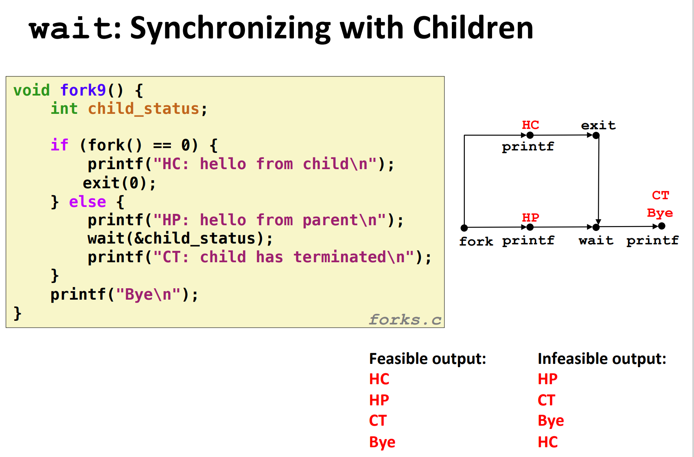

[8.5 信号 - 深入理解计算机系统（CSAPP） (gitbook.io)](https://hansimov.gitbook.io/csapp/part2/ch08-exceptional-control-flow/8.5-signals#1-an-quan-de-xin-hao-chu-li)

[[读书笔记\]CSAPP：19[VB]ECF：信号和非本地跳转 - 知乎 (zhihu.com)](https://zhuanlan.zhihu.com/p/117269612)

[CSAPP阅读笔记-信号-来自第八章8.5-8.8的笔记-P526-P550 - 暴躁法师 - 博客园 (cnblogs.com)](https://www.cnblogs.com/czw52460183/p/10843649.html)

现代系统通过使控制流发生突变来对这些情况做出反应。一般而言，我们把这些突变称为**异常控制流**（Exceptional Control Flow，ECF）。异常控制流发生在计算机系统的各个层次。比如，在硬件层，硬件检测到的事件会触发控制突然转移到异常处理程序。在操作系统层，内核通过上下文切换将控制从一个用户进程转移到另一个用户进程。在应用层，一个进程可以发送信号到另一个进程，而接收者会将控制突然转移到它的一个信号处理程序。—个程序可以通过回避通常的栈规则，并执行到其他函数中任意位置的非本地跳转来对错误做出反应。

作为程序员，理解 ECF 很重要，这有很多原因：

- **理解 ECF 将帮助你理解重要的系统概念。**ECF 是操作系统用来实现 I/O、进程和虚拟内存的基本机制。在能够真正理解这些重要概念之前，你必须理解 ECF。
- **理解 ECF 将帮助你理解应用程序是如何与操作系统交互的。**应用程序通过使用一个叫做陷阱（trap）或者系统调用（system call）的 ECF 形式，向操作系统请求服务。比如，向磁盘写数据、从网络读取数据、创建一个新进程，以及终止当前进程，都是通过应用程序调用系统调用来实现的。理解基本的系统调用机制将帮助你理解这些服务是如何提供给应用的。
- **理解 ECF 将帮助你编写有趣的新应用程序。**操作系统为应用程序提供了强大的 ECF 机制，用来创建新进程、等待进程终止、通知其他进程系统中的异常事件，以及检测和响应这些事件。如果理解了这些 ECF 机制，那么你就能用它们来编写诸如 Unix shell 和 Web 服务器之类的有趣程序了。
- **理解 ECF 将帮助你理解并发。**ECF 是计算机系统中实现并发的基本机制。在运行中的并发的例子有：中断应用程序执行的异常处理程序，在时间上重叠执行的进程和线程，以及中断应用程序执行的信号处理程序。理解 ECF 是理解并发的第一步。我们会在第 12 章中更详细地研究并发。
- **理解 ECF 将帮助你理解软件异常如何工作。**像 C++ 和 Java 这样的语言通过 try、catch 以及 throw 语句来提供软件异常机制。软件异常允许程序进行非本地跳转（即违反通常的调用/返回栈规则的跳转）来响应错误情况。非本地跳转是一种应用层 ECF，在 C 中是通过 setjmp 和 longjmp 函数提供的。理解这些低级函数将帮助你理解高级软件异常如何得以实现。

对系统的学习，到目前为止你已经了解了应用是如何与硬件交互的。本章的重要性在于你将开始学习应用是如何与操作系统交互的。有趣的是，这些交互都是围绕着 ECF 的。我们将描述存在于一个计算机系统中所有层次上的各种形式的 ECF。从异常开始，异常位于硬件和操作系统交界的部分。我们还会讨论系统调用，它们是为应用程序提供到操作系统的入口点的异常。然后，我们会提升抽象的层次，描述进程和信号，它们位于应用和操作系统的交界之处。最后讨论非本地跳转，这是 ECF 的一种应用层形式。


# 8.1 异常

这里的异常指的是把控制交给系统内核来响应某些事件（例如处理器状态的变化），其中内核是操作系统常驻内存的一部分，而这类事件包括除以零、数学运算溢出、页错误、I/O 请求完成或用户按下了 ctrl+c 等等系统级别的事件。

具体的过程可以用下图表示：


系统会通过异常表(Exception Table)来确定跳转的位置，每种事件都有对应的唯一的异常编号，发生对应异常时就会调用对应的异常处理代码


## 8.1.1.异常的处理

异常可能会难以理解，因为处理异常需要硬件和软件紧密合作。很容易搞混哪个部分执行哪个任务。让我们更详细地来看看硬件和软件的分工吧。

**异常号**：每种类型异常都有一个非负整数的异常号，一部分由**处理器设计者分配**，一部分由**操作系统内核的设计者分配**，前者的示例包括**被 0 除，缺页、内存访问违例、断点以及算术运算溢出**。后者的示例包括**系统调用和来自外部的 I/O 设备的信号**

**异常表**：其实感觉和 got 表类似，**保存着对应程序的地址，属于一个跳转表，系统启动时分配**

在系统启动时（当计算机重启或者加电时），操作系统分配和初始化一张称为**异常表**的跳转表，使得表目 k 包含异常 k 的处理程序的地址。图 8-2 展示了异常表的格式。


在运行时（当系统在执行某个程序时），处理器检测到发生了一个事件，并且确定了相应的异常号 k。随后，处理器触发异常，方法是执行间接过程调用，通过异常表的表目 k，转到相应的处理程序。

图 8-3 展示了处理器如何使用异常表来形成适当的异常处理程序的地址。异常号是到异常表中的索引，异常表的起始地址放在一个叫做**异常表基址寄存器**（exception table base register）的特殊 CPU 寄存器里。


* 过程调用时，在跳转到处理程序之前，处理器将返回地址压入栈中。然而，根据异常的类型，返回地址要么是当前指令（当事件发生时正在执行的指令），要么是下一条指令（如果事件不发生，将会在当前指令后执行的指令）。

* 处理器也把一些**额外的处理器状态压到栈里**，在处理程序返回时，重新开始执行被中断的程序会需要这些状态。比如，x86-64 系统会将包含当前条件码的 EFLAGS 寄存器和其他内容压入栈中。

* 如果控制从用户程序转移到内核，所有这些项目都被**压到内核栈**中，而不是压到用户栈中。

* **异常处理程序运行在内核模式下**（见 8.2.4 节），这意味着它们对所有的系统资源都有完全的访问权限。

一旦硬件触发了异常，剩下的工作就是由异常处理程序在软件中完成。在处理程序处理完事件之后，它通过执行一条特殊的“**从中断返回”指令**，可选地返回到被中断的程序，该指令将**适当的状态弹回到处理器的控制和数据寄存器中**，如果异常中断的是一个用户程序，就将状态恢复为**用户模式**（见 8.2.4 节），然后将**控制返回给被中断的程序**。


## 8.1.2 异常的类别

异常可以分为四类：**中断**（interrupt），**陷阱**（trap）、**故障**（fault）和**终止**（abort）。图 8-4 中的表对这些类别的属性做了小结。


**中断**是异步发生的，是来自处理器外部的 I/O 设备的信号的结果。硬件中断不是由任何一条专门的指令造成的，从这个意义上来说它是异步的。硬件中断的异常处理程序常常称为**中断处理程序**（interrupt handler）。

图 8-5 概述了一个中断的处理。I/O 设备，例如网络适配器、磁盘控制器和定时器芯片，通过向处理器芯片上的一个引脚发信号，并将异常号放到系统总线上，来触发中断，这个异常号标识了引起中断的设备。


### 1.中断

**中断**是**异步**发生的，也称为**异步异常(Asynchronous Exception)**，是来自**处理器外部的 I/O 设备的信号**的结果。是由处理器外面发生的事情引起的，对于执行程序来说，这种“中断”的发生完全是异步的，因为不知道什么时候会发生。硬件中断的异常处理程序常常称为**中断处理程序**（interrupt handler）。

图 8-5 概述了一个中断的处理。I/O 设备，例如网络适配器、磁盘控制器和定时器芯片，**通过向处理器芯片上的一个引脚发信号，并将异常号放到系统总线上，来触发中断**，这个异常号标识了引起中断的设备


在当前指令完成执行之后，**处理器注意到中断引脚的电压变高了，就从系统总线读取异常号，然后调用适当的中断处理程序**。当处理程序返回时，它就将控制返回给下一条指令（也即如果没有发生中断，在控制流中会在当前指令之后的那条指令）。结果是程序继续执行，就好像没有发生过中断一样。

比较常见的中断有两种：**计时器中断和 I/O 中断**。**计时器中断是由计时器芯片每隔几毫秒触发的，内核用计时器终端来从用户程序手上拿回控制权**。**I/O 中断类型比较多样，比方说键盘输入了 ctrl-c，网络中一个包接收完毕，都会触发这样的中断**。


### 2.自陷和系统调用

陷阱是有意的异常，是执行一条指令的结果。就像中断处理程序一样，陷阱处理程序将控制返回到下一条指令。陷阱最重要的用途是在用户程序和内核之间提供一个像过程一样的接口，叫做**系统调用**。

用户程序经常需要向内核请求服务，比如读一个文件（read）、创建一个新的进程（fork），加载一个新的程序（execve），或者终止当前进程（exit）。为了允许对这些内核服务的受控的访问，处理器提供了一条特殊的 “syscall n” 指令，当用户程序想要请求服务 n 时，可以执行这条指令。执行 syscall 指令会导致一个到异常处理程序的陷阱，这个处理程序解析参数，并调用适当的内核程序。图 8-6 概述了一个系统调用的处理。


从程序员的角度来看，系统调用和普通的函数调用是一样的。然而，它们的实现非常不同。普通的函数运行在用户模式中，用户模式限制了函数可以执行的指令的类型，而且它们只能访问与调用函数相同的栈。系统调用运行在内核模式中，内核模式允许系统调用执行特权指令，并访问定义在内核中的栈。8.2.4 节会更详细地讨论用户模式和内核模式。


### 3.故障

故障由**错误情况**引起，它可能能够被故障处理程序修正。当故障发生时，处理器将控制转移给故障处理程序。**如果处理程序能够修正这个错误情况，它就将控制返回到引起故障的指令，从而重新执行它。否则，处理程序返回到内核中的 abort 例程，abort 例程会终止引起故障的应用程序。**图 8-7 概述了一个故障的处理。


一个经典的故障示例是**缺页异常**，当指令引用一个虚拟地址，而与该地址相对应的物理页面不在内存中，因此必须从磁盘中取出时，就会发生故障。就像我们将在第 9 章中看到的那样，一个页面就是虚拟内存的一个连续的块（典型的是 4KB）。**缺页处理程序从磁盘加载适当的页面，然后将控制返回给引起故障的指令**。当指令再次执行时，相应的物理页面已经驻留在内存中了，指令就可以没有故障地运行完成了。


再举一个例子，引用非法地址：

```c
int a[1000];
main()
{
    a[5000] = 13;
}
```


具体来说会向用户进程发送 `SIGSEGV` 信号，用户进程会以 segmentation fault 的标记退出。

从上面我们就可以看到异常的具体实现是依靠在用户代码和内核代码间切换而实现的，是非常底层的机制。

​	

### 4.终止

终止是不可恢复的致命错误造成的结果，通常是一些硬件错误，比如 DRAM 或者 SRAM 位被损坏时发生的奇偶错误。终止处理程序从不将控制返回给应用程序。如图 8-8 所示，处理程序将控制返回给一个 abort 例程，该例程会终止这个应用程序。


## 8.1.3 Linux/x86-64 系统中的异常

为了使描述更具体，让我们来看看为 x86-64 系统定义的一些异常。有高达 256 种不同的异常类型【50】。0 ∼ 31 的号码对应的是由 Intel 架构师定义的异常，因此对任何 x86-64 系统都是一样的。32 ∼ 255 的号码对应的是操作系统定义的中断和陷阱。图 8-9 展示了一些示例。


### 1.Linux/x86-64 故障和终止

**除法错误。**当应用试图除以零时，或者当一个除法指令的结果对于目标操作数来说太大了的时候，就会发生除法错误（异常 0）。Unix 不会试图从除法错误中恢复，而是选择终止程序。Linuxshell 通常会把除法错误报告为“浮点异常（Floating exception）”。

**一般保护故障。**许多原因都会导致不为人知的一般保护故障（异常 13），通常是因为一个程序引用了一个未定义的虚拟内存区域，或者因为程序试图写一个只读的文本段。Linux 不会尝试恢复这类故障。Linux shell 通常会把这种一般保护故障报告为“段故障（Segmentation fault）”。

**缺页**（异常 14）是会重新执行产生故障的指令的一个异常示例。处理程序将适当的磁盘上虚拟内存的一个页面映射到物理内存的一个页面，然后重新执行这条产生故障的指令。我们将在第 9 章中看到缺页是如何工作的细节。

**机器检查。**机器检查（异常 18）是在导致故障的指令执行中检测到致命的硬件错误时发生的。机器检查处理程序从不返回控制给应用程序。


### 2.Linux/86-64 系统调用

Linux 提供几百种系统调用，当应用程序想要请求内核服务时可以使用，包括读文件、写文件或是创建一个新进程。图 8-10 给出了一些常见的 Linux 系统调用。每个系统调用都有一个唯一的整数号，对应于一个到内核中跳转表的偏移量。（注意：这个跳转表和异常表不一样，异常表中分配给操作系统的编号是32~255）


C 程序用 syscall 函数可以直接调用任何系统调用。然而，实际中几乎没必要这么做。对于大多数系统调用，标准 C 库提供了一组方便的包装函数。这些包装函数将参数打包到一起，以适当的系统调用指令陷入内核，然后将系统调用的返回状态传递回调用程序。在本书中，我们将系统调用和与它们相关联的包装函数都称为**系统级函数**，这两个术语可以互换地使用。

在 X86-64 系统上，系统调用是通过一条称为 **syscall 的陷阱指令**来提供的。研究程序能够如何使用这条指令来直接调用 Linux 系统调用是很有趣的。所有到 Linux 系统调用的参数都是通过通用寄存器而不是栈传递的。按照惯例，**寄存器 ％rax 包含系统调用号**，寄存器 **%rdi、%rsi、%rdx、%r10、%r8  和 ％r9 包含最多 6 个参数**。第一个参数在  ％rdi 中，第二个在 ％rsi 中，以此类推。从系统调用返回时，寄存器 %rcx 和 ％r11 都会被破坏，％rax 包含返回值。**-4095 到 -1 之间的负数返回值表明发生了错误，对应于负的 errno。**


> ## 旁注 - 关于术语的注释
>
> 各种异常类型的术语根据系统的不同而有所不同。处理器 ISA 规范通常会区分异步“中断”和同步“异常”，但是并没有提供描述这些非常相似的概念的概括性的术语。为了避免不断地提到“异常和中断”以及“异常或者中断”，我们用单词“异常”作为通用的术语，而且只有在必要时才区别异步异常（中断）和同步异常（陷阱、故障和终止）。正如我们提到过的，对于每个系统而言，基本的概念都是相同的，但是你应该意识到一些制造厂商的手册会用“异常" 仅仅表示同步事件引起的控制流的改变。


# 8.2 进程

进程给应用程序的关键抽象：

* 一个独立的逻辑控制流，他提供一个假象，好像我们的程序独占地使用处理器
* 一个私有的地址空间，他提供一个假象，好像我们的程序独占地使用内存系统


上下文切换(进程调度)机制的工作:

* 保存当前进程的上下文
* 恢复某个先前被抢占的进程被保存的上下文
* 将控制传递给这个新恢复的进程


# 8.3 系统调用错误处理


当 Unix 系统级函数遇到错误时，它们通常会返回 —1，并设置全局整数变量 errno 来表示什么出错了。程序员应该总是检査错误，但是不幸的是，许多人都忽略了错误检查，因为它使代码变得臃肿，而且难以读懂。比如，下面是我们调用 Unix fork 函数时会如何检査错误：

```c
if ((pid = fork()) < 0) {
    fprintf(stderr, "fork error: %s\n", strerror(errno));
    exit(0);
}
```

**strerror 函数返回一个文本串**，描述了和某个 errno 值相关联的错误。通过定义下面的错误报告函数，我们能够在某种程度上简化这个代码：

```c
void unix_error(char *msg) /* Unix-style error */
{
    fprintf(stderr, "%s: %s\n", msg, strerror(errno));
    exit(0);
}
```

给定这个函数，我们对 fork 的调用从 4 行缩减到 2 行：

```c
if ((pid = fork()) < 0)
    unix_error("fork error");
```

下面是 fork 函数的错误处理包装函数：

```c
pid_t Fork(void)
{
    pid_t pid;
    if ((pid = fork()) < 0)
        unix_error("Fork error");
    return pid;
}
```

给定这个包装函数，我们对 fork 的调用就缩减为 1 行：

```c
pid = Fork();
```

我们将在本书剩余的部分中都使用错误处理包装函数。它们能够保持代码示例简洁，而又不会给你错误的假象，认为允许忽略错误检査。注意，当在本书中谈到系统级函数时，我们总是用它们的小写字母的基本名字来引用它们，而不是用它们大写的包装函数名来引用。


# 8.4 进程控制

Unix 提供了大量从 C 程序中操作进程的系统调用。这一节将描述这些重要的函数，并举例说明如何使用它们。


## 8.4.1 获取进程 ID


每个进程都有一个唯一的**正数（非零）进程 ID（PID）**。**getpid** 函数返回调用进程的 PID。**getppid** 函数返回它的父进程的 PID（创建调用进程的进程）

```c
#include <sys/type.h>  
#include <unistd.h>  
pid_t getpid();   // 返回该进程PID,Linux系统中pid_t被定义为int  
pid_t getppid();  // 返回父进程的PID  
```

getpid 和 getppid 函数返回一个类型为 pid_t 的整数值，在 Linux 系统上它在 types.h 中被定义为 int。


## 8.4.2 创建和终止进程

从程序员的角度，我们可以认为进程总是处于下面三种状态之一：

- **运行。**进程要么在 CPU 上 执行，要么在等待被执行且最终会被内核调度。
- **暂停。**进程的执行被挂起（suspended），且不会被调度。当收到 SIGSTOP、SIGTSTP、SIGTTIN 或者 SIGTTOU 信号时，进程就暂停，并且保持停止直到它收到一个 SIGCONT 信号，在这个时刻，进程再次开始运行。（信号是一种软件中断的形式，将在 8.5 节中详细描述。）
- **终止。**进程永远地停止了。进程会因为三种原因终止：
  - 1）收到一个信号，该信号的默认行为是终止进程；
  - 2）从主程序返回；
  - 3）调用 exit 函数。

```c
#include <stdlib.h>

void exit(int status);

// 该函数不返回。
```

exit 函数以 status 退出状态来终止进程（另一种设置退出状态的方法是从主程序中返回一个整数值）。


父进程通过调用 fork 函数创建一个新的运行的子进程。

```c
#include <sys/types.h>
#include <unistd.h>

pid_t fork(void);

// 返回：子进程返回 0，父进程返回子进程的 PID，如果出错，则为 -1。
```

新创建的子进程几乎但不完全与父进程相同。子进程得到与父进程用户级虚拟地址空间相同的（但是独立的）一份副本，包括代码和数据段、堆、共享库以及用户栈。子进程还获得与父进程任何打开文件描述符相同的副本，这就意味着当父进程调用 fork 时，子进程可以读写父进程中打开的任何文件。父进程和新创建的子进程之间最大的区别在于它们有不同的 PID。

fork 函数是有趣的（也常常令人迷惑），因为它只被调用一次，却会返回两次：一次是在调用进程（父进程）中，一次是在新创建的子进程中。在父进程中，fork 返回子进程的 PID。在子进程中，fork 返回 0。因为子进程的 PID 总是为非零，返回值就提供一个明确的方法来分辨程序是在父进程还是在子进程中执行。


## 8.4.3 回收子进程

<u>当一个进程由于某种原因终止时，内核并不是立即把它从系统中清除。相反，**进程被保持在一种已终止的状态中**，直到被它的父进程**回收**（reaped）</u>。

**当父进程回收已终止的子进程时，内核将子进程的退出状态传递给父进程，然后抛弃已终止的进程**，从此时开始，该进程就不存在了。

一个**终止了但还未被回收的进程**称为**僵死进程**（zombie）——僵死进程已经终止了，而内核仍保留着它的某些状态直到父进程回收它为止.

如果一个**父进程终止了**，内核会安排 **init** 进程成为它的**孤儿进程的养父**。**init 进程的 PID 为 1，是在系统启动时由内核创建的，它不会终止，是所有进程的祖先**。如果**父进程没有回收它的僵死子进程就终止了，那么内核会安排 init 进程去回收它们**，所以一般不必显式回收。.不过，**长时间运行的程序，比如 shell 或者服务器，总是应该回收它们的僵死子进程。即使僵死子进程没有运行，它们仍然消耗系统的内存资源。**


> **这里有一个重要的点是，子进程终止了，父进程需要用wait去回收子进程，才能使其从僵尸进程中清除。如果父进程终止了，init会自动回收其僵死子进程。（当然，如果子进程还在执行的话，那么不会回收的）**


可以看到，这里子进程终止，父进程while (1)的循环，由于父进程没有退出，是需要用wait去回收的，而没有回收的话，子进程就维持僵死状态


可以看到，我们杀死父进程，就成功把子进程回收了，因为init代替自动执行了回收任务.


### waitpid


这里，父进程退出，子进程继续执行.


这个例子说明，子进程必须要进入僵死状态才会被回收。


一个进程可以通过调用 **waitpid** 函数来**等待它的子进程终止或者停止**。

```c
#include <sys/types.h>
#include <sys/wait.h>

pid_t waitpid(pid_t pid, int *statusp, int options);

// 返回：如果成功，则为子进程的 PID，如果 WNOHANG，则为 0，如果其他错误，则为 -1。
```

waitpid 函数有点复杂。默认情况下（当 options=0 时），waitpid 挂起调用进程的执行，直到它的**等待集合**（wait set）中的**一个子进程终止**。如果等待集合中的一个进程在刚调用的时刻就已经终止了，那么 waitpid 就立即返回。在这两种情况中，waitpid 返回导致 waitpid 返回的已终止子进程的 PID。此时，已终止的子进程已经被**回收**，内核会从系统中删除掉它的所有痕迹。


**1. 判定等待集合的成员**

等待集合的成员是由参数 pid 来确定的：

- 如果 **Pid>0**，那么**等待集合就是一个单独的子进程**，它的进程 ID 等于 pid。
- 如果 **Pid=-1**，那么**等待集合就是由父进程所有的子进程组成的**，没有任何限制，此时waitpid和wait的作用一模一样
- 如果**pid=0** ，等待同一个**进程组中的任何子进程**，如果子进程已经加入了别的进程组，waitpid不会对它做任何理睬。
- 如果**pid<-1** ，等待一个**指定进程组中的任何子进程**，这个进程组的ID等于pid的绝对值。**

waitpid 函数还支持其他类型的等待集合，包括 Unix 进程组，对此我们将不做讨论。


**2.修改默认行为**

可以通过将 **options** 设置为常量 WNOHANG、WUNTRACED 和 WCONTINUED 的各种组合来修改默认行为

**WNOHANG：**如果pid指定的子进程没有结束，则waitpid()函数立即返回0，而不是阻塞在这个函数上等待；如果结束了，则返回该子进程的进程号。待子进程终止的同时，如果还想做些有用的工作，这个选项会有用。（相当于是轮询）

**WUNTRACED：**挂起调用进程的执行，直到等待集合中的一个进程变成已终止或者被停止。返回的 PID 为导致返回的已终止或停止子进程的 PID。默认的行为是挂起调用进程，直到有子进程终止。

**WCONTINUED：**挂机调用进程的执行，直到等待集合中一个运行的进程终止或等待集合中的一个被停止的进程收到 SIGCONT 信号重新开始执行

也可以把这些 options 通过了或运算组合，比如 WNOHANG|WUNTRACED：立即返回，如果等待集合中的子进程都没有被停止或终止，则返回 0，如果有一个停止或终止，则返回该子进程的 PID

> **0：阻塞等待**
>
> **如果使用了WNOHANG(wait no hung)参数调用waitpid，即使没有子进程退出，它也会立即返回，不会像wait那样永远等下去。(非阻塞)**
>
> 而WUNTRACED参数，由于涉及到一些跟踪调试方面的知识，加之极少用到，这里就不多费笔墨了，有兴趣的读者可以自行查阅相关材料。


**3.检查已回收子进程的退出状态**

如果 statusp 参数是非空的，那么 waitpid 就会在 status 中放上关于导致返回的子进程的状态信息，status 是 statusp 指向的值。wait.h 头文件定义了解释 status 参数的几个宏：

* **WIFEXITED(status)：**如果于进程通过调用 exit 或者一个返回（return）正常终止，就返回真。

* **WEXITSTATUS(status)：**返回一令正常终止的子进程的退出状态。只有在 WIFEXITED() 返回为真时，才会定义这个状态。

* **WIFSIGNALED(status)**：如果子进程是因为一个未被捕获的信号终止的，. 那么就返回真。

* **WTERMSIG(status)：**返回导致子进程终止的信号的编号。只有在 WIFSIGNALED() 返回为真时，才定义这个状态。

* **WIFSTOPPED(status)：**如果引起返回的子进程当前是停止的，那么就返回真。

* **WSTOPSIG(status)：**返回引起子进程停止的信号的编号。只有在 WIFSTOPPED() 返回为真时，才定义这个状态。

* **WIFCONTINUED(status)：**如果子进程收到 SIGCONT 信号重新启动，则返回真。


**4.错误条件**

如果调用进程没有子进程，那么 waitpid 返回 -1，并且设置 errno 为 ECHILD。如果 waitpid 函数被一个信号中断，那么它返回 -1，并设置 errno 为 EINTR。


### wait

wait 函数是 waitpid 函数的简单版本：

```c
#include <sys/types.h>
#include <sys/wait.h>

pid_t wait(int *statusp);
// 返回：如果成功，则为子进程的 PID，如果出错，则为 -1。
```

调用 **wait(&status)** 等价于调用 **waitpid(-1, &status, 0)**，等待集合是所有的子进程


### 例子



这个例子中，子进程直接退出，父进程用wait去回收子进程，回收完后打印CT,所以状态图如上图所示.


**N=5**，我们父进程调用5次fork，并回收5次。我们用**WIFEXITED**，使得子进程正常结束时为True，否则为False。如果正常结束的话，我们用**WEXITSTATUS**,得到返回码.


这个和上面的wait版本略有不同，就是指定了回收的子进程的编号，所以一定是按顺序的


## 8.4.4 让进程休眠

sleep函数将一个进程挂起一段指定的时间。

```c
#include <unistd.h>
unsigned int sleep(unsigned int secs);

// 返回：还要休眠的秒数。
```

如果请求的时间量已经到了，sleep 返回 0，否则返回还剩下的要休眠的秒数。后一种情况是可能的，如果因为 sleep 函数被一个信号中断而过早地返回。我们将在 8.5 节中详细讨论信号。

我们会发现另一个很有用的函数是 pause 函数，该函数让调用函数休眠，直到该进程收到一个信号。

```c
#include <unistd.h>
int pause(void);

// 总是返回 -1。
```


## 8.4.5 加载并运行程序

execve 函数在当前进程的上下文中加载并运行一个新程序。

```c
#include <unistd.h>
int execve(const char *filename, const char *argv[],
           const char *envp[]);

// 如果成功，则不返回，如果错误，则返回 -1。
```

filename 为可执行目标文件名字，argv [0] 存储可执行目标文件的名字，argv [0] 之后存的就是参数，envp 存的是环境变量，函数执行成功时没有返回值，执行失败时的返回值为- 1


execve 函数加载并运行可执行目标文件 filename，且带参数列表 argv 和环境变量列表 envp。只有当出现错误时，例如找不到 filename，execve 才会返回到调用程序。所以，与 fork—次调用返回两次不同，execve 调用一次并从不返回。


环境变量的列表是由一个类似的数据结构表示的，如图 8-21 所示。envp 变量指向一个以 null 结尾的指针数组，其中每个指针指向一个环境变量字符串，每个串都是形如 “name=value” 的名字—值对。


在 execve 加载了 filename 之后，它调用 7.9 节中描述的启动代码。启动代码设置栈，并将控制传递给新程序的主函数，该主函数有如下形式的原型:

```c
int main(int argc, char **argv, char **envp);
```

或者等价的

```c
int main(int argc, char *argv[], char *envp[]);
```

当 main 开始执行时，用户栈的组织结构如图 8-22 所示。

让我们从栈底（高地址）往栈顶（低地址）依次看一看。首先是参数和环境字符串。栈往上紧随其后的是以 null 结尾的指针数组，其中每个指针都指向栈中的一个环境变量字符串。全局变量 environ 指向这些指针中的第一个 envp[0]o 紧随环境变量数组之后的是以 null 结尾的 argv[] 数组，其中每个兀素都指向栈中的一个参数字符串。在栈的顶部是系统启动函数 libc_start_main（见 7.9 节）的栈帧。


main 函数有 3 个参数：

1. argc，它给出 argv[ ] 数组中非空指针的数量；

2. argv，指向 argv[ ] 数组中的第一个条目；

3. envp，指向 envp[ ] 数组中的第一个条目。

   

Linux 提供了几个函数来操作环境数组：

```c
#include <stdlib.h>
char *getenv(const char *name);

// 返回：若存在则为指向 name 的指针，若无匹配的，则为 NULL。
```

getenv 函数在环境数组中搜索字符串 “name=value”。如果找到了，它就返回一个指向 value 的指针，否则它就返回 NULL。

```c
#include <stdlib.h>

int setenv(const char *name, const char *newvalue, int overwrite);
// 返回：若成功则为 0，若错误则为 -1。

void unsetenv(const char *name);
// 返回：无。
```

如果环境数组包含一个形如 “name=oldva1ue” 的字符串，那么 unsetenv 会删除它，而 setenv 会用 newvalue 代替 oldvalue，但是只有在 overwirte 非零时才会这样。如果 name 不存在，那么 setenv 就把 “name=newvalue” 添加到数组中。


```c
#include <csapp.c>

int main(int argc, char *argv[], char *envp[])
{
    int i;

    printf("Command-line arguments:\n");
    for (i = 0; argv[i] != NULL; i++)
        printf(" argv[%2d]: %s\n", i, argv[i]);

    printf("\n");
    printf("Environment variables:\n");
    for (i = 0; envp[i] != NULL; i++)
        printf(" envp[%2d]: %s\n", i, envp[i]);

    exit(0);
}
```


## 8.4.6 利用 fork 和 execve 运行程序

像 Unix shell 和 Web 服务器这样的程序大量使用了 fork 和 execve 函数。shell 是一个交互型的应用级程序，它代表用户运行其他程序。shell 执行一系列的读 / 求值步骤，然后终止。读步骤读取来自用户的一个命令行。求值步骤解析命令行，并代表用户运行程序


下面代码展示了一个简单 shell 的 main 例程。shell 打印一个命令行提示符，等待用户在 stdin 上 输入命令行，然后对这个命令行求值。

```c
#include <csapp.c>
#define MAXARGS 128

/* Function prototypes */
void eval(char *cmdline);
int parseline(char *buf, char **argv);
int builtin_command(char **argv);

int main()
{
    char cmdline[MAXLINE]; /* Command line */

    while (1) {
        /* Read */
        printf("> ");
        Fgets(cmdline, MAXLINE, stdin);
        if (feof(stdin))	//feof，当stdin中没有内容时，返回1
            exit(0);

        /* Evaluate */
        eval(cmdline);
    }
}
```

下面展示了对命令行求值的代码。它的首要任务是调用` parseline `函数，这个函数**解析了以空格分隔的命令行参数，并构造最终会传递给 execve 的 argv 向量**。第一个参数被假设为要么是一个内置的 shell 命令名，马上就会解释这个命令，要么是一个可执行目标文件，会在一个新的子进程的上下文中加载并运行这个文件。

```c
/* eval - Evaluate a command line */
void eval(char *cmdline)
{
    char *argv[MAXARGS]; /* Argument list execve() */
    char buf[MAXLINE];   /* Holds modified command line */
    int bg;              /* Should the job run in bg or fg? */
    pid_t pid;           /* Process id */

    strcpy(buf, cmdline);	//comline[] 复制给 buf[]
    bg = parseline(buf, argv);	
    if (argv[0] == NULL)
        return;   /* Ignore empty lines */

    if (!builtin_command(argv)) {	//如果不是内置指令,那么就当作可执行文件去执行
        if ((pid = Fork()) == 0) {   /* Child runs user job */
            if (execve(argv[0], argv, environ) < 0) {
                printf("%s: Command not found.\n", argv[0]);
                exit(0);
            }
        }
		//如果是内置指令，执行下面的代码
        /* Parent waits for foreground job to terminate */
        if (!bg) {	//如果不是后台运行
            int status;
            if (waitpid(pid, &status, 0) < 0)	//阻塞，等待子进程终止后回收子进程
                unix_error("waitfg: waitpid error");
            }
        else	//如果是后台运行,就打印一个pid + cmdline，就不管子进程了，让他继续去执行
            printf("%d %s", pid, cmdline);
    }
    return;
}

/* If first arg is a builtin command, run it and return true */
int builtin_command(char **argv)
{
    if (!strcmp(argv[0], "quit")) /* quit command */
        exit(0);
    if (!strcmp(argv[0], "&"))    /* Ignore singleton & */
        return 1;
    return 0;                     /* Not a builtin command */
}
```

我们的eval中，已经给了详尽的注释，大致的流程就是，先调用`bg = parseline(buf, argv);`来将buf用空格分割成argv数组，并返回是否是后台执行.然后是两个分支，如果这个argv是内置指令，那么就在builtin_command中去执行这个指令，如果不是内置指令，就调用一个fork，用子进程去execve，父进程waitpid（如果不是后台的话）.

最后，我们再看一下parseline是怎样的：

```c
/* parseline - Parse the command line and build the argv array */
int parseline(char *buf, char **argv)
{
    char *delim;         /* Points to first space delimiter */
    int argc;            /* Number of args */
    int bg;              /* Background job? */

    buf[strlen(buf)-1] = ' ';  /* Replace trailing '\n' with space */
    while (*buf && (*buf == ' ')) /* Ignore leading spaces */
        buf++;

    /* Build the argv list */
    argc = 0;
    while ((delim = strchr(buf, ' '))) {
        argv[argc++] = buf;
        *delim = '\0';
        buf = delim + 1;
        while (*buf && (*buf == ' ')) /* Ignore spaces */
            buf++;
    }
    argv[argc] = NULL;

    if (argc == 0) /* Ignore blank line */
        return 1;

    /* Should the job run in the background? */
    if ((bg = (*argv[argc-1] == '&')) != 0)
        argv[--argc] = NULL;

    return bg;
}
```

如果最后一个参数是一个 “&” 字符，那么 `parseline` 返回 1，表示应该在后台执行该程序（shell 不会等待它完成）。否则，它返回 0，表示应该在前台执行这个程序（shell 会等待它完成）。

在解析了命令行之后，`eval` 函数调用 `builtin_command` 函数，该函数检查第一个命令行参数是否是一个内置的 shell 命令。如果是，它就立即解释这个命令，并返回值 1。否则返回 0。简单的 shell 只有一个内置命令—— quit 命令，该命令会终止 shell。实际使用的 shell 有大量的命令，比如 pwd、jobs 和 fg。

如果 builtin_command 返回 0，那么 shell 创建一个子进程，并在子进程中执行所请求的程序。如果用户要求在后台运行该程序，那么 shell 返回到循环的顶部，等待下一个命令行。否则，shell 使用 waitpid 函数等待作业终止。当作业终止时，shell 就开始下一轮迭代。

**注意，这个简单的 shell 是有缺陷的，因为它并不回收它的后台子进程。修改这个缺陷就要求使用信号，我们将在下一节中讲述信号。**


最终的代码如下：

```c
#include <csapp.c>
#define MAXARGS 128

/* Function prototypes */
void eval(char *cmdline);
int parseline(char *buf, char **argv);
int builtin_command(char **argv);

int main()
{
    char cmdline[MAXLINE]; /* Command line */

    while (1) {
        /* Read */
        printf("> ");
        Fgets(cmdline, MAXLINE, stdin);
        if (feof(stdin))	//feof，当stdin中没有内容时，返回1
            exit(0);

        /* Evaluate */
        eval(cmdline);
    }
}

/* eval - Evaluate a command line */
void eval(char *cmdline)
{
    char *argv[MAXARGS]; /* Argument list execve() */
    char buf[MAXLINE];   /* Holds modified command line */
    int bg;              /* Should the job run in bg or fg? */
    pid_t pid;           /* Process id */

    strcpy(buf, cmdline);	//comline[] 复制给 buf[]
    bg = parseline(buf, argv);	
    if (argv[0] == NULL)
        return;   /* Ignore empty lines */

    if (!builtin_command(argv)) {	//如果不是内置指令,那么就当作可执行文件去执行
        if ((pid = Fork()) == 0) {   /* Child runs user job */
            if (execve(argv[0], argv, environ) < 0) {
                printf("%s: Command not found.\n", argv[0]);
                exit(0);
            }
        }
		//如果是内置指令，执行下面的代码
        /* Parent waits for foreground job to terminate */
        if (!bg) {	//如果不是后台运行
            int status;
            if (waitpid(pid, &status, 0) < 0)	//阻塞，等待子进程终止后回收子进程
                unix_error("waitfg: waitpid error");
            }
        else	//如果是后台运行,就打印一个pid + cmdline，就不管子进程了，让他继续去执行
            printf("%d %s", pid, cmdline);
    }
    return;
}

/* If first arg is a builtin command, run it and return true */
int builtin_command(char **argv)
{
    if (!strcmp(argv[0], "quit")) /* quit command */
        exit(0);
    if (!strcmp(argv[0], "&"))    /* Ignore singleton & */
        return 1;
    return 0;                     /* Not a builtin command */
}

/* parseline - Parse the command line and build the argv array */
int parseline(char *buf, char **argv)
{
    char *delim;         /* Points to first space delimiter */
    int argc;            /* Number of args */
    int bg;              /* Background job? */

    buf[strlen(buf)-1] = ' ';  /* Replace trailing '\n' with space */
    while (*buf && (*buf == ' ')) /* Ignore leading spaces */
        buf++;

    /* Build the argv list */
    argc = 0;
    while ((delim = strchr(buf, ' '))) {
        argv[argc++] = buf;
        *delim = '\0';
        buf = delim + 1;
        while (*buf && (*buf == ' ')) /* Ignore spaces */
            buf++;
    }
    argv[argc] = NULL;

    if (argc == 0) /* Ignore blank line */
        return 1;

    /* Should the job run in the background? */
    if ((bg = (*argv[argc-1] == '&')) != 0)
        argv[--argc] = NULL;

    return bg;
}
```


